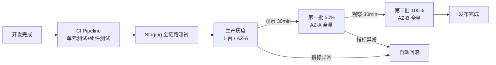

# 以图搜商品系统 · 系统设计文档

**版本**：v1.2
**日期**：2026-02-10
**状态**：评审闭环版（v1.2: 对齐技术架构 v1.3 评审风险闭环项）
**适用范围**：后端研发 / 算法工程师 / SRE / QA
**关联文档**：BRD v3.9 / 技术架构文档 v1.3 / 业务协作与治理说明 v1.0 / 数据追平与灰度验证方案 v1.0 / 评审整合报告 v1.1

---

## 一、设计概述

### 1.1 文档定位

```
BRD v3.9          → 做什么（What）      → 产品/研发/测试
技术架构 v1.1     → 为什么这么选（Why）  → 架构评审/研发Lead
本文档 (系统设计) → 怎么写代码（How）    → 后端研发/算法/SRE
协作治理 v1.0     → 谁负责/怎么用       → 合作方/PM
```

技术架构定义了组件边界和数据流向，本文档将每个组件展开至**可编码粒度**：DDL、伪代码、配置项、错误码、消息格式、重试策略、线程模型。

### 1.2 设计约束（继承自技术架构）

| 约束 | 规格 | 来源 |
|------|------|------|
| 图片总量 | ~29.5 亿（18 月滚动 ~26.5 亿 + 常青 ≤3 亿） | BRD §2.1 |
| **设计容量上限** | **全图 30 亿（滚动 27 亿 + 常青 3 亿），超过触发架构评审扩容** | 本文档 |
| **容量预警线** | **28 亿触发黄色预警，29 亿触发红色预警** | 本文档 |
| **存储架构** | **两区：热区 HNSW（5 月滚动 7.5 亿）+ 非热区 DiskANN（13 月滚动 + 常青 20.5 亿）** | 本文档 §附录E |
| 检索 P99 | ≤400ms（级联场景：热区 ≤150ms + 非热区 ≤250ms）/ 快速路径 ≤240ms | BRD §5.1 / 本文档 §附录E |
| 热区 QPS | ≥1,000（HNSW, ef_search=192, Recall@100 ≈ 98.5%） | 本文档 §附录E |
| 非热区 QPS | ≥500（DiskANN, SearchListSize=200, Recall@100 ≈ 98%） | 本文档 §附录E |
| 写入可见性 | Level 1: P95 ≤5s（已有图 Redis 命中）/ Level 2: P95 ≤10s（已有图 PG 命中）/ Level 3: P95 ≤15s（新图完整链路） | 本文档 §5.1 |
| 核心 SLA | 99.99%（月停机 ≤4.5min） | BRD §6.1 |
| 硬件部署 | 方案 A（云上）：36 台腾讯云实例；方案 B（自建 IDC）：24 台物理机（使用 19 / 空闲 5） | 本文档 §附录E |
| 月运营成本 | 方案 A：¥220,700（刊例价）/ ¥176,560（包年 8 折）；方案 B：¥44,600（IDC 托管 + 光纤 + 电费） | 本文档 §附录E |

> **接口版本策略**（对齐 BRD v3.9 §3.4.1 R14）：所有接口路径以 `/api/v1/` 为前缀。`v1` 主版本周期内保持向后兼容。非兼容变更通过 `/api/v2/` 新路径提供，旧版本保留至少 2 个发布周期后废弃。

---

### 1.3 术语与标识契约（不可变）

| 术语 | 定义 | 约束 |
|------|------|------|
| `image_id` | 对外统一标识，32 hex 字符，等于 `sha256(uri)` 的前 16 bytes 的十六进制表示 | **恒等于 `image_pk`**，两者仅命名场景不同 |
| `image_pk` | 内部表字段名（Milvus/PG/RocksDB），与 `image_id` 完全相同 | 算法不可变更（SHA256 截断），变更等同于全量重建 |
| `uri` | 图片原始 URL，作为全局去重的唯一输入 | 不落盘、不索引，仅用于生成 image_pk 和下载 |
| `product_id` | 调用方透传的商品标识，图搜系统不维护映射关系 | **不可用于交易决策**（见 §3.1.1 风险声明） |
| `merchant_id` | 商家字符串标识，内部通过字典编码为 uint32 bitmap_index | 对外始终为字符串，编码对调用方透明 |

> **命名规则**：API 请求/响应中一律使用 `image_id`；内部存储/日志中使用 `image_pk`。两者在任何上下文中**值恒等**，禁止出现两者不一致的情况。

### 1.4 业务治理声明

**ADD-only 约束（当前版本 v1.0 硬性治理规则）**：

商家与图片的关联关系**仅追加、不删除**（对齐 BRD v3.9 §2.4 / 协作治理 v1.0 §2.1）。当前版本所有写入链路（update-image → Kafka → Flink → PG bitmap → RocksDB）均基于此假设设计：

- Flink 聚合使用 `rb_or()` 幂等合并，**无减法语义**
- RocksDB CDC 仅处理 `"c"/"u"` 事件，**无 `"d"` 处理**
- 对账 job 仅校验"PG ⊇ RocksDB"，**不校验反向**

**v1.2+ 演进预案（REMOVE 事件）**：若未来业务需要商家解绑，需同步变更：
1. Kafka 事件增加 `event_type: "REMOVE"`（Flink 已预留扩展点，见 §5.3）
2. Flink 聚合增加 `rb_andnot()` 减法语义，需处理乱序（event_time watermark）
3. PG 聚合改为 `rb_andnot(bitmap, :removed)` 或 `rb_remove(bitmap, :index)`
4. 对账 job 改为双向校验（PG = RocksDB）
5. 业务影响：解绑后该商家商品不再出现在过滤结果中，但 Milvus 向量不删除（仅过滤层变更）

---

## 二、服务架构与模块设计

### 2.1 服务清单

| 服务 | 运行时 | 实例数 | 端口 | 职责 |
|------|--------|--------|------|------|
| **search-service** | Python 3.11 + uvicorn | 4（2×4080Ti + 2×3090 GPU 服务器） | 8080 (HTTP) | 检索主链路 + 特征提取（GPU 共存） |
| **write-service** | Python 3.11 + uvicorn | 4（2×2 AZ） | 8081 (HTTP) | 写入主链路 + 去重 + 事件发布 |
| **bitmap-filter-service** | Go 1.22 + gRPC | 4（2×2 AZ） | 50051 (gRPC) | 商家过滤（内嵌 RocksDB） |
| **flink-pipeline** | Java 17 + Flink 1.18 | 2 TaskManager | — | 商家关联事件聚合 → PG |
| **cdc-connector** | Debezium 2.5 + Kafka Connect | 1 | — | PG → Kafka CDC |
| **cron-scheduler** | Python 3.11 + APScheduler | 1 | — | 定时任务编排 |

### 2.2 search-service 模块结构

```
search-service/
├── app/
│   ├── api/
│   │   ├── routes.py            # FastAPI 路由定义
│   │   ├── search_handler.py    # POST /api/v1/image/search
│   │   ├── status_handler.py    # GET /api/v1/system/status
│   │   └── health_handler.py    # /healthz, /readyz
│   ├── core/
│   │   ├── pipeline.py          # 级联检索流水线编排
│   │   ├── degrade_fsm.py       # 降级状态机
│   │   ├── config.py            # 配置加载
│   │   └── metrics.py           # Prometheus 指标定义
│   ├── engine/
│   │   ├── feature_extractor.py # TensorRT 推理封装
│   │   ├── ann_searcher.py      # Milvus 向量检索
│   │   ├── bitmap_filter.py     # gRPC 调用 bitmap-filter-service
│   │   ├── refiner.py           # Refine 精排
│   │   ├── fallback.py          # 子图+标签多路召回
│   │   └── ranker.py            # 融合排序
│   ├── model/
│   │   ├── request.py           # 请求模型 (Pydantic)
│   │   ├── response.py          # 响应模型
│   │   └── internal.py          # 内部数据结构
│   ├── infra/
│   │   ├── milvus_client.py     # Milvus 连接池
│   │   ├── redis_client.py      # Redis 连接
│   │   ├── kafka_producer.py    # 搜索日志发送
│   │   └── dict_cache.py        # 字典编码本地缓存
│   └── main.py
├── models/                       # TensorRT 引擎文件
│   ├── backbone_fp16.engine
│   ├── yolov8s_fp16.engine
│   └── projection_heads.engine
├── config/
│   ├── default.yaml
│   ├── staging.yaml
│   └── production.yaml
└── tests/
```

### 2.3 write-service 模块结构

```
write-service/
├── app/
│   ├── api/
│   │   ├── update_image.py      # POST /api/v1/image/update
│   │   ├── update_video.py      # POST /api/v1/video/update
│   │   ├── batch_index.py       # POST /api/v1/image/index
│   │   ├── bind_merchant.py     # POST /api/v1/merchant/bindImage
│   │   └── behavior_report.py   # POST /api/v1/behavior/report
│   ├── core/
│   │   ├── dedup.py             # URI 去重 (Redis → PG 二级)
│   │   ├── id_generator.py      # image_pk = hex(sha256(uri)[0:16])
│   │   ├── feature_client.py    # GPU 特征提取 RPC
│   │   ├── evergreen.py         # 常青判定逻辑
│   │   └── video_extractor.py   # FFmpeg 关键帧提取
│   ├── infra/
│   │   ├── milvus_client.py
│   │   ├── pg_client.py
│   │   ├── redis_client.py
│   │   └── kafka_producer.py    # 商家关联事件发送
│   └── main.py
└── tests/
```

### 2.4 bitmap-filter-service 模块结构

```
bitmap-filter-service/  (Go)
├── cmd/
│   └── server/main.go
├── internal/
│   ├── grpc/
│   │   ├── server.go            # gRPC 服务注册
│   │   └── handler.go           # BatchFilter RPC 实现
│   ├── store/
│   │   ├── rocksdb.go           # RocksDB 封装 (cf_rolling + cf_evergreen)
│   │   ├── multi_get.go         # 并行 MultiGet (4 线程)
│   │   └── compaction.go        # 手动 compaction 调度
│   ├── bitmap/
│   │   ├── roaring.go           # Roaring Bitmap 运算封装
│   │   └── intersect.go         # Batch AND 过滤
│   ├── sync/
│   │   ├── kafka_consumer.go    # CDC 事件消费
│   │   └── applier.go           # 写入 RocksDB
│   └── degrade/
│       └── health.go            # 健康检查 + 降级判断
├── proto/
│   └── bitmap_filter.proto      # gRPC 接口定义
└── config/
```

### 2.5 并发模型与资源上限

| 服务 | 运行时 | Worker/线程 | 并发上限 | 关键队列 | 监控指标 |
|------|--------|------------|---------|---------|---------|
| search-service | uvicorn + asyncio | 4 workers × async | inflight ≤200 req/worker | GPU 推理队列 (maxsize=16) | `uvicorn_inflight_requests`, `gpu_inference_queue_length` |
| write-service | uvicorn + asyncio | 2 workers × async | inflight ≤100 req/worker | 图片下载队列 (semaphore=32) | `write_inflight_requests`, `download_semaphore_waiting` |
| bitmap-filter-service | Go gRPC | 200 goroutines (MaxConcurrentStreams) | 200 并发 gRPC 调用 | RocksDB MultiGet 线程池 (4) | `grpc_inflight`, `rocksdb_multiget_latency` |
| Milvus Client | pymilvus pool | pool_size=16 / search-service | 16 并发查询/实例 | — | `milvus_client_pending` |

> **P99 400ms 预算分解（v1.1 两区级联最坏场景）**：GPU 推理 30ms + 热区 HNSW 150ms（ef=192）+ 标签召回 10ms（P1 全量）+ 非热区 DiskANN 250ms（SL=200, 仅 ~20% 请求穿透）+ Refine 7ms（P1 候选池 2000）+ Bitmap 过滤 8ms + 网络/序列化 37ms。快速路径（~80% 请求）仅命中热区+标签：P99 ≤240ms。当任何队列长度超过 80% 上限时，Prometheus 告警触发。

---

## 三、数据模型详细设计

### 3.1 Milvus Collection Schema

#### 3.1.1 global_images（全图主集合）

```python
# Collection 创建伪代码
from pymilvus import CollectionSchema, FieldSchema, DataType

fields = [
    # === Primary Key ===
    FieldSchema("image_pk",     DataType.VARCHAR, max_length=32, is_primary=True),  # hex(sha256(uri)[0:16])

    # === 向量字段 ===
    FieldSchema("global_vec",   DataType.FLOAT_VECTOR, dim=256),  # 全图向量, L2 归一化后存储

    # === 标量字段 (INVERTED 索引) ===
    FieldSchema("category_l1",  DataType.INT32),            # 一级类目整数编码 (词表 ≤200)
    FieldSchema("category_l2",  DataType.INT32),            # 二级类目整数编码 (词表 ≤2000)
    FieldSchema("category_l3",  DataType.INT32),            # 三级类目整数编码 (词表 ≤8192)
    FieldSchema("tags",         DataType.ARRAY,             # 标签整数编码数组
                element_type=DataType.INT32, max_capacity=32),
    FieldSchema("color_code",   DataType.INT32),            # 颜色编码
    FieldSchema("material_code",DataType.INT32),            # 材质编码
    FieldSchema("style_code",   DataType.INT32),            # 风格编码
    FieldSchema("season_code",  DataType.INT32),            # 季节编码

    # === 元数据字段 ===
    FieldSchema("is_evergreen", DataType.BOOL),             # 常青标记
    FieldSchema("ts_month",     DataType.INT32),            # 写入月份 YYYYMM (分区键)
    FieldSchema("promoted_at",  DataType.INT64),            # 常青晋升时间戳 (Unix ms), 非常青=0
                                                            # 用途: 常青池水位治理按此字段升序清理超龄节点 (BRD §2.8)
    FieldSchema("product_id",   DataType.VARCHAR, max_length=64),  # 可选透传, ⚠️ 见下方风险声明
    FieldSchema("created_at",   DataType.INT64),            # Unix 毫秒时间戳
]

schema = CollectionSchema(fields, description="以图搜商品 - 全图主集合")

# 索引配置 — 两区策略 (v1.1)
# 热区 (ts_month ∈ 最近5个月 + is_evergreen==false): HNSW 内存索引
# 非热区 (ts_month ∈ 6-18个月 + is_evergreen==true): DiskANN 磁盘索引
index_configs = {
    # ── 热区索引 (HNSW, 7.5 亿向量, 内存常驻) ──
    "global_vec__hot": {
        "index_type": "HNSW",
        "metric_type": "COSINE",        # 向量已 L2 归一化, COSINE ≡ IP
        "params": {
            "M": 24,                     # HNSW 出度 (v1.1 P0: 从 16 提升至 24, Recall 97%→98.5%, 内存 +40%)
            "efConstruction": 200        # 构建精度
        }
    },
    # ── 非热区索引 (DiskANN, 20.5 亿向量, NVMe 磁盘检索) ──
    "global_vec__non_hot": {
        "index_type": "DISKANN",
        "metric_type": "COSINE",
        "params": {
            "MaxDegree": 64,             # Vamana 图出度 (v1.1 P0: 从 56 提升至 64, Recall 97%→98%)
            "SearchListSize": 200,       # 搜索遍历候选集大小 (v1.1 P0: 从 150 提升至 200, Recall@100 ≈ 98%)
            "PQCodeBudgetGBRatio": 0.125 # PQ 编码内存预算 (默认)
        }
        # DiskANN 索引体积: 20.5 亿 × 2.0KB ≈ 4.1TB (MaxDegree=64, 比 56 增 ~8%)
        # 分布: 14 个分区, 每台 NVMe 节点加载 2 个分区 (~585GB)
    },
    # 标量 INVERTED 索引 (替代 Elasticsearch, 热区/非热区共享)
    "category_l1":   {"index_type": "INVERTED"},
    "category_l2":   {"index_type": "INVERTED"},
    "category_l3":   {"index_type": "INVERTED"},
    "tags":          {"index_type": "INVERTED"},
    "color_code":    {"index_type": "INVERTED"},
    "material_code": {"index_type": "INVERTED"},
    "style_code":    {"index_type": "INVERTED"},
    "season_code":   {"index_type": "INVERTED"},
    "is_evergreen":  {"index_type": "INVERTED"},
    "ts_month":      {"index_type": "INVERTED"},
}

# 分区策略: 按 ts_month 分区
# partition_key = "ts_month"
# 分区数: 18 (滚动) + 1 (常青 is_evergreen=true) = 19
#
# v1.1 两区分配:
#   热区 (HNSW, 内存):  最近 5 个月滚动分区 → 7.5 亿向量
#   非热区 (DiskANN, NVMe): 第 6-18 月滚动分区 + 常青分区 → 20.5 亿向量
#   每月轮转: 最新月进入热区, 第 6 月从热区降级到非热区
#   常青数据 (≤3 亿) 始终在非热区 DiskANN 索引中, SearchListSize=200 保障 98% Recall
```

**热区 HNSW 搜索参数**：

```yaml
# 热区 (0-5 月滚动): HNSW 内存检索
hot_zone_search_params:
  ef_search: 192          # S0 正常模式, Recall@100 ≈ 98.5% (P0: 从 128 提升)
  # ef_search: 128        # S1 预降级 (Recall ~97%)
  # ef_search: 64         # S2 强降级 (Recall ~90%)

# SQ8 量化: 256d × 1 byte = 256 bytes/向量 (vs float32 1024 bytes, 节省 75%)
# 精度损失: Recall@100 约降 1-2%, 由 Refine 阶段用 float32 补偿
```

**非热区 DiskANN 搜索参数**：

```yaml
# 非热区 (6-18 月滚动 + 常青): DiskANN 磁盘检索
non_hot_zone_search_params:
  search_list: 200        # S0 正常模式, Recall@100 ≈ 98% (P0: 从 150 提升, 50 次磁盘随机读)
  # search_list: 150      # S1 预降级 (Recall ~97%, P99 ~190ms)
  # search_list: 80       # S2 强降级 (Recall ~95%, P99 ~110ms)

# DiskANN 性能特征 (NVMe, 256 维向量):
#   SearchListSize=200: P99 ~250ms, 单节点 ~64 QPS (并发 16)
#   磁盘读模式: Vamana 图遍历, 每次查询 ~50 次 4KB 随机读
#   NVMe 延迟: 每次随机读 ~0.08ms → 总磁盘时间 ~4ms → 并发下 P99 ~250ms
```

**⚠️ product_id 风险声明（必须在所有使用处重复）**：

```
results[].product_id 是调用方写入时透传的元数据, 图搜系统不维护 image→product 映射。
❌ 不保证跨请求稳定 (不同 merchant_scope 可能返回不同结果集)
❌ 不保证跨策略版本稳定 (模型迭代可能改变排序)
❌ 不可直接用于库存/价格/交易判断
✅ 正确做法: 从 image_id 出发, 调用方自行查询商品域获取当前可售商品
```

#### 3.1.2 sub_images（子图集合）

```python
sub_fields = [
    FieldSchema("sub_pk",      DataType.VARCHAR, max_length=48, is_primary=True),
    # sub_pk = "{image_pk}_{sub_idx}"  例: "a1b2c3d4...f890_02"
    FieldSchema("image_pk",    DataType.VARCHAR, max_length=32),  # 父图 PK
    FieldSchema("sub_vec",     DataType.FLOAT_VECTOR, dim=128),   # 子图向量
    FieldSchema("bbox",        DataType.VARCHAR, max_length=64),  # "x1,y1,x2,y2" 归一化坐标
    FieldSchema("confidence",  DataType.FLOAT),                   # YOLOv8 检测置信度
    FieldSchema("ts_month",    DataType.INT32),
    FieldSchema("is_evergreen",DataType.BOOL),
]

sub_schema = CollectionSchema(sub_fields, description="以图搜商品 - 子图集合")

# 索引: IVF_PQ (子图量更大, 用 PQ 压缩)
sub_index = {
    "sub_vec": {
        "index_type": "IVF_PQ",
        "metric_type": "COSINE",
        "params": {
            "nlist": 4096,
            "m": 16,                     # PQ 子空间数
            "nbits": 8
        }
    }
}
# 仅加载热区分区 (~50 亿行, 5 个月 + 热区范围内的子图)
# 搜索参数: nprobe = 64

# ⚠️ 子图生命周期管理 (对齐 v1.1 两区架构):
#   - 仅热区 (≤5 月) 数据在 Milvus 中加载, 非热区子图不加载
#   - 非热区子图数据不主动清理 (Milvus 中保留但 Release), 按分区轮转自然过期
#   - Fallback 子图检索仅命中热区, 不查非热区 (性能保证)
#   - 定期清理: 每月 cron 执行 Milvus Release(sub_images, partition=过期月份)
```

### 3.2 PostgreSQL DDL

#### 3.2.1 URI 全局去重表

```sql
-- ⚠️ 不使用分区: PG 分区表主键必须包含分区键, 会导致 image_pk 全局唯一性约束失效
-- uri_dedup 是全局去重表 (对齐技术架构 v1.1 §4.5), 必须保证 image_pk 全局唯一
CREATE TABLE uri_dedup (
    image_pk    CHAR(32)     PRIMARY KEY,    -- hex(sha256(uri)[0:16]), 全局唯一
    uri_hash    CHAR(64)     NOT NULL,       -- sha256(uri) 完整 64 位 hex
    ts_month    INT          NOT NULL,       -- 写入月份 YYYYMM, 用于历史清理
    created_at  TIMESTAMPTZ  NOT NULL DEFAULT now()
);

-- ts_month 索引: 用于定期清理过期数据
CREATE INDEX idx_uri_dedup_ts ON uri_dedup (ts_month);

-- 清理策略: 每月 cron 执行 DELETE (非 DROP PARTITION)
-- 去重表仅存 ID+hash (~120 bytes/行, 29.5 亿行 ≈ 350GB), DELETE 开销可控
-- DELETE FROM uri_dedup WHERE ts_month < :cutoff_month AND ts_month != 999999;
```

#### 3.2.2 商家 Bitmap 表

```sql
CREATE EXTENSION IF NOT EXISTS roaringbitmap;

CREATE TABLE image_merchant_bitmaps (
    image_pk        CHAR(32)        PRIMARY KEY,
    bitmap          roaringbitmap   NOT NULL DEFAULT '\x3a30000000000000'::roaringbitmap,
    -- bitmap 中存储的是 merchant_id 对应的 uint32 字典编码值
    is_evergreen    BOOLEAN         NOT NULL DEFAULT false,   -- CDC 路由: true→cf_evergreen, false→cf_rolling
    merchant_count  INT GENERATED ALWAYS AS (rb_cardinality(bitmap)) STORED,  -- 计算列, 用于监控
    updated_at      TIMESTAMPTZ     NOT NULL DEFAULT now()
);

-- 不分区: Bitmap 需要全局查询 (商家过滤不区分时间层)
-- 清理策略: 跟随 uri_dedup 分区删除联动

-- CDC 变更捕获所需
ALTER TABLE image_merchant_bitmaps REPLICA IDENTITY FULL;
```

#### 3.2.3 商家字典编码表

```sql
CREATE TABLE merchant_id_mapping (
    merchant_str   VARCHAR(64)   PRIMARY KEY,    -- 原始 string 商家 ID
    bitmap_index   SERIAL,                        -- uint32 自增编码 (1-based)
    created_at     TIMESTAMPTZ   NOT NULL DEFAULT now(),

    CONSTRAINT bitmap_index_unique UNIQUE (bitmap_index)
);

-- 编码上限: uint32 max = 4,294,967,295, 远大于 2 亿商家规模
-- 编码分配: INSERT ... ON CONFLICT DO NOTHING + RETURNING bitmap_index
```

#### 3.2.4 常青类目配置表

```sql
CREATE TABLE evergreen_categories (
    category_l1_code  INT          PRIMARY KEY,    -- 一级类目整数编码
    category_l1_name  VARCHAR(64)  NOT NULL,       -- 人类可读名称
    enabled           BOOLEAN      NOT NULL DEFAULT true,
    enabled_at        TIMESTAMPTZ  NOT NULL DEFAULT now(),
    -- 只增不减: enabled 一旦为 true 不可改回 false (业务规则)
    created_at        TIMESTAMPTZ  NOT NULL DEFAULT now()
);

-- 初始数据示例
INSERT INTO evergreen_categories (category_l1_code, category_l1_name) VALUES
    (101, '家具'),
    (102, '珠宝'),
    (103, '经典箱包');
```

#### 3.2.5 词表映射表

```sql
CREATE TABLE vocabulary_mapping (
    vocab_type   VARCHAR(32)   NOT NULL,  -- 'category_l1'/'category_l2'/'category_l3'/'tag'/'color'/'material'/'style'/'season'
    string_val   VARCHAR(128)  NOT NULL,  -- 原始字符串值
    int_code     INT           NOT NULL,  -- 整数编码 (0-based)

    PRIMARY KEY (vocab_type, string_val),
    UNIQUE (vocab_type, int_code)
);

-- 词表容量约束:
--   category_l1: ≤200
--   category_l2: ≤2000
--   category_l3: ≤8192
--   tag:         ≤4096
--   color/material/style/season: 各 ≤256
-- 合计 ≤12,000 行
```

#### 3.2.6 商家范围预注册表

```sql
CREATE TABLE merchant_scope_registry (
    scope_id       VARCHAR(64)   PRIMARY KEY,       -- 预注册 Scope ID
    caller_id      VARCHAR(64)   NOT NULL,           -- 所属调用方
    merchant_ids   TEXT          NOT NULL,            -- JSON array: ["m001","m002",...]
    bitmap_cache   BYTEA,                             -- 预计算的 Roaring Bitmap (可选, 加速过滤)
    created_at     TIMESTAMPTZ   NOT NULL DEFAULT now(),
    updated_at     TIMESTAMPTZ   NOT NULL DEFAULT now()
);

-- 索引: 按调用方查询
CREATE INDEX idx_scope_caller ON merchant_scope_registry (caller_id);
-- 容量: ≤10,000 行 (每个调用方 ≤100 个 Scope)
-- 更新: 调用方通过管理接口注册/更新, bitmap_cache 在更新时自动重算
-- ⚠️ 缓存一致性: 更新 Scope 时必须同步删除 Redis key "scope:{scope_id}" (强制失效)
--    管理接口实现: UPDATE PG → DELETE Redis → 返回成功 (写后失效模式)
```

### 3.3 Redis Key 设计

```
┌──────────────────────────────────────────────────────────────────┐
│ Key 命名规范: {service}:{entity}:{identifier}                    │
│ 所有 Key 使用 UTF-8, 禁止包含空格和换行                           │
└──────────────────────────────────────────────────────────────────┘

1. URI 缓存 (去重加速)
   Key:    uri_cache:{image_pk}                  例: uri_cache:a1b2c3d4e5f67890a1b2c3d4e5f67890
   Value:  "1"
   TTL:    90 天 (7,776,000s)
   容量:   ~4.4 亿 key × ~50 bytes ≈ 22 GB
   用途:   写入链路第一级去重, Redis miss 再查 PG
   写入时机: PG 去重确认后 SET, 或 PG 命中回写
   淘汰策略: volatile-ttl (仅淘汰带 TTL 的 key)

2. 分布式写入锁
   Key:    uri_lock:{image_pk}
   Value:  "{write_service_instance_id}"
   TTL:    15s (EX 15)
   操作:   SET NX EX 15 (获取锁) / DEL (释放锁)
   用途:   防止同一新图片并发写入
   注意:   锁超时后其他实例可获取, 幂等性由 Milvus Upsert 保证

3. 常青类目配置缓存
   Key:    config:evergreen_categories
   Value:  JSON array "[101, 102, 103]"
   TTL:    5 分钟 (300s)
   用途:   写入时判定 is_evergreen, 避免每次查 PG
   更新:   配置变更时主动 DEL 失效 + TTL 兜底

4. 字典编码本地缓存 (Redis 作为二级)
   Key:    dict:merchant:{merchant_str}
   Value:  "{bitmap_index}"                      例: "42857"
   TTL:    24 小时 (86,400s)
   容量:   ~4000 万 key × ~80 bytes ≈ 3 GB
   用途:   search-service 本地 LRU miss 时查 Redis, Redis miss 查 PG
   写入时机: Flink 分配新编码时写入

5. 降级状态广播
   Key:    degrade:state
   Value:  JSON {"state": "S0", "since": null, "by": null}
   TTL:    无 (持久)
   用途:   跨实例同步降级状态; 各 search-service 节点本地状态机为主, Redis 为辅
   更新:   状态机转移时 SET + PUBLISH degrade_channel
```

### 3.4 RocksDB Key-Value 格式 (bitmap-filter-service)

```
Column Families:
  cf_rolling    — 滚动分区数据 (18 个月)
  cf_evergreen  — 常青分区数据

Key (16 bytes):
  hex_decode(image_pk)                  // 32 个 hex 字符 → 16 bytes 二进制
  例: "a1b2c3d4e5f67890a1b2c3d4e5f67890" → 16 bytes

Value (变长):
  序列化的 Roaring Bitmap 字节流          // CRoaring 标准格式
  平均大小: ~2 KB (500-1000 商家)
  最大: ~50 KB (极热图片, >10,000 商家)

RocksDB 配置:
  block_cache_size:     8 GB (实例内存 32G 的 25%)
  bloom_filter_bits:    10 (每 key ~1.2 bytes, 假阳率 ~1%)
  compression:          LZ4
  max_open_files:       -1 (无限制)
  write_buffer_size:    128 MB
  level0_file_num_compaction_trigger: 4
  target_file_size_base: 256 MB
```

### 3.5 Kafka Topic 与消息格式

#### 3.5.1 merchant_events（商家关联事件）

```yaml
topic: image-search.merchant-events
partitions: 16
replication_factor: 3
retention_ms: 604800000   # 7 天
cleanup_policy: delete
```

```json
// Message Key: image_pk (保证同一图片事件有序)
// Message Value:
{
  "event_type": "ADD",
  "image_pk": "a1b2c3d4e5f67890a1b2c3d4e5f67890",
  "merchant_id": "m_shop_12345",
  "source": "update-image",
  "timestamp": 1738886400000,
  "trace_id": "req_20260207_abc123"
}
// 当前仅 ADD 事件; 预留 REMOVE 事件 (v1.2+ 如需商家解绑)
```

#### 3.5.2 search_logs（搜索日志）

```yaml
topic: image-search.search-logs
partitions: 8
replication_factor: 2
retention_ms: 259200000   # 3 天 (ClickHouse 消费后即可删)
```

```json
{
  "request_id": "req_20260207_abc123",
  "version": {
    "model_version": "v2.1.0",
    "vocab_version": "v1.3",
    "fusion_weight_version": "exp_20260205",
    "pipeline_version": "1.0.36"
  },
  "query_features": {
    "global_vec_norm": 1.0,
    "category_l1_pred": 101,
    "tags_pred": [42, 87, 156]
  },
  "params": {
    "merchant_scope_size": 500,
    "top_k": 100,
    "data_scope": "all",
    "time_range": "9m"
  },
  "results": {
    "count": 100,
    "top1_score": 0.87,
    "top10_avg_score": 0.72,
    "strategy": "fast_path",
    "confidence": "high"
  },
  "performance": {
    "total_ms": 48,
    "feature_ms": 17,
    "ann_ms": 22,
    "filter_ms": 3,
    "refine_ms": 4
  },
  "meta": {
    "degraded": false,
    "expanded": false,
    "filter_skipped": false,
    "degrade_state": "S0"
  },
  "timestamp": 1738886400000
}
```

**坏例回放包（Bad Case Replay Pack）**：

当算法/QA 需要定位线上"坏例"时，仅凭 `request_id` 查日志不足以重现（query_image 不落盘）。search_logs 中已包含足够信息构建**不含原图的最小回放快照**：

```
回放输入 = {
  query_features.global_vec_norm + category_l1_pred + tags_pred,  // 查询侧特征摘要
  params.*,                                                        // 完整请求参数
  version.*,                                                       // 模型/词表/权重/管线版本
  results.top1_pk + top1_score + count,                            // 结果摘要
  degrade_state                                                    // 系统状态
}
```

回放流程：用 `version.*` 加载对应模型版本 → 用 `params` 构造请求 → 对比离线 Golden Set 标注 → 定位 Recall/Precision 偏差根因。**不需要原图**，符合数据合规要求。

#### 3.5.3 behavior_events（行为上报事件）

> **可选增强能力声明**（对齐 BRD v3.9 §8.6 / 协作治理 v1.0 §10）：行为上报为可选能力，不上报不影响基础检索功能。Kafka 写入失败**不得阻塞检索/写入主链路**，仅记录 metrics 和 warn 日志。

```yaml
topic: image-search.behavior-events
partitions: 4
replication_factor: 2
retention_ms: 259200000   # 3 天 (Kafka 仅作传输缓冲, 长期存储依赖 ClickHouse 90 天, 见 §3.6)
```

```json
{
  "event_type": "click",            // impression / click / inquiry / order / negative_feedback
  "request_id": "req_20260207_abc123",
  "image_id": "a1b2c3d4e5f67890a1b2c3d4e5f67890",
  "position": 3,
  "timestamp": 1738886405000
}
// 不含 PII (无用户身份信息)
```

#### 3.5.4 bitmap_cdc（PG → bitmap-filter-service）

```yaml
topic: dbserver.public.image_merchant_bitmaps
# Debezium CDC 自动创建, 命名遵循 Debezium 规范
partitions: 16
replication_factor: 3
retention_ms: 86400000    # 1 天
```

### 3.6 ClickHouse Schema

```sql
CREATE TABLE search_quality_log (
    request_id      String,
    timestamp       DateTime64(3),
    -- 搜索参数
    merchant_scope_size  UInt32,
    top_k           UInt16,
    data_scope      LowCardinality(String),
    time_range      LowCardinality(String),
    -- 搜索结果
    result_count    UInt16,
    top1_score      Float32,
    top10_avg_score Float32,
    strategy        LowCardinality(String),
    confidence      LowCardinality(String),
    -- 性能
    total_ms        UInt32,
    feature_ms      UInt16,
    ann_ms          UInt16,
    filter_ms       UInt16,
    refine_ms       UInt16,
    -- 降级状态
    degraded        UInt8,
    expanded        UInt8,
    filter_skipped  UInt8,
    degrade_state   LowCardinality(String)
) ENGINE = MergeTree()
PARTITION BY toYYYYMM(timestamp)
ORDER BY (timestamp, request_id)
TTL timestamp + INTERVAL 90 DAY;

CREATE TABLE behavior_log (
    event_type      LowCardinality(String),
    request_id      String,
    image_id        String,
    position        UInt16,
    timestamp       DateTime64(3)
) ENGINE = MergeTree()
PARTITION BY toYYYYMM(timestamp)
ORDER BY (request_id, timestamp)
TTL timestamp + INTERVAL 90 DAY;

-- 质量大盘物化视图: 搜索日志 JOIN 行为事件
-- ⚠️ 指标延迟容忍声明:
--   search_quality_mv 为小时级聚合, 行为日志 (click/inquiry) 滞后 ≤10 分钟视为正常
--   质量大盘 Grafana 看板默认展示 T-1h 数据, 避免因延迟产生误判
--   实时告警 (P99/错误率) 走 Prometheus 直采, 不依赖此物化视图
CREATE MATERIALIZED VIEW search_quality_mv
ENGINE = AggregatingMergeTree()
PARTITION BY toYYYYMMDD(ts)
ORDER BY (ts, data_scope, confidence)
AS SELECT
    toStartOfHour(s.timestamp) AS ts,
    s.data_scope,
    s.confidence,
    count() AS search_count,
    countIf(b.event_type = 'click') AS click_count,
    countIf(b.event_type = 'inquiry') AS inquiry_count,
    avg(s.total_ms) AS avg_latency_ms
FROM search_quality_log s
LEFT JOIN behavior_log b ON s.request_id = b.request_id
GROUP BY ts, s.data_scope, s.confidence;
```

---

## 四、检索链路详细设计

### 4.1 请求处理流水线

```python
# search-service/app/core/pipeline.py (伪代码)

class SearchPipeline:
    """级联检索流水线 — v1.1 两区架构：热区 HNSW + 非热区 DiskANN"""

    # 级联置信度阈值: Top1 ≥ 此值时跳过非热区查询 (快速路径, 约 80% 请求命中)
    CONFIDENCE_HIGH = 0.80

    async def execute(self, req: SearchRequest) -> SearchResponse:
        ctx = PipelineContext(request_id=gen_request_id())

        # ── Stage 0: 降级状态覆盖 ──
        effective_params = self.degrade_fsm.apply(req)
        ctx.degrade_state = self.degrade_fsm.state

        # ── Stage 0.5: merchant_scope_id 解析 (v1.0 补全) ──
        if req.merchant_scope_id and not req.merchant_scope:
            effective_params.merchant_scope = await self._resolve_merchant_scope(req.merchant_scope_id)

        # ── Stage 1: 特征提取 ──
        with ctx.timer("feature"):
            features = await self._extract_with_gpu_fallback(
                image_bytes=req.query_image,
                mode="fast"     # 快路径: 仅全图 + 标签
            )

    async def _extract_with_gpu_fallback(self, image_bytes, mode):
        """GPU 推理优先, 超时/异常自动降级到 CPU (对齐技术架构 v1.1 §7.3)
           CPU 推理延迟 +~100ms, 限流 10 QPS (防止 CPU 过载)"""
        try:
            return await asyncio.wait_for(
                self.feature_extractor.extract_query(image_bytes, mode=mode, device="gpu"),
                timeout=0.030   # GPU P99 ≤ 30ms
            )
        except (asyncio.TimeoutError, GPUError) as e:
            metrics.gpu_fallback_total.inc()
            if not self.cpu_limiter.try_acquire():  # 令牌桶: 10 QPS
                raise ServiceOverloadError("100_05_01", "GPU unavailable and CPU at capacity")
            return await self.feature_extractor.extract_query(image_bytes, mode=mode, device="cpu")
            # CPU 使用 ONNX Runtime FP32, P99 ~120ms

        # ── Stage 2: 两区级联 ANN 检索 (v1.1) ──
        with ctx.timer("ann"):
            # Stage 2a: 热区 HNSW 检索 (所有请求必过)
            hot_candidates = await self.ann_searcher.search(
                vector=features.global_vec,
                zone="hot",                  # 热区: 最近 5 月分区, HNSW
                partition_filter=self._build_partition_filter(effective_params, zone="hot"),
                ef_search=effective_params.ef_search,  # 默认 192
                top_k=2000      # coarse_top_k, 内部固定
            )
            ctx.hot_top1_score = hot_candidates[0].score if hot_candidates else 0.0

            # Stage 2b: 非热区 DiskANN 检索 (仅低置信度请求穿透, ~20%)
            cold_candidates = []
            if ctx.hot_top1_score < self.CONFIDENCE_HIGH:
                with ctx.timer("ann_non_hot"):
                    cold_candidates = await self.ann_searcher.search(
                        vector=features.global_vec,
                        zone="non_hot",          # 非热区: 6-18 月 + 常青, DiskANN
                        partition_filter=self._build_partition_filter(effective_params, zone="non_hot"),
                        search_list=effective_params.search_list,  # 默认 200
                        top_k=2000
                    )
                    metrics.non_hot_penetration_total.inc()

            # 合并热区 + 非热区候选
            candidates = self._merge_candidates(hot_candidates, cold_candidates)

        # ── Stage 3: 商家过滤 ──
        if effective_params.merchant_scope:
            with ctx.timer("filter"):
                candidates = await self.bitmap_filter.filter_batch(
                    candidate_pks=[c.image_pk for c in candidates],
                    merchant_scope=effective_params.merchant_scope
                )

        # ── Stage 3.5: 全量标签召回 (P1: 所有请求, 不再仅 fallback) ──
        with ctx.timer("tag_recall"):
            tag_candidates = await self.ann_searcher.search_by_tags(
                tags=features.tags,
                partition_filter=self._build_partition_filter(effective_params, zone="hot"),
                top_k=500                    # P1: 标签召回与 ANN 互补, 捞回语义相近但向量不够近的结果
            )
            # 合并 ANN + 标签候选 (去重)
            candidates = self._merge_candidates(candidates, tag_candidates)

        # ── Stage 4: Refine 精排 (P1: 扩大候选池 500→2000, Recall +1-2%) ──
        with ctx.timer("refine"):
            refined = await self.refiner.rerank(
                query_vec=features.global_vec,     # float32
                candidates=candidates[:effective_params.refine_top_k],  # P1: 默认 2000
                use_float32=True                   # 热区内存常驻
            )

        # ── Stage 5-7: 条件 Fallback (仅子图, 标签已全量前置) ──
        top1_score = refined[0].score if refined else 0.0
        if top1_score < 0.75 and effective_params.enable_fallback:
            with ctx.timer("fallback"):
                # Stage 5: Lazy 子图提取
                sub_features = await self.feature_extractor.extract_sub_images(
                    backbone_output=features.backbone_output  # 复用 Stage 1
                )
                # Stage 6: 子图召回 (标签已在 Stage 3.5 全量执行)
                sub_results = await self.ann_searcher.search_sub(
                    sub_features.sub_vecs, top_k=200
                )
                # Stage 7: 融合排序
                refined = self.ranker.fuse(refined, sub_results)

        # ── Stage 8: 响应构建 ──
        response = self._build_response(ctx, refined, effective_params)

        # 异步: 搜索日志写入 Kafka
        asyncio.create_task(self._emit_search_log(ctx, response))

        return response

    async def _resolve_merchant_scope(self, scope_id: str) -> List[str]:
        """merchant_scope_id → merchant_id 列表 (对齐协作治理 v1.0 §7)"""
        # Level 1: Redis 缓存
        cached = await self.redis.get(f"scope:{scope_id}")
        if cached:
            return json.loads(cached)
        # Level 2: PG
        row = await self.pg.fetchone(
            "SELECT merchant_ids FROM merchant_scope_registry WHERE scope_id = $1", scope_id
        )
        if not row:
            raise InvalidParamError("100_01_06", f"merchant_scope_id '{scope_id}' not found")
        ids = json.loads(row["merchant_ids"])
        await self.redis.set(f"scope:{scope_id}", row["merchant_ids"], ex=3600)
        return ids

    def _build_response(self, ctx, refined, params):
        """响应构建: 整数编码反查 + product_id 透传"""
        results = []
        for r in refined[:params.top_k]:
            results.append({
                "image_id": r.image_pk,
                "score": round(r.score, 4),
                # ⚠️ product_id: 仅原样透传, 不可用于交易决策 (见 §3.1.1 风险声明)
                "product_id": r.product_id if r.product_id else None,
                "position": len(results) + 1,
                "is_evergreen": r.is_evergreen,
                # 整数编码 → 字符串反查 (对齐 BRD v3.9 §8.4 "对调用方透明")
                "category_l1": self.vocab_cache.decode("category_l1", r.category_l1),
                "tags": [self.vocab_cache.decode("tag", t) for t in (r.tags or [])],
            })
        # ... meta 构建省略 ...
```

### 4.2 分区路由逻辑

```python
def _build_partition_filter(self, params: EffectiveParams, zone: str = "hot") -> str:
    """根据 zone + data_scope + time_range + 降级状态, 构建 Milvus 分区过滤表达式
    
    v1.1 两区策略:
      hot:     ts_month ∈ [now-4, now] AND is_evergreen == false → HNSW 内存检索
      non_hot: ts_month ∈ [now-17, now-5] OR is_evergreen == true → DiskANN 磁盘检索
    """

    now_month = current_yyyymm()
    hot_boundary = month_subtract(now_month, 4)   # 最近 5 个月 (含当月)
    cold_start = month_subtract(now_month, 17)     # 最远 18 个月

    if zone == "hot":
        # 热区: 仅最近 5 月滚动数据
        return f"ts_month >= {hot_boundary} and is_evergreen == false"

    elif zone == "non_hot":
        # 非热区: 第 6-18 月滚动 + 全部常青
        hot_cutoff = month_subtract(now_month, 5)  # 第 6 月起
        if params.data_scope == "evergreen":
            return "is_evergreen == true"
        return f"(ts_month >= {cold_start} and ts_month <= {hot_cutoff}) or (is_evergreen == true)"

    # data_scope 覆盖 (调用方指定 "evergreen" 仅查常青)
    if params.data_scope == "evergreen":
        return "is_evergreen == true"

    months = self._time_range_to_months(params.time_range)
    start = month_subtract(now_month, months)
    return f"(ts_month >= {start}) or (is_evergreen == true)"

def _merge_candidates(self, hot: List, cold: List) -> List:
    """合并热区和非热区候选, 按 score 降序, 去重 image_pk"""
    seen = set()
    merged = []
    for c in sorted(hot + cold, key=lambda x: x.score, reverse=True):
        if c.image_pk not in seen:
            seen.add(c.image_pk)
            merged.append(c)
    return merged

def _time_range_to_months(self, time_range: str) -> int:
    return {"3m": 3, "9m": 9, "18m": 18}.get(time_range, 9)
```

### 4.3 融合排序算法

```python
# search-service/app/engine/ranker.py

class FusionRanker:
    """加权融合排序 — 合并全图/子图/标签三路召回结果"""

    # 权重配置 (对齐 BRD v3.9 §3.4.2, 可通过 A/B 实验调优)
    WEIGHTS = {
        "global":  0.40,    # 全图 ANN 相似度
        "sub":     0.30,    # 子图 ANN 相似度
        "tag":     0.20,    # 标签匹配得分
        "cat":     0.10,    # 类目匹配得分 (category_l1/l2 一致性)
    }

    def fuse(self, global_results, sub_results, tag_results) -> List[RankedResult]:
        # Step 1: 按 image_pk 聚合 (去重)
        scores = defaultdict(lambda: {"global": 0, "sub": 0, "tag": 0, "cat": 0})

        for r in global_results:
            scores[r.image_pk]["global"] = max(scores[r.image_pk]["global"], r.score)
            # 类目匹配: 查询图预测类目 vs 候选图实际类目
            scores[r.image_pk]["cat"] = max(scores[r.image_pk]["cat"], r.category_match_score)
        for r in sub_results:
            scores[r.image_pk]["sub"] = max(scores[r.image_pk]["sub"], r.score)
        for r in tag_results:
            scores[r.image_pk]["tag"] = max(scores[r.image_pk]["tag"], r.score)

        # Step 2: 加权融合
        fused = []
        for pk, s in scores.items():
            final_score = (
                self.WEIGHTS["global"] * s["global"] +
                self.WEIGHTS["sub"]    * s["sub"] +
                self.WEIGHTS["tag"]    * s["tag"] +
                self.WEIGHTS["cat"]    * s["cat"]
            )
            fused.append(RankedResult(image_pk=pk, score=final_score))

        # Step 3: 降序排序
        fused.sort(key=lambda x: x.score, reverse=True)
        return fused

    @staticmethod
    def compute_confidence(top1_score: float, result_count: int) -> str:
        """置信度计算 (对齐 BRD v3.9 §3.4.1 / §4.4)
           快/慢路径分界也使用 0.75 (见 §4.1 Stage 5 触发条件)"""
        if top1_score >= 0.75 and result_count >= 10:
            return "high"       # "找到了与图片高度一致的商品"
        elif top1_score >= 0.50:
            return "medium"     # "未找到完全同款，以下是相似款式推荐"
        else:
            return "low"        # "暂未找到高度相似商品，以下是同类推荐"
```

### 4.4 search_scope_desc 生成

```python
def _build_search_scope_desc(self, params: EffectiveParams, ctx: PipelineContext) -> str:
    """生成人类可读的搜索范围描述 (完整覆盖 BRD v3.9 §7.1 六种场景)"""

    # 优先级 1: 异常状态描述 (覆盖一切)
    # v1.2: filter_skipped 正常流程中不再出现（bitmap+PG 均不可用时强制 S2/S4）
    # 保留此检查作为防御性兜底
    if ctx.filter_skipped:
        logger.error("filter_skipped=true should not occur in v1.2+, check S2 trigger")
        return "系统维护中，搜索结果可能不完整"
    if ctx.degraded:
        return "当前搜索范围已缩小（近3个月 + 经典款）"

    # 优先级 2: 数据范围描述
    if params.data_scope == "evergreen":
        return "经典款商品"
    if params.data_scope == "rolling":
        if params.merchant_scope:
            return f"在 {len(params.merchant_scope)} 个商家范围内搜索（近 {params.time_range}）"
        return f"近 {params.time_range} 商品"

    # 优先级 3: data_scope == "all" (默认)
    if params.merchant_scope:
        return f"在 {len(params.merchant_scope)} 个商家范围内搜索"
    return f"全平台商品（近{params.time_range} + 经典款）"
```

### 4.5 用户提示语义模板

```python
# 置信度 → 用户提示文案 (对齐 BRD v3.9 §3.4.1 / §4.4)
CONFIDENCE_PROMPTS = {
    "high":   "找到了与图片高度一致的商品",
    "medium": "未找到完全同款，以下是相似款式推荐",
    "low":    "暂未找到高度相似商品，以下是同类推荐",
}

# 空结果处理 (对齐 BRD v3.9 §1.4 "不保证 100% 找到同款"):
# results 为空时返回 HTTP 200 (非错误), confidence="low", results=[]
# 调用方根据 results.length == 0 和 confidence 决定 UI 展示
```

---

## 五、写入链路详细设计

> **写入幂等性承诺（对外公开）**：`update-image` 接口对同一 URI 多次调用保证幂等。同一 URI 的 `image_pk` 由 `sha256(uri)` 确定性生成，Milvus 以 Upsert 语义写入（同 PK 覆盖），PG 以 `ON CONFLICT DO NOTHING` 写入，Bitmap 以 `rb_or()` 合并（幂等）。调用方无需自行去重，可安全重试。

**v1.1 写入可见性时序分解**：

```
Level 1 (已有图, Redis 命中): P95 ≤5s
  ├─ 去重检查 Redis hit:     ~1ms
  ├─ 并行: Kafka send + 直推 bitmap-filter:  ~50ms
  ├─ bitmap-filter 内存生效:  ~2ms (直推路径, 立即可过滤)
  └─ Milvus 向量已存在:      无需等待 → 总计 <1s (大幅优于 SLA)

Level 2 (已有图, PG 命中): P95 ≤10s
  ├─ 去重检查 Redis miss → PG hit:  ~5ms
  ├─ Redis 回写:                     ~1ms
  ├─ 并行: Kafka send + 直推 bitmap-filter:  ~50ms
  ├─ bitmap-filter 内存生效:  ~2ms (直推路径)
  ├─ Flink 1s 窗口 + PG 写入:  ~1.5s (持久化路径, 兜底)
  └─ CDC → RocksDB 覆写:     ~2-3s → 总计 ~4s (优于 SLA)

Level 3 (新图, 完整链路): P95 ≤15s
  ├─ 去重检查 (miss):            ~5ms
  ├─ 分布式锁获取:               ~1ms
  ├─ 图片下载:                    ~1-2s (P95, timeout 2s)
  ├─ GPU 特征提取:               ~0.5s
  ├─ 并行写入:
  │   ├─ Milvus upsert + Flush:   ~3-5s (含 Flush 落盘)
  │   ├─ PG 去重 INSERT:          ~5ms
  │   └─ Redis 缓存:              ~1ms
  ├─ 并行: Kafka send + 直推:     ~50ms
  ├─ bitmap-filter 内存生效:      ~2ms
  └─ Milvus Flush 完成 → 可搜索: ~5-8s → 总计 ~8-12s (优于 15s SLA)

关键优化点 (v1.1 vs v1.0):
  ✅ Milvus 写后即 Flush (消除定时 Flush 等待, 节省 ~5-10s)
  ✅ bitmap-filter 直推 (绕过 Flink+PG+CDC, 节省 ~8-15s)
  ✅ IO 并行化 (Milvus/PG/Redis/Kafka 并发写入, 节省 ~3-5s)
  ✅ Flink 窗口 5s→1s, Kafka linger 10ms→5ms
  ✅ 下载超时 3s→2s, 锁 TTL 30s→15s
```

### 5.1 update-image 完整流程

```python
# write-service/app/api/update_image.py (伪代码)

class UpdateImageHandler:

    async def handle(self, req: UpdateImageRequest) -> UpdateImageResponse:
        # ── 参数校验 ──
        validate_uri(req.uri)                           # 非空, ≤2048 chars
        validate_merchant_id(req.merchant_id)           # 非空, ≤64 chars
        validate_category_l1(req.category_l1)           # 非空, 存在于词表

        # ── 生成确定性 ID ──
        image_pk = hex(sha256(req.uri.encode())[0:16])  # CHAR(32)

        # ── 二级去重 ──
        is_new = await self._check_dedup(image_pk, req.uri)

        if is_new:
            # 新图片: 需要下载 + 特征提取 + 入库
            await self._process_new_image(image_pk, req)
        # else: 已有图片, 跳过特征提取

        # ── 并行写入: Kafka 事件 + 直推 bitmap-filter (v1.1 低延迟路径) ──
        bitmap_index = await self._get_or_create_bitmap_index(req.merchant_id)
        await asyncio.gather(
            # 路径 A: Kafka → Flink → PG → CDC → RocksDB (持久化, 最终一致)
            self.kafka.send("image-search.merchant-events", {
                "event_type": "ADD",
                "image_pk": image_pk,
                "merchant_id": req.merchant_id,
                "bitmap_index": bitmap_index,   # v1.1: 预编码, 减少 Flink 查询
                "source": "update-image",
                "timestamp": now_ms(),
                "trace_id": get_trace_id()
            }, key=image_pk),
            # 路径 B: 直接 gRPC 推送 bitmap-filter-service (实时, 内存生效)
            self._direct_push_bitmap(image_pk, bitmap_index),
        )

        return UpdateImageResponse(
            status="accepted",
            image_id=image_pk,
            is_new=is_new
        )

    async def _direct_push_bitmap(self, image_pk: str, bitmap_index: int):
        """v1.1 低延迟路径: 绕过 Flink/PG/CDC, 直推 bitmap-filter 内存
        
        可见性保障:
          - 成功: bitmap-filter 内存立即生效 (~1-2ms), 无需等 Flink+CDC 链路
          - 失败: 静默降级, 依赖 Flink+CDC 最终一致路径 (退化到 ~5-8s)
          - 一致性: CDC 路径最终覆写, 确保 RocksDB 持久化
        """
        try:
            await asyncio.wait_for(
                self.bitmap_filter_client.push_update(image_pk, bitmap_index),
                timeout=0.050  # 50ms 超时, 不阻塞主链路
            )
        except Exception as e:
            # 静默失败: Flink+CDC 路径兜底
            metrics.direct_push_failures.inc()
            logger.debug(f"Direct bitmap push failed (CDC fallback): {e}")

    async def _check_dedup(self, image_pk: str, uri: str) -> bool:
        """二级去重: Redis → PG, 返回 True 表示新图片"""

        # Level 1: Redis
        if await self.redis.get(f"uri_cache:{image_pk}"):
            return False

        # Level 2: PG
        row = await self.pg.fetchone(
            "SELECT 1 FROM uri_dedup WHERE image_pk = $1", image_pk
        )
        if row:
            # 回写 Redis (缓存穿透修复)
            await self.redis.set(f"uri_cache:{image_pk}", "1", ex=7776000)
            return False

        return True

    async def _process_new_image(self, image_pk: str, req: UpdateImageRequest):
        """处理新图片: 获取锁 → 下载 → 提取 → 入库
        
        v1.1 可见性优化: 
          - 下载 + 特征提取串行 (依赖关系)
          - Milvus upsert + PG 去重 + Redis 缓存并行
          - Milvus upsert 后立即触发 Flush (确保向量可搜索)
          - 全链路 P95 目标: ≤12s (为 Level 3 的 15s 留 3s 余量)
        """

        # 分布式锁 (防并发)
        lock_key = f"uri_lock:{image_pk}"
        if not await self.redis.set(lock_key, self.instance_id, nx=True, ex=15):
            # v1.1: 锁超时从 30s 缩短到 15s, 匹配新 SLA
            return

        try:
            # 下载图片 (v1.1: 超时从 3s 缩至 2s, 重试从 2 次缩至 1 次)
            image_bytes = await self._download_image(req.uri, timeout=2, retries=1)

            # 特征提取 (写入侧: 全量提取)
            features = await self.feature_client.extract_write(image_bytes)

            # 常青判定
            is_evergreen = await self._check_evergreen(req.category_l1)
            ts_month = 999999 if is_evergreen else current_yyyymm()
            promoted_at = now_ms() if is_evergreen else 0

            # 整数编码
            cat_codes = await self._encode_vocabulary(req.category_l1, features)

            # ── v1.1: 并行写入 (Milvus + PG + Redis 同时执行) ──
            milvus_data = [{
                "image_pk":      image_pk,
                "global_vec":    features.global_vec,
                "category_l1":   cat_codes.l1,
                "category_l2":   cat_codes.l2,
                "category_l3":   cat_codes.l3,
                "tags":          cat_codes.tags[:32],
                "color_code":    cat_codes.color,
                "material_code": cat_codes.material,
                "style_code":    cat_codes.style,
                "season_code":   cat_codes.season,
                "is_evergreen":  is_evergreen,
                "ts_month":      ts_month,
                "promoted_at":   promoted_at,
                "product_id":    req.product_id or "",
                "created_at":    now_ms(),
            }]

            await asyncio.gather(
                self._milvus_upsert_and_flush(image_pk, milvus_data, features, ts_month, is_evergreen),
                self.pg.execute(
                    "INSERT INTO uri_dedup (image_pk, uri_hash, ts_month) VALUES ($1, $2, $3) ON CONFLICT DO NOTHING",
                    image_pk, sha256_hex(req.uri), ts_month
                ),
                self.redis.set(f"uri_cache:{image_pk}", "1", ex=7776000),
            )

        finally:
            await self.redis.delete(lock_key)

    async def _milvus_upsert_and_flush(self, image_pk, data, features, ts_month, is_evergreen):
        """Milvus 写入 + 立即 Flush, 确保向量在搜索索引中可见
        
        v1.1: 每次 upsert 后触发 collection flush, 将内存中的 growing segment
              刷入 sealed segment, 使向量可被 ANN 检索命中。
              Flush P95 ~1-2s (取决于当前 segment 大小)
        """
        # 全图 upsert
        await self.milvus.upsert("global_images", data)

        # 子图入库 (仅热区+常青)
        for i, sub in enumerate(features.sub_images[:5]):
            await self.milvus.upsert("sub_images", [{
                "sub_pk":       f"{image_pk}_{i:02d}",
                "image_pk":     image_pk,
                "sub_vec":      sub.vector,
                "bbox":         f"{sub.x1},{sub.y1},{sub.x2},{sub.y2}",
                "confidence":   sub.confidence,
                "ts_month":     ts_month,
                "is_evergreen": is_evergreen,
            }])

        # v1.1: 立即 Flush — 确保写入可搜索
        # 注意: Flush 是异步操作, 返回后向量进入 sealed segment 可被检索
        # 高频写入场景下 Milvus 会自动合并 Flush 请求, 不会造成性能问题
        await self.milvus.flush(["global_images", "sub_images"])
```

### 5.2 字典编码分配

```python
# flink-pipeline 中的字典编码逻辑 (伪代码)

class MerchantDictEncoder:
    """商家 ID string→uint32 字典编码
       分配策略: PG SERIAL 自增, 本地+Redis 二级缓存"""

    def __init__(self):
        self.local_cache = LRUCache(max_size=100_000)  # 本地缓存 10 万条

    async def encode(self, merchant_id: str) -> int:
        # Level 1: 本地 LRU
        cached = self.local_cache.get(merchant_id)
        if cached:
            return cached

        # Level 2: Redis
        redis_val = await self.redis.get(f"dict:merchant:{merchant_id}")
        if redis_val:
            code = int(redis_val)
            self.local_cache.put(merchant_id, code)
            return code

        # Level 3: PG INSERT ... ON CONFLICT
        code = await self.pg.fetchval("""
            INSERT INTO merchant_id_mapping (merchant_str)
            VALUES ($1)
            ON CONFLICT (merchant_str) DO UPDATE SET merchant_str = EXCLUDED.merchant_str
            RETURNING bitmap_index
        """, merchant_id)

        # 回写缓存
        await self.redis.set(f"dict:merchant:{merchant_id}", str(code), ex=86400)
        self.local_cache.put(merchant_id, code)
        return code

    async def batch_encode(self, merchant_ids: List[str]) -> Dict[str, int]:
        """批量编码, 减少网络往返"""
        result = {}
        misses = []
        for mid in merchant_ids:
            cached = self.local_cache.get(mid)
            if cached:
                result[mid] = cached
            else:
                misses.append(mid)

        if misses:
            # 批量查 Redis MGET
            redis_keys = [f"dict:merchant:{mid}" for mid in misses]
            redis_vals = await self.redis.mget(redis_keys)
            pg_misses = []
            for mid, val in zip(misses, redis_vals):
                if val:
                    result[mid] = int(val)
                    self.local_cache.put(mid, int(val))
                else:
                    pg_misses.append(mid)

            # 批量查/写 PG
            if pg_misses:
                rows = await self.pg.fetch("""
                    INSERT INTO merchant_id_mapping (merchant_str)
                    SELECT unnest($1::varchar[])
                    ON CONFLICT (merchant_str) DO UPDATE SET merchant_str = EXCLUDED.merchant_str
                    RETURNING merchant_str, bitmap_index
                """, pg_misses)
                pipe = self.redis.pipeline()
                for row in rows:
                    result[row["merchant_str"]] = row["bitmap_index"]
                    self.local_cache.put(row["merchant_str"], row["bitmap_index"])
                    pipe.set(f"dict:merchant:{row['merchant_str']}", str(row["bitmap_index"]), ex=86400)
                await pipe.execute()

        return result
```

### 5.3 Flink 商家关联聚合

```java
// flink-pipeline 核心逻辑 (伪代码)

// Kafka Source: image-search.merchant-events
// Window: Tumbling 1s (v1.1: 从 5s 缩至 1s, 配合 15s 写入可见性 SLA)
// Sink: PG image_merchant_bitmaps

public class MerchantBitmapAggregator {

    // 窗口内按 image_pk 聚合, 批量合并 Bitmap
    @ProcessWindowFunction
    void aggregate(Context ctx, Iterable<MerchantEvent> events, Collector<BitmapUpdate> out) {
        Map<String, RoaringBitmap> additions = new HashMap<>();
        // 预留: v1.2+ 商家解绑
        // Map<String, RoaringBitmap> removals = new HashMap<>();

        for (MerchantEvent e : events) {
            int bitmapIndex = dictEncoder.encode(e.merchantId);
            if ("ADD".equals(e.eventType)) {
                additions.computeIfAbsent(e.imagePk, k -> new RoaringBitmap())
                         .add(bitmapIndex);
            }
            // 预留: v1.2+ REMOVE 事件
            // else if ("REMOVE".equals(e.eventType)) {
            //     removals.computeIfAbsent(e.imagePk, k -> new RoaringBitmap())
            //              .add(bitmapIndex);
            // }
        }

        for (var entry : additions.entrySet()) {
            out.collect(new BitmapUpdate(entry.getKey(), entry.getValue(), UpdateType.ADD));
        }
    }

    // PG Sink: 原子合并
    @SinkFunction
    void upsertBitmap(BitmapUpdate update) {
        pg.execute("""
            INSERT INTO image_merchant_bitmaps (image_pk, bitmap, updated_at)
            VALUES ($1, $2::roaringbitmap, now())
            ON CONFLICT (image_pk) DO UPDATE
            SET bitmap = rb_or(image_merchant_bitmaps.bitmap, EXCLUDED.bitmap),
                updated_at = now()
        """, update.imagePk, update.bitmap.serialize());
        // rb_or() 幂等: 重复 ADD 不影响结果
    }
}
```

### 5.4 常青状态变更处理

```python
# cron-scheduler: 常青类目新增时的存量迁移
# 触发条件: evergreen_categories 表新增一行 (只增不减)

async def migrate_to_evergreen(new_category_l1_code: int):
    """将该类目下的存量滚动数据迁移到常青分区
       原理: Milvus 分区由 ts_month 决定, 翻转必须 Delete + Insert (Atomic Move)"""

    # Step 1: 查询受影响的 image_pk 列表
    affected = await milvus.query(
        collection="global_images",
        expr=f"category_l1 == {new_category_l1_code} and is_evergreen == false",
        output_fields=["image_pk"]
    )

    # Step 2: 分批迁移 (每批 1000)
    for batch in chunked(affected, 1000):
        pks = [r["image_pk"] for r in batch]

        # 读取完整数据
        rows = await milvus.query(
            collection="global_images",
            expr=f'image_pk in {pks}',
            output_fields=["*"]
        )

        # 修改分区字段
        for row in rows:
            row["is_evergreen"] = True
            row["ts_month"] = 999999
            row["promoted_at"] = now_ms()  # 迁移时刻即为晋升时间

        # Upsert (Milvus Upsert = Delete + Insert on same PK)
        await milvus.upsert("global_images", rows)

        # 同步迁移子图
        await _migrate_sub_images(pks, is_evergreen=True)

        # 同步迁移 RocksDB CF
        for pk in pks:
            bmp = await rocksdb.get("cf_rolling", pk)
            if bmp:
                await rocksdb.put("cf_evergreen", pk, bmp)
                await rocksdb.delete("cf_rolling", pk)

    logger.info(f"Evergreen migration complete: {len(affected)} images for category {new_category_l1_code}")
```

### 5.5 常青池水位治理

```python
# cron-scheduler: 每日 06:00 执行 (对齐 BRD v3.9 §2.8 绿/黄/红三区)

class EvergreenPoolGovernor:
    GREEN_THRESHOLD  = 250_000_000   # 2.5 亿: 安全区, 不清理
    YELLOW_THRESHOLD = 280_000_000   # 2.8 亿: 预警区, 按年限清理
    RED_THRESHOLD    = 300_000_000   # 3.0 亿: 硬上限, 紧急清理
    MIN_RETENTION_YEARS = 2          # 最低保留 2 年

    async def daily_check(self):
        current = await self.milvus.query(
            "global_images", expr="is_evergreen == true", output_fields=["count(*)"]
        )
        count = current[0]["count(*)"]
        metrics.evergreen_pool_total.set(count)

        if count < self.GREEN_THRESHOLD:
            metrics.evergreen_pool_watermark.labels(zone="green").set(1)
            return  # 安全区, 无需操作

        if count >= self.RED_THRESHOLD:
            metrics.evergreen_pool_watermark.labels(zone="red").set(1)
            logger.critical(f"Evergreen pool RED: {count} >= {self.RED_THRESHOLD}")
            # 紧急清理: 按 promoted_at 升序, 删除最早晋升的常青图片直到回到绿区
            await self._cleanup(target=self.GREEN_THRESHOLD, min_age_years=self.MIN_RETENTION_YEARS)
        else:
            metrics.evergreen_pool_watermark.labels(zone="yellow").set(1)
            logger.warning(f"Evergreen pool YELLOW: {count} >= {self.YELLOW_THRESHOLD}")
            # 预警清理: 按 promoted_at 升序, 清理 >5 年的常青图片
            await self._cleanup(target=self.GREEN_THRESHOLD, min_age_years=5)

    async def _cleanup(self, target: int, min_age_years: int):
        """v1.2 修订: 软删除 + 7天冷备期 + 审计（对齐技术架构 v1.3 §4.7）"""
        cutoff_ts = now_ms() - min_age_years * 365 * 86400 * 1000
        total_soft_deleted = 0
        current = await self._get_evergreen_count()

        # 红区清理需人工审批（v1.2 评审闭环）
        if current >= self.RED_THRESHOLD:
            if not await self._check_cleanup_approval():
                logger.warning("Red zone cleanup requires SRE + PM approval, skipping")
                metrics.evergreen_cleanup_approval_pending.set(1)
                return

        while current > target:
            candidates = await self.milvus.query(
                "global_images",
                expr=f"is_evergreen == true and promoted_at > 0 and promoted_at < {cutoff_ts} and is_deleted == false",
                output_fields=["image_pk", "promoted_at"],
                limit=1000,
                sort="promoted_at ASC"
            )
            if not candidates:
                logger.warning(f"No more candidates with age > {min_age_years}y, pool still at {current}")
                break

            pks = [r["image_pk"] for r in candidates]

            try:
                # Step 1: 软删除 — 仅标记 is_deleted=true，查询时 pre-filter 自动排除
                await self.milvus.upsert(
                    "global_images",
                    data=[{"image_pk": pk, "is_deleted": True} for pk in pks]
                )

                # Step 2: 审计记录 — 写入 ClickHouse 审计表
                await self.clickhouse.insert("evergreen_cleanup_audit", [
                    {"image_pk": pk, "promoted_at": r["promoted_at"],
                     "soft_deleted_at": now_ms(), "min_age_years": min_age_years,
                     "zone": "red" if current >= self.RED_THRESHOLD else "yellow"}
                    for pk, r in zip(pks, candidates)
                ])

                # Step 3: PG/RocksDB 数据在冷备期（7天）内不删除
                # 物理删除由 _physical_cleanup_cron 在冷备期后执行

                total_soft_deleted += len(pks)
                current -= len(pks)

                logger.info(f"Evergreen soft-delete batch: {len(pks)}, total={total_soft_deleted}, remaining={current}")
                metrics.evergreen_cleanup_total.inc(len(pks))
            except Exception as e:
                logger.error(f"Evergreen cleanup failed after {total_soft_deleted} deletions: {e}")
                metrics.evergreen_cleanup_errors.inc()
                break

        logger.info(f"Evergreen cleanup complete: {total_soft_deleted} images soft-deleted, pool at {current}")

    async def _physical_cleanup_cron(self):
        """每日 04:00 执行: 物理删除超过 7 天冷备期的软删除记录（v1.2 新增）"""
        cold_backup_cutoff = now_ms() - 7 * 86400 * 1000
        expired = await self.clickhouse.query(
            "SELECT image_pk FROM evergreen_cleanup_audit WHERE soft_deleted_at < $1",
            cold_backup_cutoff
        )
        if not expired:
            return

        pks = [r["image_pk"] for r in expired]
        # 三端物理删除: Milvus → PG bitmap → RocksDB (PG uri_dedup 保留防重复写入)
        await self.milvus.delete("global_images", expr=f'image_pk in {pks}')
        await self.milvus.delete("sub_images", expr=f'parent_pk in {pks}')
        await self.pg.execute("DELETE FROM image_merchant_bitmaps WHERE image_pk = ANY($1)", pks)
        logger.info(f"Physical cleanup: {len(pks)} images permanently deleted after 7d cold backup")

    async def _revert_soft_delete(self, pks: list[str]):
        """一键恢复软删除（冷备期内可用）（v1.2 新增）"""
        await self.milvus.upsert(
            "global_images",
            data=[{"image_pk": pk, "is_deleted": False} for pk in pks]
        )
        logger.info(f"Reverted soft-delete for {len(pks)} images")
```

---

## 六、商家过滤服务详细设计

> **设计决策**：Milvus 向量引擎不原生支持高效的 Bitmap 交集运算（技术架构 v1.1 §3.2）。为满足 P99 ≤8ms 的商家过滤性能要求，将过滤逻辑抽取为独立服务，内嵌 RocksDB 进行高效集合运算，避免网络往返开销。

### 6.1 gRPC 接口定义

```protobuf
// proto/bitmap_filter.proto

syntax = "proto3";
package imagesearch.bitmap;

service BitmapFilterService {
    // 批量过滤: 输入候选集 + 商家 Bitmap, 返回匹配结果
    rpc BatchFilter (BatchFilterRequest) returns (BatchFilterResponse);

    // v1.1 新增: 实时推送商家关联 (低延迟路径, 绕过 Flink+CDC)
    rpc PushUpdate (PushUpdateRequest) returns (PushUpdateResponse);

    // 健康检查
    rpc HealthCheck (HealthCheckRequest) returns (HealthCheckResponse);
}

// v1.1 新增: 写入侧直推接口
message PushUpdateRequest {
    bytes image_pk = 1;              // 16 bytes (hex-decoded)
    uint32 bitmap_index = 2;         // 商家字典编码
}

message PushUpdateResponse {
    bool applied = 1;                // 是否成功应用到内存
}

message BatchFilterRequest {
    repeated bytes candidate_pks = 1;    // 16 bytes each (hex-decoded image_pk)
    bytes query_bitmap = 2;              // 序列化的 Roaring Bitmap (查询商家范围)
    int32 max_results = 3;               // 最大返回数, 默认 0 = 不限
}

message BatchFilterResponse {
    repeated bytes filtered_pks = 1;     // 过滤后的 image_pk 列表
    int32 total_candidates = 2;
    int32 filtered_count = 3;
    float filter_ratio = 4;              // 过滤比例 = filtered / total
    int64 latency_us = 5;               // 处理耗时 (微秒)
}

message HealthCheckRequest {}
message HealthCheckResponse {
    enum Status { SERVING = 0; NOT_SERVING = 1; DEGRADED = 2; }
    Status status = 1;
    int64 rocksdb_size_bytes = 2;
    int64 last_cdc_offset = 3;
    int64 cdc_lag_ms = 4;               // CDC 延迟 >10s → DEGRADED, >60s → NOT_SERVING
}
```

**内部健康判定逻辑**：

```go
func (h *HealthChecker) Check() pb.Status {
    cdcLag := time.Since(h.lastCDCEvent)
    if !h.rocksdb.IsOpen() || cdcLag > 60*time.Second {
        return pb.NOT_SERVING       // 触发 search-service Level 1 降级
    }
    if cdcLag > 10*time.Second {
        return pb.DEGRADED          // 数据可能不完整, 日志告警
    }
    return pb.SERVING
}
// search-service 调用 BatchFilter 前可选预检:
// 若上次 HealthCheck 返回 NOT_SERVING (缓存 5s), 直接跳到 Level 1
```

### 6.2 过滤执行实现

```go
// internal/grpc/handler.go (伪代码)

func (h *Handler) BatchFilter(ctx context.Context, req *pb.BatchFilterRequest) (*pb.BatchFilterResponse, error) {
    start := time.Now()

    // Step 1: RocksDB MultiGet (4 线程并行)
    bitmaps, err := h.store.ParallelMultiGet(req.CandidatePks, 4)
    if err != nil {
        return nil, status.Errorf(codes.Internal, "rocksdb error: %v", err)
    }

    // Step 2: 反序列化查询 Bitmap
    queryBmp := roaring.NewBitmap()
    if err := queryBmp.UnmarshalBinary(req.QueryBitmap); err != nil {
        return nil, status.Errorf(codes.InvalidArgument, "invalid query bitmap")
    }

    // Step 3: 并行 AND 过滤
    filtered := make([][]byte, 0, len(req.CandidatePks)/2)
    for i, pk := range req.CandidatePks {
        if bitmaps[i] == nil {
            continue // 该 image_pk 无 Bitmap 数据, 跳过
        }
        candidateBmp := roaring.NewBitmap()
        candidateBmp.UnmarshalBinary(bitmaps[i])

        // AND: 候选图片的商家集 ∩ 查询商家范围 ≠ ∅
        if roaring.And(candidateBmp, queryBmp).GetCardinality() > 0 {
            filtered = append(filtered, pk)
        }
    }

    return &pb.BatchFilterResponse{
        FilteredPks:     filtered,
        TotalCandidates: int32(len(req.CandidatePks)),
        FilteredCount:   int32(len(filtered)),
        FilterRatio:     float32(len(filtered)) / float32(len(req.CandidatePks)),
        LatencyUs:       time.Since(start).Microseconds(),
    }, nil
}

// v1.1 新增: 写入侧直推, 实时更新内存中的 Bitmap
func (h *Handler) PushUpdate(ctx context.Context, req *pb.PushUpdateRequest) (*pb.PushUpdateResponse, error) {
    // Step 1: 读取当前 Bitmap (可能不存在)
    cf := "cf_rolling"  // 默认写入 rolling CF, CDC 路径会修正
    existing, _ := h.store.Get(cf, req.ImagePk)

    bmp := roaring.NewBitmap()
    if existing != nil {
        bmp.UnmarshalBinary(existing)
    }

    // Step 2: 添加新 bitmap_index (幂等: rb_or)
    bmp.Add(req.BitmapIndex)

    // Step 3: 写入 RocksDB (内存 + WAL)
    data, _ := bmp.MarshalBinary()
    if err := h.store.Put(cf, req.ImagePk, data); err != nil {
        return &pb.PushUpdateResponse{Applied: false}, err
    }

    metrics.directPushApplied.Inc()
    return &pb.PushUpdateResponse{Applied: true}, nil
    // 注: CDC 路径最终会覆写, 确保 PG bitmap 与 RocksDB 一致
}
```

### 6.3 CDC 消费与写入

```go
// internal/sync/applier.go

func (a *Applier) ApplyCDCEvent(event CDCEvent) error {
    // Debezium 事件格式: {before, after, op}
    switch event.Op {
    case "c", "u":  // create / update
        pk := hexDecode(event.After.ImagePK)  // 32 hex → 16 bytes
        bitmapBytes := event.After.Bitmap     // pg_roaringbitmap 序列化

        // 使用 is_evergreen 字段路由到对应 Column Family
        cf := "cf_rolling"
        if event.After.IsEvergreen {
            cf = "cf_evergreen"
        }
        return a.rocksdb.Put(cf, pk, bitmapBytes)

    case "d":  // delete
        pk := hexDecode(event.Before.ImagePK)
        a.rocksdb.Delete("cf_rolling", pk)
        a.rocksdb.Delete("cf_evergreen", pk)
        return nil
    }
    return nil
}
```

### 6.4 三级降级实现（v1.2 修订：L2 从跳过过滤改为强制 S2/S4）

```go
// internal/degrade/health.go

type FilterDegrade struct {
    currentLevel int  // 0=bitmap-filter, 1=远端PG, 2=强制S2/S4降级 (v1.2: 不再跳过)
}

// search-service 调用逻辑 (Python 侧)
async def filter_with_degrade(self, candidate_pks, merchant_scope):
    """三级降级: bitmap-filter-service → PG → 跳过"""

    # Pre-check: bitmap-filter-service 健康状态 (缓存 5s, 避免每次 RPC)
    health = self._cached_health_status  # 定期 HealthCheck 更新, 默认 SERVING
    if health == "NOT_SERVING":
        # 快速跳过 Level 0, 直接走 Level 1
        metrics.bitmap_filter_fallback.inc(labels={"level": "1", "reason": "health_not_serving"})
    else:
        # Level 0: bitmap-filter-service (正常路径, health=SERVING 或 DEGRADED)
        try:
            result = await asyncio.wait_for(
                self.grpc_client.batch_filter(candidate_pks, merchant_scope),
                timeout=0.008  # 8ms 硬超时
            )
            if health == "DEGRADED":
                metrics.bitmap_filter_degraded_hit.inc()  # CDC 可能滞后, 结果可能不完整
            return result.filtered_pks, False  # (结果, filter_skipped)
        except Exception as e:
            metrics.bitmap_filter_fallback.inc(labels={"level": "1", "reason": "timeout_or_error"})

    # Level 1: 远端 PG 查询 (降级)
    try:
        result = await asyncio.wait_for(
            self._pg_filter(candidate_pks, merchant_scope),
            timeout=0.010  # 10ms 超时 (对齐 BRD v3.9 §5.2)
        )
        return result, False
    except Exception as e:
        metrics.bitmap_filter_fallback.inc(labels={"level": "2"})

    # Level 2: 强制触发 S2/S4 降级（v1.2 评审闭环，对齐技术架构 v1.3 §1.3 P2.2）
    # bitmap-filter 是商家隔离语义的核心执行者，全不可用时禁止返回无过滤结果
    logger.error(f"Bitmap filter AND PG both unavailable: {e}, forcing S2 degradation")
    metrics.bitmap_filter_force_degrade.inc()
    degrade_fsm.force_transition(DegradeState.S2_HARD_DEGRADED, reason="bitmap_filter_total_failure")
    raise BitmapFilterUnavailableError("商家过滤完全不可用，已触发 S2 降级")
    # 调用方 search 主流程捕获此异常后返回降级响应（非空结果但带 degraded=true）
```

### 6.5 节点级止损与重启恢复（v1.2 新增，对齐技术架构 v1.3 §5.4.1）

**节点级止损**——防止"部分节点正确、部分节点数据陈旧"的幽灵问题：

```go
// internal/health/pg_diff_checker.go
// 每个 bitmap-filter 实例独立运行, 60s 采样一次

func (c *PGDiffChecker) Run(ctx context.Context) {
    ticker := time.NewTicker(60 * time.Second)
    for {
        select {
        case <-ticker.C:
            diffCount := c.sampleDiff()  // 随机采样 1000 个 image_pk, 比对 RocksDB vs PG
            metrics.BitmapFilterPGDiffCount.Set(float64(diffCount))

            if diffCount > 10000 {
                c.consecutiveHighDiff++
                if c.consecutiveHighDiff >= 3 {  // 持续 > 3min (3 × 60s)
                    log.Warn("PG-RocksDB diff too high, ejecting self from gRPC LB",
                        "diff", diffCount, "consecutive", c.consecutiveHighDiff)
                    c.ejectFromLoadBalancer()          // 从 gRPC 负载均衡中摘除
                    metrics.BitmapFilterNodeEjected.Inc()
                    c.triggerCDCFullRebuild()           // 触发 CDC 全量重建 (~10min)
                    c.waitForRebuildAndRejoin(ctx)      // 重建完成后自动重新加入
                    c.consecutiveHighDiff = 0
                }
            } else {
                c.consecutiveHighDiff = 0
            }
        case <-ctx.Done():
            return
        }
    }
}

func (c *PGDiffChecker) sampleDiff() int {
    // 从 PG 随机采样 1000 个 image_pk
    pgSamples := c.pgClient.RandomSample(1000)
    diffCount := 0
    for _, s := range pgSamples {
        localBitmap := c.rocksdb.Get(s.ImagePK)
        if !bitmapEqual(localBitmap, s.Bitmap) {
            diffCount++
        }
    }
    // 外推: diffCount/1000 * totalRows
    return diffCount * c.estimatedTotalRows / 1000
}
```

**重启恢复保障**：

```go
// internal/startup/recovery.go
// bitmap-filter-service 启动时执行

func (r *RecoveryManager) OnStartup(ctx context.Context) error {
    // Step 1: RocksDB WAL 自动恢复 (RocksDB 原生能力, 无需额外代码)
    log.Info("RocksDB WAL recovery completed")

    // Step 2: 增量对账 — 仅对比 last_cdc_ts 之后的变更
    lastCDCTs := r.rocksdb.GetMeta("last_cdc_timestamp")
    log.Info("Starting incremental reconciliation", "since", lastCDCTs)

    changes := r.pgClient.GetChangesSince(lastCDCTs)
    for _, ch := range changes {
        r.applyChange(ch)  // 补齐重启期间的 CDC 缺失
    }
    log.Info("Incremental reconciliation completed", "applied", len(changes))

    // Step 3: 对账完成后才加入 gRPC 负载均衡
    r.joinLoadBalancer()
    log.Info("Joined gRPC load balancer, ready to serve")
    return nil
}
```

---

## 七、降级与容错详细设计

### 7.1 降级状态机实现

```python
# search-service/app/core/degrade_fsm.py

import enum, time, threading
from dataclasses import dataclass

class DegradeState(enum.Enum):
    S0_NORMAL = "S0"
    S1_PRE_DEGRADED = "S1"
    S2_HARD_DEGRADED = "S2"
    S3_RECOVERING = "S3"
    S4_MANUAL_OVERRIDE = "S4"

@dataclass
class DegradeConfig:
    # S0 → S1 触发条件
    s0_s1_p99_threshold_ms: int = 350
    s0_s1_duration_s: int = 120          # 持续 2 分钟

    # S0/S1 → S2 触发条件
    s2_p99_threshold_ms: int = 800
    s2_duration_s: int = 30              # 持续 30 秒
    s2_error_rate_threshold: float = 0.01

    # S1 → S3 恢复条件
    s1_recovery_dwell_s: int = 300       # 最短驻留 5 分钟
    s1_recovery_p99_ms: int = 250
    s1_recovery_observe_s: int = 600     # 观察 10 分钟

    # S2 → S3 恢复条件
    s2_recovery_dwell_s: int = 600       # 最短驻留 10 分钟
    s2_recovery_p99_ms: int = 500
    s2_recovery_observe_s: int = 300     # 观察 5 分钟

    # S3 → S0 恢复
    s3_observe_s: int = 600              # 观察 10 分钟
    s3_cooldown_s: int = 900             # 冷却 15 分钟

    # S3 灰度放量
    s3_ramp_stages: list = (0.1, 0.5, 1.0)

class DegradeStateMachine:
    def __init__(self, config: DegradeConfig = DegradeConfig()):
        self.state = DegradeState.S0_NORMAL
        self.config = config
        self.entered_at = time.monotonic()
        self.metrics_window = RollingWindow(window_s=120)
        self.ramp_stage = 0               # S3 灰度阶段
        self._lock = threading.Lock()

    def apply(self, req: SearchRequest) -> EffectiveParams:
        """将降级状态应用到请求参数"""
        params = EffectiveParams.from_request(req)

        if self.state == DegradeState.S0_NORMAL:
            return params  # 不修改

        if self.state in (DegradeState.S1_PRE_DEGRADED, DegradeState.S2_HARD_DEGRADED):
            params.time_range = "3m"              # 强制缩小到 3 个月 + 常青
            params.enable_fallback = False         # 关闭 fallback

        if self.state == DegradeState.S1_PRE_DEGRADED:
            params.ef_search = 128              # P0: S1 从 96→128 (原 S0 值)
            params.search_list = 150            # P0: S1 从 100→150 (原 S0 值)
            params.refine_top_k = 500           # P1: S1 退回原始水平

        if self.state == DegradeState.S2_HARD_DEGRADED:
            params.ef_search = 64
            params.search_list = 80
            params.refine_top_k = 200

        if self.state == DegradeState.S3_RECOVERING:
            # 灰度放量: 仅部分请求使用完整参数
            ramp_ratio = self.config.s3_ramp_stages[min(self.ramp_stage, len(self.config.s3_ramp_stages)-1)]
            # 使用 murmurhash3 保证跨语言一致性和均匀分布
            if mmh3.hash(req.request_id) % 100 < ramp_ratio * 100:
                return params  # 完整参数
            else:
                params.time_range = "3m"
                params.enable_fallback = False
                params.ef_search = 96

        if self.state == DegradeState.S4_MANUAL_OVERRIDE:
            # 人工设定的参数, 从 Redis/配置中心读取
            pass

        return params

    def tick(self, current_p99_ms: float, current_error_rate: float):
        """定期调用 (每秒), 检查是否需要状态转移"""
        with self._lock:
            self.metrics_window.push(current_p99_ms, current_error_rate)
            now = time.monotonic()
            dwell = now - self.entered_at

            if self.state == DegradeState.S0_NORMAL:
                if self._should_enter_s2():
                    self._transition(DegradeState.S2_HARD_DEGRADED)
                elif self._should_enter_s1():
                    self._transition(DegradeState.S1_PRE_DEGRADED)

            elif self.state == DegradeState.S1_PRE_DEGRADED:
                if self._should_enter_s2():
                    self._transition(DegradeState.S2_HARD_DEGRADED)
                elif dwell >= self.config.s1_recovery_dwell_s and self._recovery_ok("s1"):
                    self._transition(DegradeState.S3_RECOVERING)

            elif self.state == DegradeState.S2_HARD_DEGRADED:
                if dwell >= self.config.s2_recovery_dwell_s and self._recovery_ok("s2"):
                    self._transition(DegradeState.S3_RECOVERING)

            elif self.state == DegradeState.S3_RECOVERING:
                if self._metrics_worsening():
                    self._transition(DegradeState.S2_HARD_DEGRADED)  # 回退
                elif dwell >= self.config.s3_observe_s:
                    self._advance_ramp()

    def _transition(self, new_state: DegradeState):
        old = self.state
        self.state = new_state
        self.entered_at = time.monotonic()
        self.ramp_stage = 0
        # 广播到 Redis
        redis.set("degrade:state", json.dumps({"state": new_state.value, "since": now_iso()}))
        redis.publish("degrade_channel", new_state.value)
        # Prometheus
        metrics.degrade_transitions.inc(labels={"from": old.value, "to": new_state.value})
        logger.warning(f"Degrade: {old.value} → {new_state.value}")
```

**降级状态的用户语义保证（v1.2 新增，对齐技术架构 v1.3 §5.5.2）**：

| 状态 | 结果语义 | 可能缺失 | meta 字段 | 前端提示建议 |
|------|---------|---------|----------|------------|
| S0 | 完整结果，覆盖用户指定时间范围 | 无 | degraded=false | 无需提示 |
| S1 | 仅近 3 个月 + 常青结果 | 第 4-18 个月滚动数据 | degraded=true, search_scope_desc="范围已缩小至近3个月" | "当前搜索范围已缩小，部分历史商品可能未展示" |
| S2 | 仅近 3 个月 + 常青，精度降低 | 同 S1 + Recall 约降至 90% | degraded=true, search_scope_desc="系统维护中" | "系统维护中，搜索结果可能不完整" |
| S4 | 人工设定 | 视具体配置 | degraded=true | 人工决定 |

> **产品确认项**：前端提示方案需与产品 PM 对齐，确认 search_scope_desc 字段的文案展示方式和位置。

### 7.2 超时与重试策略

| 调用 | 超时 | 重试 | 熔断 | 说明 |
|------|------|------|------|------|
| Milvus ANN 查询 | 200ms | 0 | 连续 5 次超时 → 降级 | 不重试: 超时即应降级 |
| bitmap-filter-service gRPC | 8ms | 0 | Level 1→PG | 三级降级, 不重试 |
| PG Bitmap 查询 (降级路径) | 10ms | 1 | Level 2→强制 S2/S4 | 仅降级路径重试 1 次 |
| Redis GET (去重缓存) | 5ms | 0 | 直接穿透到 PG | Redis 不可用不阻塞主链路 |
| 图片下载 (写入侧) | 3s | 2 | — | 指数退避 1s/2s |
| Milvus Upsert (写入侧) | 5s | 2 | — | 幂等, 安全重试 |
| Kafka 发送 | 1s | 3 | 本地 WAL 兜底 | acks=1, 异步 |
| 特征提取 (查询侧 GPU) | 30ms | 0 | CPU 降级 (+~100ms) | 不重试: 超时走 CPU |
| 特征提取 (写入侧 GPU) | 5s | 1 | — | 离线容忍 |

### 7.3 熔断器配置

```python
# 基于 pybreaker

class CircuitBreakerConfig:
    milvus = CircuitBreaker(
        fail_max=5,                     # 连续 5 次失败
        reset_timeout=30,               # 30s 后半开
        exclude=[TimeoutError]          # 超时不计入失败 (由降级状态机处理)
    )

    bitmap_filter = CircuitBreaker(
        fail_max=3,
        reset_timeout=10,               # 10s 后半开 (bitmap 服务有三级降级)
    )

    pg_read = CircuitBreaker(
        fail_max=10,
        reset_timeout=60,
    )
```

### 7.4 限流设计

```python
# 基于令牌桶算法

rate_limits = {
    # 全局限流
    "global_search_qps":        TokenBucket(rate=500, burst=800),

    # 按调用方限流 (api_key 维度)
    "per_caller_search_qps":    TokenBucket(rate=50, burst=100),   # 默认, 接入时可调
    "per_caller_write_qps":     TokenBucket(rate=100, burst=200),

    # 按接口限流
    "behavior_report_qps":      TokenBucket(rate=200, burst=500),

    # 反爬保护: merchant_scope 为空的全平台查询
    "unscoped_search_qps":      TokenBucket(rate=10, burst=20),
}

# 限流响应
HTTP 429 Too Many Requests
{
    "error": {
        "code": "RATE_LIMITED",
        "message": "QPS limit exceeded, retry after {retry_after_ms}ms",
        "retry_after_ms": 200
    }
}
```

---

## 八、安全设计

### 8.1 认证

```yaml
# API Key 认证 (HTTP Header)
Header: X-API-Key: <api_key>

# API Key 管理
- 接入审批后由图搜团队签发
- 每个调用方一个 Key, 绑定 caller_id
- Key 格式: "imgsrch_{caller_id}_{random_32}"
- 存储: PG api_keys 表, SHA256 哈希存储
- 校验: search-service 启动时全量加载到内存 (≤100 个 Key)

# 内部服务间认证
- gRPC (bitmap-filter-service): mTLS (双向 TLS)
- Kafka: SASL_SCRAM_SHA256
- Milvus: Token 认证 (Milvus 2.5 内置)
- PG: 密码认证 + SSL
```

### 8.2 数据安全

| 维度 | 措施 |
|------|------|
| 传输加密 | HTTPS (外部 API) + mTLS (内部 gRPC) |
| 存储加密 | PG: TDE (透明数据加密) / RocksDB: 不加密 (内网) |
| 查询图片 | 不持久化, 仅在内存中处理后丢弃 |
| 行为日志 | 不含 PII (无 user_id), 仅 request_id 关联 |
| 日志脱敏 | URI 日志中截断至域名 + 前 8 字符路径 |
| 访问审计 | 管理接口 (/admin/*) 记录操作人 + IP + 时间 |

---

## 九、配置管理

### 9.1 全量配置清单

#### 9.1.1 检索引擎配置

```yaml
search:
  # ANN 检索 — 两区配置 (v1.1)
  ann:
    coarse_top_k: 2000              # ANN 粗排返回数 (依据: 30 亿规模压测, Recall@100 需 ≥2000 候选)
    # 热区 HNSW 参数 (P0 调参: M=24, ef=192 → Recall 98.5%)
    ef_search: 192                  # HNSW 搜索精度 (依据: 与 M=24 匹配, Recall@100 ≈ 98.5%)
    ef_search_s1: 128               # S1 降级 (Recall 降至 ~97%, 延迟降 ~30%)
    ef_search_s2: 64                # S2 降级 (Recall 降至 ~90%, 延迟降 ~55%)
    # 非热区 DiskANN 参数 (P0 调参: SL=200, MD=64 → Recall 98%)
    search_list: 200                # DiskANN SearchListSize (Recall@100 ≈ 98%, P99 ~250ms)
    search_list_s1: 150             # S1 降级 (Recall ~97%, P99 ~190ms)
    search_list_s2: 80              # S2 降级 (Recall ~95%, P99 ~110ms)
    # 级联控制
    cascade_confidence_high: 0.80   # Top1 ≥ 此值跳过非热区 (~80% 快速路径)
    # 全量标签召回 (P1: 每次请求都执行, 与 ANN 互补)
    tag_recall_top_k: 500           # 标签召回候选数 (INVERTED 索引查询, ~5-10ms)
    enable_always_tag_recall: true  # P1 开关: 关闭后退化为仅 fallback 标签召回
    # 子图参数
    sub_nprobe: 64                  # 子图 IVF_PQ nprobe (依据: nlist=4096 的 1.5%)
    timeout_ms: 250                 # 单区 Milvus 查询超时 (P0: 从 200ms 提升, 适配 SL=200)
    cascade_timeout_ms: 400         # 级联场景总超时 (热区 + 非热区, P0: 从 350ms 提升)

  # Refine 精排
  refine:
    top_k: 2000                     # Refine 候选数 (P1: 从 500 扩大至 2000, Recall +1-2%, 延迟 +2ms)
    top_k_s1: 500                   # S1 (退回原始水平)
    top_k_s2: 200                   # S2 (降低 90% 计算量)
    use_float32: true               # 使用 float32 原始向量

  # Fallback
  fallback:
    score_threshold: 0.75           # Top1 < 此值触发 fallback
    sub_image_top_k: 200            # 子图召回数/路
    tag_top_k: 200                  # 标签召回数

  # 融合排序权重 (对齐 BRD v3.9 §3.4.2)
  fusion:
    weight_global: 0.40
    weight_sub: 0.30
    weight_tag: 0.20
    weight_cat: 0.10

  # 置信度阈值 (对齐 BRD v3.9 §3.4.1)
  confidence:
    high_score: 0.75
    high_min_count: 10
    medium_score: 0.50

  # 响应
  response:
    max_top_k: 200                  # 调用方可设的最大 top_k
    default_top_k: 100
    default_time_range: "9m"
    default_data_scope: "all"
```

#### 9.1.2 写入引擎配置

```yaml
write:
  # 图片下载 (v1.1: 压缩超时, 适配 15s SLA)
  download:
    timeout_s: 2                    # v1.1: 从 3s 缩至 2s
    retries: 1                      # v1.1: 从 2 次缩至 1 次
    max_size_mb: 10
    user_agent: "SZWEGO-ImageSearch/1.0"

  # 去重
  dedup:
    redis_ttl_days: 90
    lock_ttl_s: 15                  # v1.1: 从 30s 缩至 15s

  # 特征提取 (写入侧)
  feature:
    batch_size: 8                   # 写入侧 mini-batch
    timeout_s: 3                    # v1.1: 从 5s 缩至 3s
    max_sub_images: 5               # 每图最多 5 个子图

  # Milvus 写入 (v1.1 新增)
  milvus:
    flush_after_upsert: true        # 每次 upsert 后立即 Flush (确保可搜索)
    flush_timeout_s: 3              # Flush 超时

  # 直推 bitmap-filter (v1.1 新增: 低延迟路径)
  direct_push:
    enabled: true                   # 开关: 关闭后退化到 Flink+CDC 路径
    timeout_ms: 50                  # gRPC 推送超时
    retry: 0                        # 不重试 (Flink+CDC 兜底)

  # Kafka
  kafka:
    merchant_events_topic: "image-search.merchant-events"
    search_logs_topic: "image-search.search-logs"
    behavior_events_topic: "image-search.behavior-events"
    acks: 1
    linger_ms: 5                    # v1.1: 从 10ms 缩至 5ms
    batch_size: 32768               # v1.1: 从 64KB 缩至 32KB (更快发送)
```

#### 9.1.3 商家过滤配置

```yaml
bitmap_filter:
  # gRPC
  grpc:
    port: 50051
    max_concurrent_requests: 200
    timeout_ms: 8

  # RocksDB
  rocksdb:
    block_cache_gb: 8
    bloom_filter_bits: 10
    compression: lz4
    write_buffer_mb: 128
    max_open_files: -1

  # CDC (v1.1: 缩短轮询间隔, 配合直推双写)
  cdc:
    consumer_group: "bitmap-filter-cdc"
    batch_size: 200                 # v1.1: 从 500 缩至 200 (更快消费)
    commit_interval_ms: 500         # v1.1: 从 1000ms 缩至 500ms

  # 对账
  reconciliation:
    enabled: true
    schedule: "0 3 * * *"           # 每日 03:00
    batch_size: 100000
    max_diff_threshold: 1000        # 超过触发告警
```

#### 9.1.4 降级配置

```yaml
degrade:
  s0_s1:
    p99_threshold_ms: 350
    duration_s: 120
    error_rate_threshold: 0.0005

  s0_s2:
    p99_threshold_ms: 800
    duration_s: 30
    error_rate_threshold: 0.01

  recovery:
    s1_dwell_s: 300
    s2_dwell_s: 600
    s3_observe_s: 600
    s3_cooldown_s: 900
    s3_ramp_stages: [0.1, 0.5, 1.0]
```

**Worst-case 规模防线（v1.2 新增，对齐技术架构 v1.3 §4.3）**：

| 维度 | 设计上限 | 预警线 | 硬限制 | 超限动作 |
|------|---------|--------|--------|---------|
| 常青数据总量 | ≤3 亿 | 2.5 亿（黄区） | 2.8 亿（红区，持续 7 天） | 软删除清理（§5.5），红区需 SRE+PM 审批 |
| 子图总量 | ~120 亿 | 150 亿 | 200 亿 | 仅保留热区+常青子图，非热区子图下线 |
| merchant_scope 单次请求 | ≤3000 | 2000 | 3000 | >3000 返回 400 错误码 100_01_03 |
| 滚动分区月增量 | ~1.47 亿 | 2 亿 | 3 亿 | 触发写入限流 + 容量评审 |

### 9.2 动态配置 (运行时可调)

| 配置项 | 默认值 | 修改方式 | 生效时间 | 需审批 |
|--------|--------|---------|---------|--------|
| ef_search (热区) | 192 | 配置中心 | 即时 | SRE |
| search_list (非热区) | 200 | 配置中心 | 即时 | SRE |
| cascade_confidence_high | 0.80 | 配置中心 | 即时 | 研发 |
| fusion weights | 0.4/0.3/0.2/0.1 (global/sub/tag/cat) | A/B 实验平台 | 即时 | 算法 |
| fallback score_threshold | 0.75 | 配置中心 | 即时 | 研发 |
| 降级阈值 | 见上 | 配置中心 | 即时 | SRE |
| 常青类目列表 | PG 表 | 管理接口 | ≤5min (缓存 TTL) | 产品 |
| 限流 QPS | 按调用方 | 配置中心 | 即时 | 研发 |
| direct_push_bitmap 开关 | true | 配置中心 | 即时 | 研发 |
| milvus_flush_on_write 开关 | true | 配置中心 | 即时 | SRE |
| 图片下载超时 | 2s | 配置中心 | 即时 | 研发 |

### 9.3 特性开关

```yaml
feature_flags:
  enable_fallback: true             # 总开关: 关闭后所有请求不走 fallback
  enable_sub_image_search: true     # 子图检索开关
  enable_tag_search: true           # 标签检索开关
  enable_behavior_report: true      # 行为上报消费开关
  enable_bitmap_filter: true        # 商家过滤开关 (关闭 = 强制 S2/S4 降级)
  enable_refine: true               # Refine 精排开关
  enable_video_write: true          # 视频写入开关
  enable_direct_push_bitmap: true   # v1.1: 直推 bitmap-filter 低延迟路径 (关闭退化到 Flink+CDC)
  enable_milvus_flush_on_write: true # v1.1: 写入后立即 Flush (关闭依赖定时 Flush)
  enable_always_tag_recall: true    # v1.1 P1: 全量标签召回 (关闭退化为仅 fallback 标签召回)
```

---

## 十、错误码体系

### 10.1 错误码规范

```
格式: {SERVICE}_{CATEGORY}_{DETAIL}
      3 位服务码 + 2 位类别码 + 2 位明细码

服务码:
  100 = search-service
  200 = write-service
  300 = bitmap-filter-service
  400 = feature-extraction

类别码:
  01 = 参数校验
  02 = 认证/授权
  03 = 限流
  04 = 依赖服务异常
  05 = 内部错误
  06 = 降级/不可用
  99 = 未知错误
```

### 10.2 全量错误码表

**HTTP 状态码映射**：

| HTTP | 含义 | 错误码前缀 |
|------|------|-----------|
| 400 | 参数错误 | *_01_* |
| 401 | 未认证 | *_02_01 |
| 403 | 未授权 | *_02_02 |
| 429 | 限流 | *_03_* |
| 500 | 内部错误 | *_05_* |
| 503 | 服务不可用/降级 | *_06_* |

**检索服务错误码**：

| 错误码 | HTTP | 说明 | 调用方处理 |
|--------|------|------|-----------|
| 100_01_01 | 400 | query_image 缺失或无效 | 检查图片 base64 |
| 100_01_02 | 400 | query_image 超过 10MB | 压缩图片 |
| 100_01_03 | 400 | merchant_scope 超过 3000 个 | 减少 scope 范围 |
| 100_01_04 | 400 | top_k 超出 [1, 200] | 调整 top_k |
| 100_01_05 | 400 | data_scope 无效 | 使用 evergreen/rolling/all |
| 100_01_06 | 400 | merchant_scope 与 merchant_scope_id 同时传入 | 二选一 |
| 100_02_01 | 401 | API Key 缺失 | 配置 X-API-Key |
| 100_02_02 | 403 | API Key 无效或已过期 | 联系图搜团队 |
| 100_03_01 | 429 | 全局 QPS 限流 | 降低请求频率 |
| 100_03_02 | 429 | 调用方 QPS 限流 | 联系图搜团队调整配额 |
| 100_04_01 | 500 | Milvus 查询异常 | 重试或等待 |
| 100_04_02 | 500 | 特征提取异常 | 重试 |
| 100_04_03 | 500 | Bitmap 过滤完全不可用（已触发 S2/S4 降级） | 检查 bitmap-filter-service + PG 状态 |
| 100_05_01 | 500 | 内部处理错误 | 联系图搜团队 |
| 100_06_01 | 503 | 系统维护中 | 等待维护窗口结束 |
| 100_06_02 | 200 | 降级模式 (非错误, meta.degraded=true) | 正常使用, 结果范围已缩小 |

**写入服务错误码**：

| 错误码 | HTTP | 说明 | 调用方处理 |
|--------|------|------|-----------|
| 200_01_01 | 400 | URI 缺失或格式无效 | 检查 URI |
| 200_01_02 | 400 | merchant_id 缺失 | 传入商家 ID |
| 200_01_03 | 400 | category_l1 无效 (不在词表中) | 使用有效类目 |
| 200_01_04 | 400 | 图片无法下载 (404/超时) | 检查图片 URL 可访问性 |
| 200_01_05 | 400 | 图片格式不支持 | 使用 JPEG/PNG/WebP |
| 200_04_01 | 500 | Milvus 写入异常 | 重试 (幂等) |
| 200_04_02 | 500 | PG 写入异常 | 重试 (幂等) |
| 200_04_03 | 500 | 特征提取异常 | 重试 |
| 200_05_01 | 500 | 内部处理错误 | 联系图搜团队 |

**错误响应格式**：

```json
{
  "error": {
    "code": "100_01_01",
    "message": "query_image is required",
    "request_id": "req_20260207_abc123",
    "timestamp": 1738886400000
  }
}
```

---

## 十一、可测试性设计

### 11.1 测试策略分层

| 层级 | 范围 | 工具 | 覆盖目标 | 执行频率 |
|------|------|------|---------|---------|
| **单元测试** | 函数/类 | pytest / go test | ≥80% 行覆盖 | 每次提交 |
| **组件测试** | 单服务 + Mock 依赖 | pytest + testcontainers | 核心路径 100% | 每次 MR |
| **集成测试** | 多服务联调 | docker-compose + pytest | 端到端场景 | 每日 / 每次发布 |
| **性能测试** | 全链路 | locust / wrk | P95/P99 达标 | 每周 / 重大变更 |
| **混沌测试** | 故障注入 | 手动 + 自动化脚本 | 降级状态机全覆盖 | 每月 |

### 11.2 核心测试场景

**检索链路**：

| 场景 | 输入 | 预期输出 | 优先级 |
|------|------|---------|--------|
| 正常检索 (快路径) | Top1 score ≥ 0.75 的图片 | confidence=high, strategy=fast_path | P0 |
| 正常检索 (慢路径) | Top1 score < 0.75 的图片 | strategy=slow_path, 有子图/标签结果 | P0 |
| 商家过滤 | 传入 merchant_scope | 结果仅包含 scope 内商家图片 | P0 |
| 常青查询 | data_scope=evergreen | 仅返回 is_evergreen=true 结果 | P1 |
| 空结果 | 无匹配的图片 | HTTP 200, results=[], confidence="low"（非错误） | P1 |
| 降级模式 | 系统处于 S1/S2 | meta.degraded=true, 参数被覆盖 | P0 |
| 过滤全不可用 | bitmap-filter + PG 均不可用 | 强制触发 S2/S4 降级，禁止返回 filter_skipped=true | P0 |

**降级状态机测试矩阵**（对齐技术架构 v1.1 §5.5.3，共 8 种状态转移）：

| 转移 | 触发方式 (staging) | 验证点 | 优先级 |
|------|-------------------|--------|--------|
| S0→S1 | 注入 Milvus 200ms 延迟, 持续 3min | degraded=true, time_range 强制 3m, ef_search=128 | P0 |
| S1→S2 | 注入 Milvus 500ms 延迟, 持续 1min | ef_search=64, enable_fallback=false | P0 |
| S0→S2 | 注入 800ms 延迟, 持续 1min (直通) | 同 S2 验证点, 跳过 S1 | P1 |
| S2→S3 | 恢复 Milvus, 等待 10min 驻留 + 5min 观察 | 灰度放量 10%→50%→100% | P1 |
| S3→S0 | 继续观察 10min | degrade_state=S0, degraded=false | P1 |
| S3→S2 | S3 阶段再次注入延迟 | 回退到 S2, 灰度中断 | P1 |
| S0→S4 | POST /admin/degrade/override | 人工锁定, 审计日志记录 | P1 |
| S4→S0 | POST /admin/degrade/release | 解锁, 审计日志记录 | P1 |

**写入可见性 SLA 验收定义**：

| 指标 | 起点 | 终点 | 目标 | 测试方法 |
|------|------|------|------|---------|
| Level 1 可见性 | 收到 update-image 200 响应 | search API 能召回该 image_id（不含过滤） | P95 ≤5s | 批量写入 N 张已有图（Redis 命中），轮询 search 直到召回，统计耗时分布 |
| Level 2 可见性 | 同上 | search API 能通过 merchant_scope 过滤后召回 | P95 ≤10s | 同上 + 含 merchant_scope 参数，涵盖直推 + CDC 双路径延迟 |
| Level 3 可见性 | 同上 | search API 完整召回（新图，含特征提取+缓存+字典编码） | P95 ≤15s | 批量写入 N 张新图（全链路），统计窗口为自然月 |

> 验收环境：staging 全链路，数据规模 ≥1000 万图片。统计窗口：单次测试 ≥1000 样本。超标判定：连续 3 次测试不达标视为 SLA 违约。

**写入链路**：

| 场景 | 输入 | 预期结果 | 优先级 |
|------|------|---------|--------|
| 新图片写入 | 新 URI + merchant_id | Milvus + PG + Redis 均有记录 | P0 |
| 重复 URI | 已有 URI + 不同 merchant_id | 仅发商家关联事件, 不重复提取 | P0 |
| 并发写入同一 URI | 2 个并发请求 | 仅 1 个执行提取, 另 1 个等待 | P1 |
| 视频写入 | video_uri | 提取 3 帧, 各自入库 | P1 |
| 常青类目图片 | category_l1 ∈ 常青列表 | is_evergreen=true, ts_month=999999 | P1 |

### 11.3 测试数据管理

```yaml
# 测试 Golden Set (对齐 BRD v3.9 §5.4)
golden_set:
  location: s3://image-search-test/golden_set_v1/
  size: 10,000 对 (query_image → expected_results)
  coverage:
    - 精准同款 (L3-L4): 3000 对
    - 相似款式 (L2): 3000 对
    - 同类推荐 (L1): 2000 对
    - 常青商品: 1000 对
    - 长尾/无匹配: 1000 对
  update: 算法团队维护, 产品经理审核
  usage: CI 中自动运行 Recall@20 / Precision@10 评测
  # 版本化策略: Golden Set 与模型版本一一对应
  versioning:
    naming: "golden_set_v{model_version}/"    # 例: golden_set_v1/, golden_set_v2/
    parallel: true                             # 允许并行维护多版本 (模型灰度期间)
    baseline: "golden_set_v1/"                 # 当前基线版本
    # 模型升级时: (1) 算法团队产出新版 Golden Set; (2) 产品审核; (3) CI 同时评测新旧版本
```

### 11.4 测试环境注入接口

```
仅 staging 环境启用, 生产环境禁止:

POST /admin/test/inject-latency
  { "target": "milvus", "delay_ms": 500, "duration_s": 120 }

POST /admin/test/inject-error
  { "target": "pg", "rate": 0.02, "duration_s": 60 }

POST /admin/test/force-state
  { "state": "S2" }

POST /admin/test/reset
  → 清除所有注入, 恢复 S0
```

---

## 十二、部署与发布设计

### 12.1 部署拓扑

```
v1.1 自建 IDC 部署拓扑 — 两区架构 (24 台物理机)

┌─────────────────────────── IDC 机房 ───────────────────────────────┐
│                                                                     │
│  ┌─── GPU 服务器 (search-service 特征提取) ────────────────────┐   │
│  │  GPU-1: RTX 4080 Ti / 512GB RAM   ← search-service ×1       │   │
│  │  GPU-2: RTX 4080 Ti / 512GB RAM   ← search-service ×1       │   │
│  │  GPU-3: RTX 3090 / 512GB RAM      ← search-service ×1       │   │
│  │  GPU-4: RTX 3090 / 512GB RAM      ← search-service ×1       │   │
│  │  总推理吞吐: ~2,000 img/s (TensorRT)                        │   │
│  └──────────────────────────────────────────────────────────────┘   │
│                                                                     │
│  ┌─── AMD EPYC 节点 (2×7763, 2TB RAM, 4TB NVMe) ×20 ─────────┐   │
│  │                                                              │   │
│  │  热区 Milvus HNSW QueryNode:  节点 01-03  (3 台)            │   │
│  │    7.5 亿向量, 内存 400GB/台, QPS ~960                      │   │
│  │    索引: HNSW M=24, ef_search=192, Recall ≈ 98.5%           │   │
│  │                                                              │   │
│  │  非热区 Milvus DiskANN QueryNode: 节点 04-06  (3 台)        │   │
│  │    20.5 亿向量, NVMe 1.3TB/台, QPS ~1,500                   │   │
│  │    索引: DiskANN SL=200, MD=64, Recall ≈ 98%                │   │
│  │                                                              │   │
│  │  MinIO 对象存储:          节点 07-08  (2 台)                 │   │
│  │  Milvus Coord + etcd:     节点 09     (1 台)                 │   │
│  │  bitmap-filter + 监控:    节点 10     (1 台)                 │   │
│  │                                                              │   │
│  │  ── 空闲节点: 11-20 (10 台, 可用于副本/其他业务) ──         │   │
│  └──────────────────────────────────────────────────────────────┘   │
│                                                                     │
│  PG Primary / Redis Primary                                         │
│  Kafka / Flink / ClickHouse                                         │
│                                                                     │
└──────────────── 光纤专线 ¥10,000/月 ────────────────────────────────┘
                        │
                        ▼
              ┌──── 腾讯云 VPC ────┐
              │  SLB (入口)        │
              │  write-service     │
              │  PG Standby        │
              │  Redis Sentinel    │
              └────────────────────┘
```

### 12.2 发布流程



**灰度观察指标**：

| 指标 | 灰度通过条件 |
|------|------------|
| 检索 P99（快速路径） | ≤240ms (热区命中+标签召回, ~80% 请求) |
| 检索 P99（级联路径） | ≤400ms (穿透非热区, ~20% 请求) |
| 写入可见性 Level 3 P95 | ≤15s (新图完整链路) |
| 直推成功率 | ≥99% (bitmap-filter PushUpdate) |
| 错误率 | ≤0.01% |
| Recall@20 | ≥80% (Golden Set 评测, P0+P1 提升后) |
| 非热区穿透率 | ≤25% (高于此值需排查热区质量) |
| 内存使用 | 无泄漏趋势 |
| GPU 利用率 | ≤80% |

### 12.3 回滚策略

| 组件 | 回滚方式 | RTO |
|------|---------|-----|
| search-service / write-service | K8s Deployment rollback | <60s |
| bitmap-filter-service | K8s rollback + 重启加载 RocksDB | <3min |

> **RocksDB 重建期间 SLA 声明**：bitmap-filter-service 重启需加载 RocksDB（~340GB/实例），期间该实例不可用。gRPC 负载均衡自动摘除故障实例，剩余实例承接流量。若 ≥2 实例同时重建，系统**自动进入 S1 预降级**（商家过滤走 Level 1 PG 路径），不触发 S2。
| Milvus 索引 | 索引回退到上一版本快照 | <10min |
| PG Schema 变更 | 向后兼容的 DDL, 无需回滚 | — |
| 模型文件 | 回退到上一版本 .engine 文件 | <2min |

### 12.4 数据层备份与恢复

| 存储 | 备份方式 | 频率 | RPO | RTO | 恢复方式 |
|------|---------|------|-----|-----|---------|
| PostgreSQL | PITR (WAL 归档 + pg_basebackup) | 基础备份: 每日 01:00; WAL: 持续 | ≤5min | ≤30min | pg_restore 到备用实例, 切换 DNS |
| Milvus | 快照 (milvus backup) | 每日 02:00 + 索引变更前 | ≤24h (快照间隔) | ≤10min (索引回退) / ≤2h (全量恢复) | 快照恢复到新实例 |
| RocksDB | 无独立备份, 依赖 CDC 全量重建 | — | 等于 PG bitmap 数据 | ≤10min (CDC 全量重放) | 停服→清空 DB→Debezium snapshot mode→追 CDC 到最新 |
| Redis | RDB 快照 + AOF | RDB: 每小时; AOF: 每秒 | ≤1s (AOF) | ≤5min (Sentinel 自动切换) | 自动故障转移; 数据可从 PG 重建 |
| Kafka | Topic 多副本 (RF=2) | 持续 | 0 (同步副本) | ≤5min (Broker 替换) | Controller 自动 ISR 选举 |
| ClickHouse | 分区级备份 (BACKUP TABLE) | 每周日 03:00 | ≤7d | ≤1h | RESTORE TABLE; 可接受丢失（非核心链路） |

> **灾备演练**：每季度执行一次数据恢复演练，覆盖 PG PITR 恢复、RocksDB CDC 重建、Milvus 快照恢复三个场景。演练结果记录在运维知识库中。

### 12.5 定时任务清单

| 任务 | 调度 | 执行方 | 说明 |
|------|------|--------|------|
| 分区轮转 | 每月 1 日 00:00 | cron-scheduler | 创建新月分区, 删除 >18 月旧分区。**必须同步操作 Milvus + PG 两端**，执行顺序：(1) Milvus Release 旧分区 → (2) PG DELETE 对应月份 → (3) Milvus Drop 旧分区 → (4) 校验两端分区数一致。任一步骤失败则告警并中止，不执行后续步骤。 |
| uri_dedup 清理 | 每月 1 日 01:00 | cron-scheduler | DELETE FROM uri_dedup WHERE ts_month < :cutoff AND ts_month != 999999。**SLO: 必须在凌晨低峰完成, 耗时 ≤1h，否则告警**。执行后检查 pg_stat_user_tables.n_dead_tup，若死元组 >1 亿行则触发 VACUUM。 |
| Bitmap 对账 | 每日 03:00 | cron-scheduler | PG vs bitmap-filter-service 全量比对 |
| 常青池水位检查 | 每日 06:00 | cron-scheduler | 检查 ≤3 亿硬上限, 触发清理 |
| ClickHouse TTL 清理 | 每日 02:00 | ClickHouse 内置 | 90 天滚动清理 |
| Milvus Compaction | 每周日 01:00 | cron-scheduler | 手动触发 Segment 合并 |
| Golden Set 评测 | 每日 08:00 | CI Pipeline | Recall/Precision 自动评测 |
| URI 缓存预热 | 服务启动时 | write-service | 热区 image_pk 批量加载到 Redis |
| Redis 过期扫描 | 每日 04:00 | cron-scheduler | 清理过期字典编码缓存 |

---

## 附录

### 附录A：Prometheus 指标命名

```
# 检索
image_search_requests_total{caller, data_scope, confidence}
image_search_latency_seconds{quantile, stage}        # stage: total/feature/ann/tag_recall/filter/refine/fallback
image_search_errors_total{caller, error_code}
image_search_results_count{confidence}
image_search_degrade_state{state}
image_search_degrade_transitions_total{from, to}
image_search_tag_recall_candidates_count{quantile}    # P1: 标签召回候选数分布
image_search_tag_recall_unique_add{quantile}          # P1: 标签召回新增 (不在 ANN 候选中) 数量
image_search_tag_recall_latency_seconds{quantile}     # P1: 标签召回延迟
image_search_refine_candidates_count{quantile}        # P1: Refine 候选数分布
image_search_recall_at_k{k, zone}                    # P0: Golden Set 在线评测

# 写入
image_write_requests_total{source, is_new}            # source: update-image/update-video/batch
image_write_latency_seconds{quantile, stage}          # stage: total/dedup/download/feature/milvus/pg
image_write_errors_total{error_code}
image_write_dedup_hit_total{level}                    # level: redis/pg/miss
image_write_visibility_seconds{quantile, level}       # v1.1: 写入到可搜索延迟, level: 1/2/3
image_write_milvus_flush_seconds{quantile}            # v1.1: Milvus Flush 耗时

# 商家过滤
bitmap_filter_requests_total
bitmap_filter_latency_seconds{quantile}
bitmap_filter_fallback_total{level}                   # level: 1(PG)/2(skip)
bitmap_filter_ratio{quantile}                         # 过滤比例分布
bitmap_filter_direct_push_total{result}               # v1.1: result: success/failure
bitmap_filter_direct_push_latency_seconds{quantile}   # v1.1: 直推延迟
bitmap_cdc_lag_ms
bitmap_reconcile_diff_count
bitmap_reconcile_duration_seconds

# 特征提取
feature_extract_latency_seconds{quantile, side, model}  # side: query/write, model: backbone/yolo/projection
gpu_utilization_ratio
gpu_memory_usage_bytes
gpu_inference_queue_length

# 数据生命周期
milvus_partition_row_count{partition}
evergreen_pool_total
evergreen_pool_watermark                               # green/yellow/red
uri_dedup_total{ts_month}
```

### 附录B：管理接口清单

```
# 降级管理 (需 SRE 审批)
POST   /admin/degrade/override    { "state": "S2", "reason": "..." }
POST   /admin/degrade/release     { "reason": "..." }
GET    /admin/degrade/status

# 配置热更新
POST   /admin/config/reload       → 重新加载 YAML 配置
GET    /admin/config/current       → 当前生效配置

# 常青管理
GET    /admin/evergreen/categories
POST   /admin/evergreen/categories  { "category_l1_code": 104, "name": "经典手表" }

# 词表管理
GET    /admin/vocabulary/{type}
POST   /admin/vocabulary/{type}     { "string_val": "新颜色", "int_code": 42 }

# 运维
POST   /admin/cache/flush/{key_pattern}
GET    /admin/metrics/summary
POST   /admin/compaction/trigger    → Milvus 手动 Compaction
```

### 附录C：关联文档

| 文档 | 版本 | 关系 |
|------|------|------|
| 业务需求文档 (BRD) | v3.9 | 业务规则来源 |
| 技术架构文档 | v1.1 | 架构决策来源 |
| 业务协作与治理说明 | v1.0 | 对外协作规则 |
| 数据追平与灰度验证方案 | v1.0 | 迁移实施计划 |

### 附录D：变更历史

| 版本 | 日期 | 变更内容 | 作者 |
|------|------|---------|------|
| v1.2 | 2026-02-10 | **对齐技术架构 v1.3 评审风险闭环**。核心变更：(1) **§6.4 bitmap-filter L2 语义修正**——从"跳过过滤(filter_skipped=true)"改为"强制触发 S2/S4 降级"，bitmap-filter 是商家隔离语义核心执行者，禁止返回无过滤结果 (P0-1)；全文档 6 处 filter_skipped/Level 2 跳过引用同步修正 (§4 search_scope_desc、§6.4 三级降级、§7.2 超时策略、§9 配置清单、§10 错误码、§11 测试矩阵)。(2) **§6.5 新增节点级止损+重启恢复**——PG-RocksDB diff>10000 行且>3min→自动摘除+CDC 全量重建；重启后增量对账完成前不加入负载均衡 (P0-2)。(3) **§7.1 新增降级用户语义保证表**——S0/S1/S2/S4 各状态的结果语义、可能缺失、meta 字段、前端提示建议 (P1-5)。(4) **§5.5 常青池清理安全机制重构**——直接物理删除改为软删除(is_deleted)+7 天冷备期+ClickHouse 审计表+红区 SRE+PM 审批+一键恢复接口+物理清理 cron (P1-6)。(5) **§9.1 新增 worst-case 规模防线表**——常青>3 亿/子图>150 亿/scope>3000/月增>3 亿的预警线与硬限制 (P1-4)。(6) **§11 测试矩阵修正**——S0→S1 验证点 ef_search=96→128（对齐代码 §7.1 实际值）；"过滤跳过"用例改为"过滤全不可用→强制 S2/S4"并提升至 P0 (P1-7)。 | — |
| v1.1 | 2026-02-10 | **两区架构重构 + 双部署方案 + 写入可见性压缩 + Recall 提升方案**。核心变更：(1) 存储架构从三区简化为两区（热区 HNSW + 非热区 DiskANN）。(2) 检索链路引入两区级联搜索，级联 P99 ≤400ms。(3) 新增 §附录E 双部署方案（云上 36 台 ¥249k/月 vs 自建 IDC 24 台 ¥44.6k/月），含单机对比、集群规模对比、3 年 TCO 分析。(4) 写入可见性 SLA 压缩 3 倍：Level 1 P95 15s→5s、Level 2 P95 30s→10s、Level 3 P95 45s→15s。新增 bitmap-filter 直推低延迟路径（gRPC PushUpdate）、Milvus 写后即 Flush、IO 并行化。(5) **Recall 提升 P0+P1 方案**：热区 HNSW M=16→24/ef=128→192（Recall 97%→98.5%）、非热区 DiskANN MD=56→64/SL=150→200（97%→98%）、全量标签召回 Stage 3.5（每次请求双路 ANN+INVERTED）、Refine 候选池 500→2000（修复 PQ 量化误差）。系统级等效 Recall@100 ≈ 99-99.5%。P0 调参导致热区自建节点从 3→8 台。新增 §E.9 Recall 提升路线图含 P2 候选方案（Hard Negative Mining / 常青热区副本 / 套娃向量 / 类目动态置信度）。 | — |
| v1.0 | 2026-02-08 | 初始版本（含十轮评审修订，累计 50 项）。基于 BRD v3.9 + 技术架构 v1.1 + 协作治理 v1.0 输出系统设计详细规格。**核心内容**：术语与标识契约 + ADD-only 治理声明（§1.3-1.4）、服务模块结构 + 并发模型（§2，含 GPU 队列/gRPC 并发上限）、DDL 级数据模型（§3，含 Milvus/PG/Redis/RocksDB/Kafka/ClickHouse 6 类存储 + 坏例回放包）、检索链路伪代码（§4，8 Stage 流水线 + 四路融合排序 0.4/0.3/0.2/0.1 + 用户提示语义模板）、写入链路伪代码（§5，二级去重 + 字典编码 + Flink 聚合含 REMOVE 预留 + 常青迁移 + 常青池水位治理完整实现）、商家过滤 gRPC 接口与实现（§6，含三级降级 + DEGRADED 预检 + 内部健康检查）、降级状态机实现（§7，S0-S4 完整伪代码 + 超时/重试/熔断策略）、安全设计（§8）、全量配置清单（§9，60+ 配置项含评估依据）、错误码体系（§10，30+ 错误码）、可测试性设计（§11，含 8 种降级状态转移测试矩阵 + 写入可见性验收定义）、部署发布 + 数据层备份 RPO/RTO（§12）。 | — |

---

### 附录E：两区架构与自建硬件部署方案（v1.1 新增）

#### E.1 架构设计背景

v1.0 方案采用三区（热/温/冷）全 HNSW 架构，需要 68 台云实例，月费 ¥297k。经优化分析，采用**两区架构（热区 HNSW + 非热区 DiskANN）**，结合自建 IDC 部署，在保持全量 **98-98.5% Recall**（P0+P1 Recall 提升方案）的前提下，将节点数降至 14 台，年运营成本降至 ¥54 万。

#### E.2 两区数据分布

```
┌──────────────────────────────────────────────────────────────┐
│                    28 亿向量总量分布                          │
├──────────────────┬───────────────────────────────────────────┤
│    热区 (HNSW)   │           非热区 (DiskANN)                │
│    7.5 亿向量    │           20.5 亿向量                     │
│                  │                                           │
│  最近 5 个月     │  第 6-18 月滚动     常青                  │
│  滚动数据        │  17.5 亿           3 亿                   │
│                  │                                           │
│  内存常驻        │  NVMe 磁盘检索                            │
│  P99 ≤150ms     │  P99 ≤250ms                               │
│  QPS ≥1,000     │  QPS ≥500                                 │
│  Recall ≈98.5%  │  Recall ≈98%                              │
└──────────────────┴───────────────────────────────────────────┘

  每月轮转: 最新月 → 热区; 第 6 月 → 非热区 (HNSW → DiskANN 索引重建)
  常青数据: 始终在非热区, SearchListSize=200 保障 98% Recall
```

#### E.3 索引参数与性能特征

| 参数 | 热区 (HNSW) | 非热区 (DiskANN) |
|------|-------------|-----------------|
| 向量数量 | 7.5 亿 | 20.5 亿 |
| 索引类型 | HNSW | DiskANN (Vamana Graph) |
| 距离度量 | COSINE | COSINE |
| M / MaxDegree | M=24 (P0: 从 16↑) | MaxDegree=64 (P0: 从 56↑) |
| efConstruction | 200 | — |
| ef_search / SearchListSize | 192 (P0: 从 128↑) | 200 (P0: 从 150↑) |
| Recall@100 | ≈98.5% (P0: 从 97%↑) | ≈98% (P0: 从 97%↑) |
| 单节点 QPS (并发 16) | ~120 | ~64 |
| P99 延迟 | ≤150ms | ≤250ms |
| 单副本内存 | ~1.7TB (M=24 比 M=16 增 ~40%) | ~64GB (PQ 编码 in RAM) |
| 单副本磁盘 | — | ~4.1TB (NVMe, MD=64 比 56 增 ~8%) |
| 降级 S1 参数 | ef_search=128 (Recall~97%) | SearchListSize=150 (Recall~97%) |
| 降级 S2 参数 | ef_search=64 (Recall~90%) | SearchListSize=80 (Recall~95%) |

**DiskANN SearchListSize 调参空间**：

| SearchListSize | MaxDegree | Recall@100 | 磁盘读次数 | NVMe P99 | QPS/节点 |
|----------------|-----------|------------|-----------|----------|---------|
| 50 | 48 | ~93% | ~15 | ~80ms | ~200 |
| 80 | 48 | ~95% | ~22 | ~110ms | ~145 |
| 100 | 56 | ~96% | ~28 | ~140ms | ~114 |
| 150 | 56 | ~97% | ~38 | ~190ms | ~84 |
| **200** | **64** | **~98%** | **~50** | **~250ms** | **~64** |

#### E.4 级联检索流程

```
用户请求
    │
    ▼
┌─ Stage 1: GPU 特征提取 (30ms) ─┐
│  4 台 GPU: 2×4080Ti + 2×3090   │
│  TensorRT FP16, ~2,000 img/s   │
└────────────────────────────────┘
    │
    ▼
┌─ Stage 2a: 热区 HNSW (150ms) ──┐
│  3 台 AMD EPYC, 560GB/台       │
│  7.5 亿向量, M=24, ef=192      │
│  Recall ≈98.5%, QPS ~360/台    │
└────────────────────────────────┘
    │
    ├── 并行 ──► Stage 3.5: 标签召回 (10ms)
    │            Milvus INVERTED 索引, top_k=500
    │            与 ANN 互补, 捞回语义近/向量远的结果 (P1)
    │
    ├── Top1 score ≥ 0.80 ──────────► 快速返回 (~80% 请求)
    │                                  总延迟 P99 ≤240ms
    ▼
┌─ Stage 2b: 非热区 DiskANN (250ms) ┐
│  3 台 AMD EPYC, NVMe 1.4TB/台     │
│  20.5 亿向量, MD=64, SL=200       │
│  Recall ≈98%, QPS ~192/台 (128C)  │
└────────────────────────────────────┘
    │
    ▼
  合并热区+非热区+标签 → Refine (候选 2000) → Bitmap 过滤 → 响应
  级联总延迟 P99 ≤400ms (~20% 请求)
```

#### E.5 硬件配置方案（云上 vs 自建 IDC）

本系统支持两套部署方案，架构逻辑（两区 HNSW + DiskANN）完全一致，仅底层硬件和运维模式不同。

##### E.5.1 单机硬件配置对比

**热区 HNSW QueryNode（内存密集型）**：

| 维度 | 云上方案 | 自建 IDC 方案 |
|------|---------|-------------|
| 机型 | 腾讯云 M5.16XLARGE512 | AMD EPYC 7763 × 2 物理机 |
| CPU | 64 vCPU (Intel Xeon Cascade Lake) | 128C / 256T (AMD EPYC 7763 × 2) |
| 内存 | 512GB DDR4 | 2TB DDR4 2933MHz |
| 存储 | 50GB CBS（系统盘） | 4TB NVMe Gen4 |
| 网络 | 25Gbps 内网 | 25GbE |
| 单台可承载向量数 | ~1.1 亿（内存瓶颈 ~480GB 可用） | ~4.5 亿（内存 ~1.8TB 可用） |
| 单台 QPS | ~160 (64C) | ~300+ (128C, 更大缓存命中率) |
| 刊例价 | ¥9,500/月 | — |

**非热区 DiskANN QueryNode（NVMe 密集型）**：

| 维度 | 云上方案 | 自建 IDC 方案 |
|------|---------|-------------|
| 机型 | 腾讯云 IT5.4XLARGE64 | AMD EPYC 7763 × 2 物理机 |
| CPU | 16 vCPU (Intel Xeon Ice Lake) | 128C / 256T (AMD EPYC 7763 × 2) |
| 内存 | 64GB DDR4 | 2TB DDR4 2933MHz |
| 存储 | 1.9TB 本地 NVMe | 4TB NVMe Gen4 |
| 网络 | 25Gbps 内网 | 25GbE |
| NVMe 随机读延迟 | ~0.08ms | ~0.06-0.08ms（企业级） |
| 单台可承载向量数 | ~5.8 亿 (2 分区 × 2.9 亿) | ~10+ 亿 (4TB 空间充裕) |
| 单台 QPS (SL=200) | ~64 (16C) | ~400+ (128C, 并发优势显著) |
| 刊例价 | ¥5,200/月 | — |

**GPU 推理节点（search-service）**：

| 维度 | 云上方案 | 自建 IDC 方案 |
|------|---------|-------------|
| 机型 | 腾讯云 GN7.2XLARGE32 (T4) | 2 × RTX 4080 Ti + 2 × RTX 3090 物理机 |
| GPU | NVIDIA T4 (16GB) × 1/台 | RTX 4080 Ti (16GB) × 1 或 RTX 3090 (24GB) × 1 |
| GPU 算力 (FP16) | 65 TFLOPS/卡 | 4080Ti: ~200 TFLOPS; 3090: ~142 TFLOPS |
| 内存 | 32GB | 512GB |
| 单卡推理吞吐 | ~130 img/s | 4080Ti: ~450 img/s; 3090: ~320 img/s |
| 优化手段 | 云端 TensorRT | TensorRT + 自定义 CUDA 优化 |
| 刊例价 | ¥8,000/月 | — |

##### E.5.2 集群规模与节点分配对比

| 角色 | 云上方案 | 自建 IDC 方案 | 说明 |
|------|---------|-------------|------|
| **search-service（GPU 推理）** | 12 × T4 云实例 | 4 × 物理机 (2×4080Ti + 2×3090) | 自建单卡算力 2-3 倍 |
| **热区 HNSW QueryNode** | 10 × M5.16XLARGE512 | 8 × AMD EPYC 物理机 | P0: M=24/ef=192 后单节点 QPS 降, 需更多节点 |
| **非热区 DiskANN QueryNode** | 7 × IT5.4XLARGE64 | 3 × AMD EPYC 物理机 | P0: SL=200 后单节点 QPS 降, 但 128C 仍充裕 |
| **bitmap-filter** | 4 × S5.XLARGE16 | 1 × AMD EPYC（合并部署） | 物理机资源远超需求 |
| **MinIO 对象存储** | — (使用腾讯云 COS) | 2 × AMD EPYC 物理机 | 4TB NVMe × 2 = 8TB |
| **Coordinators + etcd** | 3 × S5.XLARGE16 | 1 × AMD EPYC 物理机 | 轻量服务合并 |
| **监控 (Prometheus/Grafana)** | — (使用云监控) | 与 bitmap-filter 合并部署 | — |
| **已分配总计** | **36 台** | **19 台** | P0 Recall 提升需增 5 台热区 |
| **空闲/备用** | — | **5 台 AMD EPYC** | 备用扩容或高可用副本 |
| **硬件总计** | **36 台云实例** | **24 台物理机（使用 19 / 空闲 5）** | |

##### E.5.3 QPS 容量对比

| 组件 | 目标 QPS | 云上方案容量 | 自建方案容量 | 说明 |
|------|---------|------------|------------|------|
| search-service (GPU 推理) | 1,500 | ~1,560 (12×T4) | ~2,000 (4 GPU, TensorRT) | 自建 +28% |
| 热区 HNSW (M=24, ef=192) | 1,000 | 840 (7×M5) | ~360 (3 台) | P0 调参后 QPS 降低, 自建需加 1 台 |
| 标签召回 (INVERTED) | 1,500 | ~3,000+ | ~3,000+ | P1: INVERTED 索引查询极快 (~5ms) |
| 非热区 DiskANN (SL=200) | 500 | 448 (7×IT5) | ~1,200 (3 台, 128C 并发) | 自建仍有 2.4× 余量 |
| bitmap-filter | 1,500 | ~2,000+ (4 实例) | ~2,000+ (1 台物理机) | 对等 |

> **非热区实际承压**：级联搜索中约 80% 请求在热区即满足，非热区实际承压仅 ~200-300 QPS，两套方案均远超需求。

> **热区扩容建议（自建方案）**：P0 调参后单节点 QPS 从 ~320 降至 ~120（ef_search 192 比 128 慢 ~30%，M=24 比 M=16 图遍历范围更大）。3 台 → ~360 QPS，需从空闲节点调拨至少 5 台扩至 8 台热区节点，可达 ~960 QPS。物理机 2TB 内存中 HNSW 仅占 ~570GB/台（M=24），资源充裕。

#### E.6 成本核算与对比

##### E.6.1 云上方案成本明细

| 组件 | 机型 | 数量 | 单价（刊例/月） | 月费 |
|------|------|------|---------------|------|
| 热区 HNSW QueryNode | M5.16XLARGE512 (64C/512GB) | 10 | ¥9,500 | ¥95,000 |
| 非热区 DiskANN QueryNode | IT5.4XLARGE64 (16C/64GB/1.9TB NVMe) | 7 | ¥5,200 | ¥36,400 |
| search-service (GPU) | GN7.2XLARGE32 (T4) | 12 | ¥8,000 | ¥96,000 |
| bitmap-filter | S5.XLARGE16 | 4 | ¥800 | ¥3,200 |
| Coordinators + etcd | S5.XLARGE16 | 3 | ¥800 | ¥2,400 |
| 云对象存储 COS | — | — | — | ¥5,000 |
| 云监控 + 日志 | — | — | — | ¥3,000 |
| 云内网带宽 | — | — | — | ¥8,200 |
| **云方案月合计** | | **36 台** | | **¥249,200** |
| **云方案年合计（刊例价）** | | | | **¥2,990,400** |
| **云方案年合计（包年 8 折）** | | | | **¥2,392,320** |

##### E.6.2 自建 IDC 方案成本明细

**硬件资产（一次性投入，按 3 年折旧）**：

| 硬件 | 数量 | 估算单价 | 总价 | 年折旧 |
|------|------|---------|------|--------|
| AMD EPYC 7763 双路 / 2TB RAM / 4TB NVMe 服务器 | 20 台 | ~¥120,000 | ¥2,400,000 | ¥800,000 |
| RTX 4080 Ti GPU 服务器 (512GB RAM) | 2 台 | ~¥60,000 | ¥120,000 | ¥40,000 |
| RTX 3090 GPU 服务器 (512GB RAM) | 2 台 | ~¥45,000 | ¥90,000 | ¥30,000 |
| 交换机 / 网线 / 机柜配件 | — | — | ¥50,000 | ¥16,700 |
| **硬件总投入** | **24 台** | | **¥2,660,000** | **¥886,700/年** |

**年度运营成本**：

| 项目 | 单价 | 数量 | 月费 | 年费 |
|------|------|------|------|------|
| 机器托管费 | ¥1,000/台 | 24 台 | ¥24,000 | ¥288,000 |
| 光纤专线（IDC ↔ 云 VPC） | ¥10,000/月 | 1 条 | ¥10,000 | ¥120,000 |
| 电费（18.4kW × 24h × 30d × ¥0.8） | — | — | ¥10,600 | ¥127,200 |
| **运营年合计** | | | **¥44,600** | **¥535,200** |

**自建方案年度总拥有成本（TCO）**：

| 项目 | 第 1 年 | 第 2 年 | 第 3 年 | 3 年合计 | 年均 |
|------|--------|--------|--------|---------|------|
| 硬件折旧 | ¥886,700 | ¥886,700 | ¥886,700 | ¥2,660,000 | ¥886,700 |
| 运营成本 | ¥535,200 | ¥535,200 | ¥535,200 | ¥1,605,600 | ¥535,200 |
| **年度 TCO** | **¥1,421,900** | **¥1,421,900** | **¥1,421,900** | **¥4,265,600** | **¥1,421,900** |

> 注：第 4 年起硬件折旧完毕，年成本仅为运营 ¥535,200。

##### E.6.3 综合对比

| 维度 | 云上方案（刊例价） | 云上方案（包年 8 折） | 自建 IDC（含折旧） | 自建 IDC（折旧完毕后） |
|------|------------------|-------------------|------------------|---------------------|
| **年度成本** | **¥299.0 万** | **¥239.2 万** | **¥142.2 万** | **¥53.5 万** |
| 月度成本 | ¥249,200 | ¥199,360 | ¥118,500 | ¥44,600 |
| 节点数（使用中） | 36 台云实例 | 36 台云实例 | 19 台物理机 | 19 台物理机 |
| 空闲/备用节点 | 0 | 0 | 5 台 | 5 台 |
| 一次性硬件投入 | ¥0 | ¥0 | ¥266 万 | ¥0（已折旧） |
| 弹性扩容速度 | 分钟级 | 分钟级 | 需采购（周级） | 需采购（周级） |
| 运维复杂度 | 低（云托管） | 低（云托管） | 中（需 IDC 运维） | 中 |
| 硬件故障处理 | 云平台自动迁移 | 云平台自动迁移 | 需自行更换硬件 | 需自行更换硬件 |
| 热区 QPS 容量 | ~1,200 (10×M5) | ~1,200 | ~960 (8 台物理机) | ~960 |
| 非热区 QPS 容量 | ~448 (7×IT5) | ~448 | ~1,200 (3 台, 128C) | ~1,200 |
| GPU 推理吞吐 | ~1,560 img/s | ~1,560 img/s | ~2,000 img/s | ~2,000 img/s |
| Recall@100 | **≈98-98.5%** | **≈98-98.5%** | **≈98-98.5%** | **≈98-98.5%** |

**3 年 TCO 对比**：

| 方案 | 第 1 年 | 第 2 年 | 第 3 年 | 3 年累计 | 年均 |
|------|--------|--------|--------|---------|------|
| 云（刊例价） | ¥299.0 万 | ¥299.0 万 | ¥299.0 万 | ¥897.1 万 | ¥299.0 万 |
| 云（包年 8 折） | ¥239.2 万 | ¥239.2 万 | ¥239.2 万 | ¥717.7 万 | ¥239.2 万 |
| **自建 IDC** | ¥142.2 万 | ¥142.2 万 | ¥142.2 万 | **¥426.6 万** | **¥142.2 万** |
| 自建 vs 云（包年） | -¥97.0 万 | -¥97.0 万 | -¥97.0 万 | **省 ¥291.1 万** | **省 ¥97.0 万/年** |

> **回本周期**：自建方案硬件投入 ¥266 万，相比云包年方案每年节省 ¥97.0 万，约 **2.7 年回本**。第 4 年起（折旧完毕），年节省 ¥185.7 万。

##### E.6.4 方案选型建议

| 场景 | 推荐方案 | 理由 |
|------|---------|------|
| 业务初期 / 不确定性高 | 云上方案 | 弹性扩缩容, 无前期投入, 快速验证 |
| 业务稳定 / 长期运营 (≥3 年) | 自建 IDC | 3 年 TCO 省 ¥291 万, 物理机 128C 并发优势显著 |
| 混合部署 | 自建 Milvus + 云 GPU | GPU 迭代快可按需替换, Milvus 稳定适合自建 |
| 峰值弹性需求 | 云上扩容 + 自建常态 | 日常自建承载, 大促临时扩云实例 |
| Recall 优先 (P0+P1) | 自建 IDC | 2TB 内存支撑 M=24 HNSW, 128C 支撑 SL=200 DiskANN |

#### E.7 月度分区轮转流程

```python
# 每月 1 日 00:00 执行 — 两区分区轮转
async def monthly_partition_rotation():
    """
    轮转逻辑:
    1. 创建新月分区 → 进入热区 (HNSW)
    2. 第 6 月分区从热区降级到非热区:
       - Release HNSW 分区
       - 在非热区重建 DiskANN 索引 (后台异步, ~2-4h)
    3. 删除 >18 月旧分区 (非热区)
    """
    new_month = next_yyyymm()
    demote_month = month_subtract(new_month, 5)   # 第 6 月
    expire_month = month_subtract(new_month, 18)  # 超过 18 月

    # Step 1: 创建新月分区 (热区 HNSW)
    await milvus_hot.create_partition(f"p_{new_month}")
    await pg.execute(f"CREATE TABLE IF NOT EXISTS ... PARTITION OF ... FOR VALUES IN ({new_month})")

    # Step 2: 降级第 6 月分区 (热区 → 非热区)
    await milvus_hot.release_partition(f"p_{demote_month}")
    # 非热区异步重建 DiskANN 索引
    asyncio.create_task(rebuild_diskann_partition(demote_month))

    # Step 3: 删除过期分区
    await milvus_non_hot.release_partition(f"p_{expire_month}")
    await pg.execute(f"DELETE FROM ... WHERE ts_month = {expire_month}")
    await milvus_non_hot.drop_partition(f"p_{expire_month}")

    # Step 4: 校验
    assert hot_partition_count() == 5    # 最近 5 个月
    assert non_hot_partition_count() <= 14  # 13 个月 + 1 个常青

async def rebuild_diskann_partition(month: int):
    """后台异步重建 DiskANN 索引 (非阻塞, 利用凌晨低峰)"""
    # 从 MinIO 加载分区原始向量 → 构建 DiskANN 索引 → 写入 NVMe
    # 预计耗时 2-4h (取决于分区大小, ~1.5 亿向量)
    # 重建期间该月数据不可查询, 不影响其他分区
    logger.info(f"Rebuilding DiskANN index for partition p_{month}")
    await milvus_non_hot.create_index(f"p_{month}", index_type="DISKANN", params={
        "MaxDegree": 64, "SearchListSize": 200
    })
    await milvus_non_hot.load_partition(f"p_{month}")
    logger.info(f"DiskANN rebuild complete for p_{month}")
```

#### E.8 DiskANN 本地磁盘故障恢复

IT5 NVMe 为本地磁盘，存在数据丢失风险。恢复流程：

```
NVMe 故障/节点宕机
    │
    ▼
Milvus 自动检测节点不可用 → 摘除该 QueryNode
    │
    ▼
剩余节点承接流量 (N-1 容量, 短期可接受)
    │
    ▼
更换硬件 → 节点重新上线
    │
    ▼
Milvus 自动从 MinIO 对象存储拉取 Segment 数据
    │
    ▼
本地重建 DiskANN 索引 (~2-4h/分区)
    │
    ▼
节点恢复服务 → 流量自动回填
```

> **关键保障**：Milvus 的所有 Segment 数据持久化在 MinIO（2 台独立节点），本地 NVMe 仅为缓存/索引层。故障恢复不依赖磁盘数据完整性。

#### E.9 Recall 提升方案路线图

本节记录 v1.1 中已实施的 P0/P1 Recall 优化、以及 P2 候选方案，为后续迭代提供决策依据。

##### E.9.1 方案总览

| 优先级 | 方案 | Recall 提升 | 延迟影响 | 额外成本 | 状态 |
|--------|------|-----------|---------|---------|------|
| **P0** | HNSW M=24, ef_search=192 | +1.5%（97→98.5%） | 热区 P99 120→150ms | 内存 +40%/台, 需扩至 8 台热区 | ✅ v1.1 已实施 |
| **P0** | DiskANN MaxDegree=64, SearchListSize=200 | +1%（97→98%） | 非热区 P99 190→250ms | 索引 +8% 磁盘 | ✅ v1.1 已实施 |
| **P1** | 全量标签召回（ANN + INVERTED 双路） | +1-2%（等效） | +10ms（INVERTED 查询） | 零（已有索引） | ✅ v1.1 已实施 |
| **P1** | Refine 候选池扩大 500→2000 | +1%（精排捞回误排） | +2ms（float32 距离计算） | 零 | ✅ v1.1 已实施 |
| P2 | Hard Negative Mining 模型训练 | +2-5% | 无 | 需算法迭代周期 | 候选 |
| P2 | 常青数据热区副本 | +1.5%（常青品类） | 无 | 内存 +500GB | 候选 |
| P2 | 套娃向量 256d + 512d | +2-3% | +5ms（512d 精排） | 存储翻倍 | 候选 |
| P2 | 级联置信度按类目动态调整 | +1% | 无 | 零 | 候选 |

**v1.1 综合 Recall 预估**：

```
v1.0 基线:                   ~97% Recall@100
+ P0 HNSW M=24/ef=192:      ~98.5% (热区)
+ P0 DiskANN MD=64/SL=200:  ~98%   (非热区)
+ P1 全量标签召回:            +1-2% (ANN 漏召回的语义匹配)
+ P1 Refine 扩池:            +0.5-1% (PQ 精度损失修复)
─────────────────────────────
v1.1 等效 Recall@100:        ~99-99.5% (含多路融合)
```

> 注：等效 Recall 是指综合 ANN + 标签多路召回后的系统级 Recall，单路 ANN Recall 为 98-98.5%。

##### E.9.2 P0 实施详情：索引参数调优

**热区 HNSW 调参**：

| 参数 | v1.0 值 | v1.1 值 | 影响 |
|------|--------|--------|------|
| M (出度) | 16 | **24** | 每个向量的邻居链接数增加，图结构更密 → Recall ↑ |
| ef_search | 128 | **192** | 搜索遍历候选集增大 → 更少漏检 |
| 单副本内存 | ~1.2TB | **~1.7TB** | M 增大导致邻接表膨胀 (+40%) |
| 单节点 QPS | ~320/台 | **~120/台** | 遍历范围增大 → 延迟升高 → QPS 降低 |
| 节点数（自建） | 3 台 | **8 台** | 从空闲池调拨 5 台补偿 QPS 下降 |

**非热区 DiskANN 调参**：

| 参数 | v1.0 值 | v1.1 值 | 影响 |
|------|--------|--------|------|
| MaxDegree | 56 | **64** | 图出度增大 → 搜索路径更优 |
| SearchListSize | 150 | **200** | 遍历候选集从 38 次磁盘读增至 50 次 |
| P99 延迟 | ~190ms | **~250ms** | 磁盘读增多, 但 NVMe 随机读延迟低 |
| 索引体积 | ~3.79TB | **~4.1TB** | MaxDegree 增大导致图文件增大 ~8% |
| 单节点 QPS | ~84 (16C 云) | **~64 (16C 云) / ~400+ (128C 物理)** | 物理机 128C 并发优势弥补 |

##### E.9.3 P1 实施详情：检索策略优化

**全量标签召回（Stage 3.5）**：

v1.0 中标签召回仅在 fallback 路径（Top1 score < 0.75）触发。v1.1 将标签召回提升为每次请求必执行的 Stage 3.5，与 ANN 并行执行后合并去重。

```
原因: ANN 向量相似度搜索对"语义相近但向量距离不够近"的结果天然弱势。
      例: 同品牌不同款式的手提包, 商品标签高度重叠但视觉特征差异较大。
      标签召回基于 Milvus INVERTED 索引 (tags + category_l1/l2/l3),
      可捞回这类 ANN 漏检的结果。

性能: INVERTED 索引查询 ~5-10ms (纯标量过滤, 无向量计算)
     top_k=500 候选, 与 ANN 2000 候选合并后进入 Refine。
     P99 增加 ~10ms, 在 400ms 总预算内可接受。

开关: enable_always_tag_recall (配置中心, 即时生效)
      关闭后退化为 v1.0 行为 (仅 fallback 触发)
```

**Refine 候选池扩大**：

v1.0 Refine 阶段使用 top_k=500（从 ANN 粗排 2000 候选中截取），float32 精确距离重排。v1.1 扩大至 top_k=2000，即对所有 ANN 粗排候选 + 标签候选做全量精排。

```
原因: DiskANN 使用 PQ 压缩向量做粗排, 存在量化误差。
      真实 Top-100 中可能有 1-2% 被 PQ 排到 500 名之后。
      扩大到 2000 可修复这部分精度损失。

性能: float32 内积计算 (256 维) 极快, 2000 候选 ~2ms (SIMD 优化)
      相比 v1.0 的 500→100 多出 ~2ms, 可接受。

降级: S1 退回 500, S2 退回 200 (与 v1.0 对齐)
```

##### E.9.4 P2 候选方案详述

以下方案已完成可行性分析，作为 v1.2+ 迭代候选。

**P2-A: Hard Negative Mining 模型训练（Recall +2-5%, ROI 最高）**

利用线上搜索系统的"搜到了但排序不对"的坏例（bad case），构建 hard negative 训练数据集，对 embedding 模型做 contrastive fine-tuning。

```
数据来源:
  - search-logs 中 confidence="low" 但用户点击了非 Top1 结果的 session
  - 人工标注的"视觉相似但不同商品"样本对 (如同款不同色)
  - 坏例回放包 (§3.6 bad_case_replay 表) 中标注为 miss 的记录

训练方法:
  - 在当前 backbone (如 ViT-L/14) 基础上做 LoRA fine-tuning
  - Loss: Triplet Loss + Hard Negative Mining (semi-hard 策略)
  - 训练周期: ~2-3 天 (8×A100), 每季度更新一次

部署:
  - 新模型 .engine 文件通过 canary 发布 (§12.2)
  - 需要全量向量重建 (所有分区重新提取特征 + 重建索引)
  - 重建周期: ~48h (28 亿向量, 2000 img/s GPU 吞吐)

风险:
  - 模型更新导致新旧向量不兼容 → 需要全量重建, 过渡期 Recall 临时下降
  - 建议: shadow 模式先运行新模型, 对比 Golden Set Recall 后再切换
```

**P2-B: 常青数据热区副本（常青品类 Recall +1.5%）**

常青数据（3 亿向量）当前仅在非热区 DiskANN 中。由于常青商品是商家核心款（箱包、珠宝等高 GMV 类目），其 Recall 对商业价值敏感度最高。

```
方案:
  - 在热区 HNSW 中维护常青数据的"精简副本" (仅存 global_vec + image_pk)
  - 热区向量从 7.5 亿增至 10.5 亿 (+40%)
  - 搜索时热区直接覆盖常青, 无需穿透非热区

资源影响:
  - 内存: 每台热区节点增加 ~500GB (M=24 下, 3 亿 × 1.7KB)
  - 当前 8 台 × 2TB = 16TB 总内存, HNSW 已用 ~1.7TB × 8 = ~13.6TB
  - 增加 500GB × 8 = 4TB → 总 17.6TB, 超出物理容量
  - 需要额外调拨 3-4 台空闲节点

效果:
  - 常青品类 Recall: 98% (DiskANN) → 98.5% (HNSW)
  - 常青品类 P99: 250ms (DiskANN) → 150ms (HNSW) — 延迟大幅降低
  - 且常青查询不再穿透非热区, 级联比例进一步下降

权衡:
  - 空闲节点从 5 台降至 1-2 台, HA 余量压缩
  - 数据双写维护成本 (常青分区需同步写入热区和非热区)
```

**P2-C: 套娃向量 Matryoshka Representation Learning（Recall +2-3%）**

训练模型同时输出 256 维和 512 维向量，256d 用于粗排（与当前一致），512d 用于 Refine 精排（替代 float32 原始向量）。

```
原理:
  - 更高维度向量包含更多判别信息, 但搜索成本更高
  - 套娃训练让 256d 前缀与 512d 完整向量在同一空间对齐
  - 粗排用 256d (保持当前 QPS), 精排用 512d (提升区分度)

实施:
  - 模型训练: 在 backbone 后加 projection head, 同时输出 256d/512d
  - 存储: Milvus global_images 新增 global_vec_512 字段 (VarChar 或固定维度)
  - Refine: 用 512d COSINE 替代 256d float32 重排

资源影响:
  - 存储: 28 亿 × 512 × 4 bytes = ~5.7TB 额外 (非热区 NVMe 空间充裕)
  - 热区内存: 7.5 亿 × 512 × 4 = ~1.5TB 额外 → 需要增加热区节点
  - Refine 延迟: 512d 内积比 256d 慢 ~50%, 但仍 <5ms

效果:
  - 粗排性能不变 (仍用 256d ANN)
  - 精排质量提升 → Recall@100 +2-3%

风险:
  - 需要全量向量重建 (与 P2-A 可合并)
  - 存储成本显著增加
```

**P2-D: 级联置信度按类目动态调整（Recall +1%）**

当前 CONFIDENCE_HIGH=0.80 为全局固定值。不同品类的向量分布密度差异大：服装类向量空间稀疏（相似款多），标品类向量空间密集（外观差异大）。

```
方案:
  - 维护 category_l1 → confidence_threshold 映射表 (PG + Redis 缓存)
  - 服装/鞋靴: 0.75 (更多穿透非热区, 容忍更多级联查询)
  - 数码/标品: 0.85 (热区即可高置信匹配)
  - 默认: 0.80 (未配置类目)

实施:
  - 检索 Stage 2a 后, 根据查询图片的 category_l1 动态选择阈值
  - 配置变更通过管理接口, Redis 缓存 5min TTL

效果:
  - 服装等低置信类目: 穿透率从 20% 提升至 ~35% → Recall +1-2%
  - 标品等高置信类目: 穿透率从 20% 降至 ~10% → 降低非热区负载
  - 总体等效 Recall +1%, 且非热区负载更均衡

风险:
  - 服装类目非热区负载增加, 需监控 QPS 是否超限
  - 阈值调优需要 A/B 实验验证
```

##### E.9.5 Recall 提升监控指标

v1.1 新增以下 Prometheus 指标用于跟踪 Recall 优化效果：

```
# P0: 索引调参效果
image_search_recall_at_k{k, zone}                    # Golden Set 在线评测, zone=hot/non_hot/combined
image_search_ann_candidates_count{zone}               # 各区 ANN 返回候选数分布

# P1: 全量标签召回
image_search_tag_recall_candidates_count{quantile}    # 标签召回候选数分布
image_search_tag_recall_unique_add{quantile}          # 标签召回新增 (去重后不在 ANN 候选中的) 数量
image_search_tag_recall_latency_seconds{quantile}     # 标签召回延迟

# P1: Refine 扩池
image_search_refine_candidates_count{quantile}        # Refine 候选数分布 (预期 ~2000-2500)
image_search_refine_rank_change_total                 # Refine 后排序变动 (衡量扩池价值)

# 综合
image_search_cascade_penetration_rate                 # 非热区穿透率 (预期 ~20%)
image_search_top1_confidence{quantile}                # Top1 置信度分布
```
