# 以图搜商品系统 — 业务需求文档

**版本**：v4.0.1  
**日期**：2026-02-10  
**状态**：需求定稿（Final）  
**适用范围**：研发 / 测试 / 运维 / 架构评审 / 合作方研发  
**关联文档**：技术架构文档 v1.2 / 系统设计文档 v1.1 / 业务协作与治理说明 v1.0  
**统计口径说明**：所有 SLA / SLO / 错误预算**统一按自然月统计**（28–31 天，按当月实际天数计算）

---

## 一、项目概述

### 1.1 项目背景

SZWEGO 是服务 200-300M 日活用户和 4000 万商家的 B2B SaaS 电商平台。为提升平台商品发现效率和用户购物体验，构建"以图搜商品"能力。用户上传商品图片后，系统能够快速检索出平台内相似的商品，帮助用户找到心仪的商品或同款货源。

### 1.2 业务目标

> [表格：业务目标——含搜索覆盖率、CTR、询盘转化、GMV占比等指标]

### 1.3 核心场景

| 场景 | 用户行为 | 期望结果 | 典型用户 | 备注 |
|------|---------|---------|---------|------|
| 精准找同款 | 上传商品实拍图 | 返回相同或高度相似商品 | 采购商、代购 | |
| 找相似款式 | 上传喜欢的款式图 | 返回风格、款式相近商品 | 终端消费者、设计师 | |
| 商家内搜索 | 在指定商家范围内以图搜图 | 只返回指定商家的相似商品 | 商家自查、供应链管理 | 典型查询携带 500-3000 个商家 ID |
| 长尾查询兜底 | 上传的图片在库中无精准匹配 | 返回同类目、相似风格推荐商品 | 所有用户（降级体验） | |

### 1.4 非目标声明与项目边界（v3.7 新增）

**非目标（Out of Scope）**：

- 不保证 100% 找到同款——图搜为近似检索系统，受库内商品覆盖度和向量模型能力约束
- 不承诺跨行业语义理解——不支持"像 Dior 那样的感觉"等主观审美描述
- 不支持人工干预单次搜索结果——不提供"按相似度排序规则编辑器"或手动置顶/降权
- 不替代关键词搜索——图搜为辅助发现能力，与文本搜索互补而非替代
- 不支持视频内容语义检索——仅提取视频关键帧的静态图片特征，不做视频语义理解

**已知待扩展需求（v4.0.1 新增）**：

- **侵权图片解绑**：当图片因知识产权纠纷需从特定商家关联中移除时，当前"只追加不删除"假设无法满足。预计在系统运营 6-12 个月后评估是否启动 DELETE 能力建设。在此之前，通过**业务系统侧屏蔽**处理。

**失败影响边界**：图搜系统为增强型商品发现能力，不承担订单、库存、结算、支付等交易关键路径。在最坏情况下（系统完全不可用），对核心交易链路无影响。

**能力责任声明**：图搜系统仅对检索能力与排序策略负责。最终转化效果（CTR、下单率、GMV）同时受商品质量、价格竞争力等多因素影响，不作为图搜系统单方考核依据。

### 1.5 业务指标体系

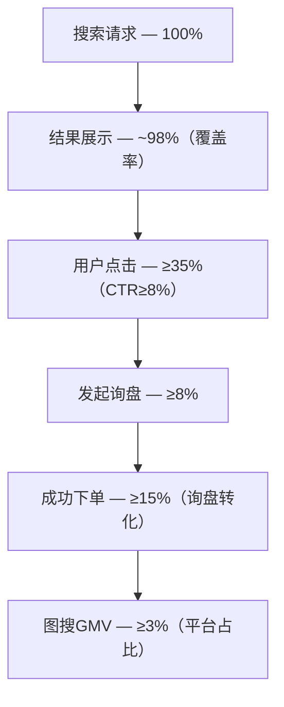

### 1.6 利益相关方

> [表格：含终端用户、商家、业务系统、产品经理、运维/SRE 五类角色]

---

## 二、数据规模与口径

### 2.1 图片数据规模

> [表格：总量 ~28亿(25亿滚动+3亿常青)、月增量 ~1.47亿]

### 2.2 每图最低数据模型

每张图片至少包含：向量 256d float32、商家列表 1-3000个、URI ≤128字符、标签 8-32个、三级类目。

**存储估算**（单图最低数据，不含索引开销）：

- 向量 = 256 × 4B = **1,024B** ≈ 1KB
- 商家列表 = 1-3000 × ~20B = **20B ~ 60KB**（原始字符串）/ **4B ~ 12KB**（Bitmap编码后）
- URI = ≤ **128B**
- 标签 = 8-32个 × ~20B = **160B ~ 640B**
- **单图合计** ≈ **1.2KB ~ 13KB**（Bitmap 编码后）

### 2.3 增量数据

> [表格：月增量 ~1.47亿图、日增量 ~490万、峰值日 ~900万]

### 2.4 图片-商家关联

每图关联商家数跨越三个数量级（1→3000），呈典型长尾分布。新图片入库时仅关联 1 个商家，随时间推移逐步积累。

**商家关联不可逆假设声明（v3.8 新增）**：当前系统设计假设商家关联**仅追加、不可逆**。

**分阶段计划**：

- **当前（v1.0-v1.1）**：仅支持追加，不支持解除关联
- **预留（v1.2+）**：若业务出现需求，可通过 REMOVE 事件 + rb_andnot() 实现，预估改造量 2-3 人周

### 2.5 商家规模与增长预测

> [表格：当前 4000万商家、10年预计增长至 2亿]

**商家 ID 说明**：商家 ID 为**字符串类型**（由商家系统分配），系统内部通过字典编码映射（string → uint32）支撑 Bitmap 运算。映射层对业务接口透明。

### 2.6 图片数据时间分层

> **v4.0 重构**：从三区（热/温/冷）演进为**两区（热区 + 非热区）**，对齐技术架构 v1.2 两区 HNSW + DiskANN 架构。

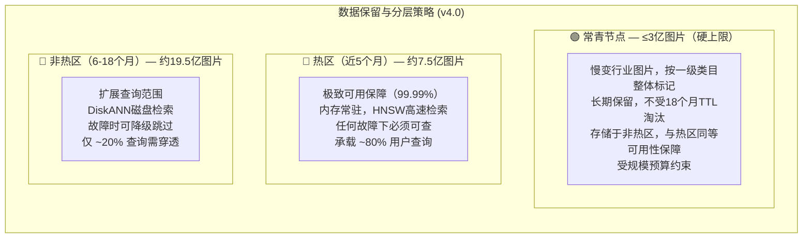

> **总计**：18个月滚动 ~26.5亿 + 常青 ≤3亿 = 总计 ~26.5-29.5亿

**原则说明**：常青节点与热区共同构成**业务核心能力承载区**，任何故障场景下必须可查；非热区是**能力扩展区**，可通过降级策略主动放弃。

### 2.7 数据生命周期管理

> [表格：滚动18个月TTL清理、常青独立治理、视频帧与源视频同生命周期]

### 2.8 常青池规模治理（v3.3 新增）

常青节点不受 18 个月 TTL 淘汰，但受 **≤3 亿硬上限**规模预算约束。

**常青标记驱动因子（v3.4 明确）**：按一级类目（category_l1）整体切分，由产品经理定义常青类目列表（只增不减）。写入时 update-image / update-video 必传 category_l1，系统查询常青类目配置表自动推导 is_evergreen。

**水位定义**：

| 水位 | 阈值 | 行动 |
|------|------|------|
| 绿区 | < 2.5亿 | 不清理 |
| 黄区 | 2.5-3亿 | 月度定期清理，年限递降 5→4→3→2年 |
| 红区 | ≥ 3亿 | 立即触发清理至 2.5亿以下 |

**清理规则**：

- 清理方式：直接删除（从全部存储引擎彻底移除），非降级回滚动池
- 清理顺序：按 promoted_at（提升为常青的时间）升序
- 年限下限：**2 年**，不可再降
- 兜底：2年以上全部删完仍超限，等下月自然老化后再清理，触发告警通知人工介入

---

## 三、领域模型与业务架构

> 本章内容整合自原《业务架构文档 v1.2》，涵盖业务流程、领域对象、状态机、业务逻辑、异常处理、数据实体与数据流图。

### 3.1 业务流程

#### 3.1.1 核心业务流程总览

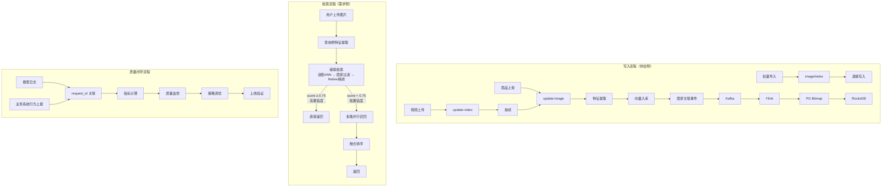

#### 3.1.2 检索流程详细

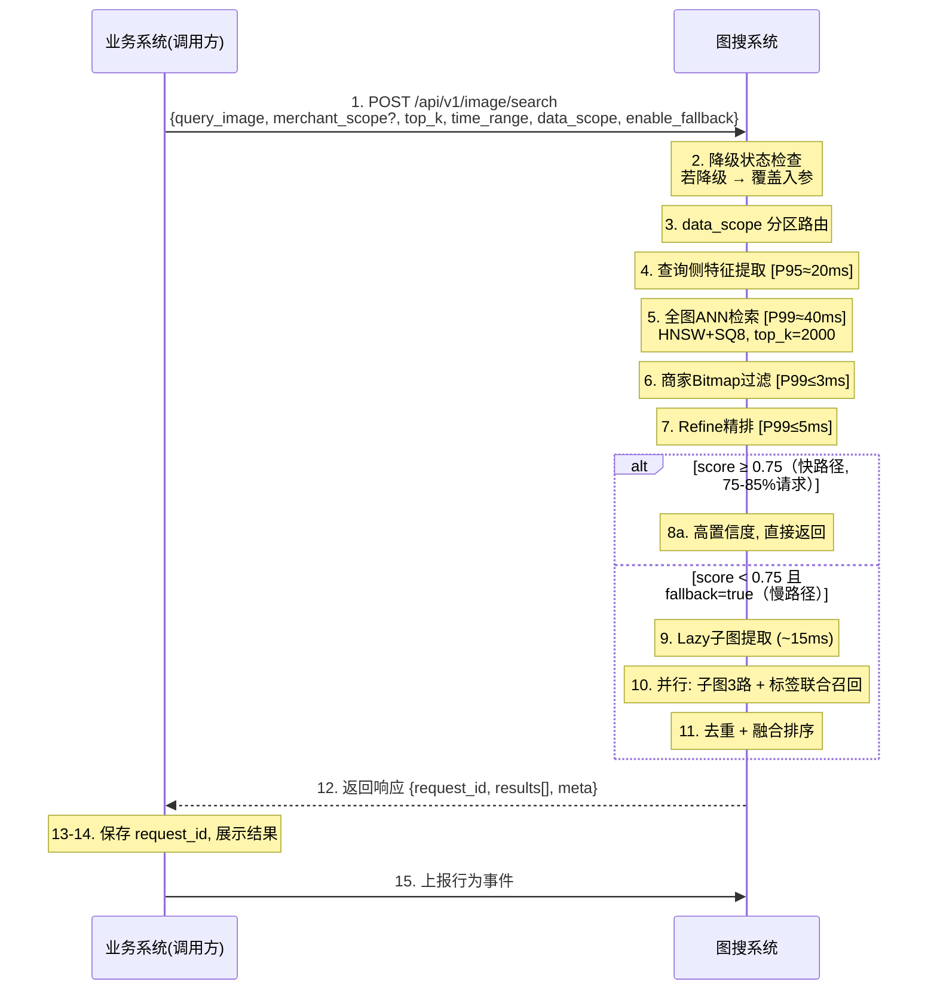

#### 3.1.3 写入流程详细

**update-image（生产主链路，占 95%+ 写入量）**

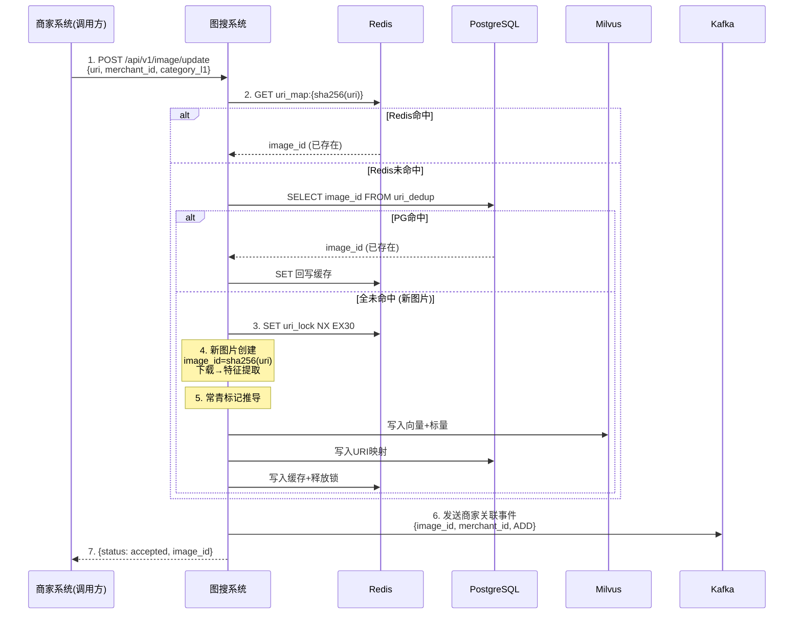

**update-video（视频写入链路）**：系统下载视频 → FFmpeg 提取前5秒3个关键帧 → 每帧独立走 update-image 内部流程。

#### 3.1.4 质量评估闭环流程

> [Mermaid 流程图：数据采集层 → 数据关联 → 在线/离线指标计算 → 质量监控大盘 → 诊断调优 → A/B测试验证]

#### 3.1.5 数据生命周期流程

> [Mermaid 流程图：写入 → 滚动分区(热区HNSW → 非热区DiskANN → TTL清理) + 常青分区(水位治理)]

### 3.2 对象实体

#### 3.2.1 领域对象模型

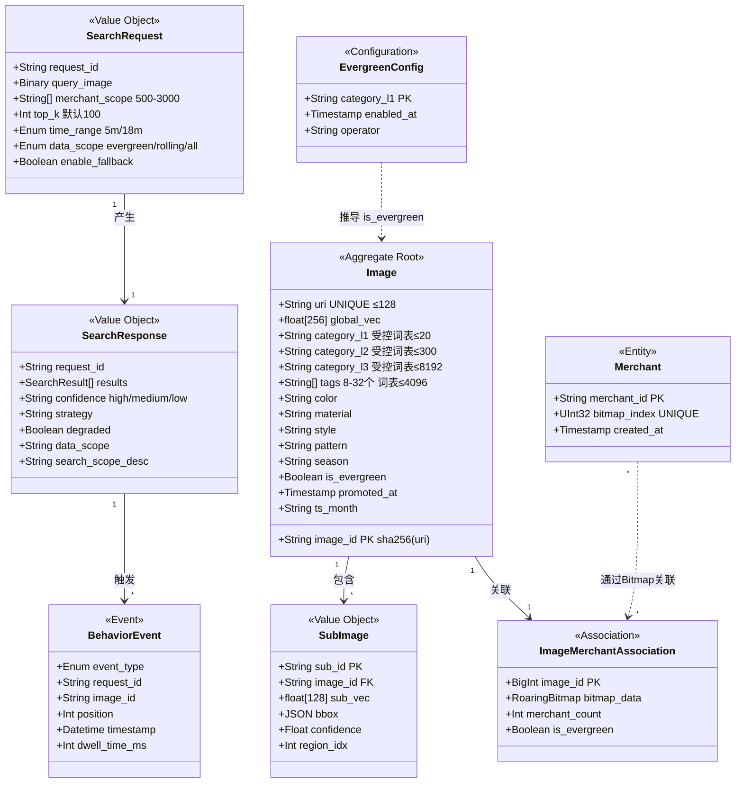

#### 3.2.2 对象实体详细说明

**Image（图片）— 核心聚合根**：
- image_id = sha256(uri) 前 16 字节 hex，确定性生成，天然幂等
- 标签和类目必须来自受控词表，写入时校验
- is_evergreen 由 category_l1 查询常青类目配置表自动推导

**SubImage（子图）— Image 的值对象**：
- 子图面积 < 原图 10% 时跳过
- 每图最多 5 个子图（按 confidence 降序取 Top5）
- 写入侧全量提取，查询侧 Lazy 按需提取

**Merchant（商家）— 独立实体**：
- 商家 ID 为字符串类型，系统内部通过字典编码映射为 uint32
- 当前 4000 万商家，10 年增长至 2 亿
- 字典编码 TTL 18 个月

**ImageMerchantAssociation（图片-商家关联）**：
- 每图关联 1-3000 个商家
- 写入采用 rb_or() 原子合并，天然幂等

### 3.3 状态机

#### 3.3.1 图片生命周期状态机

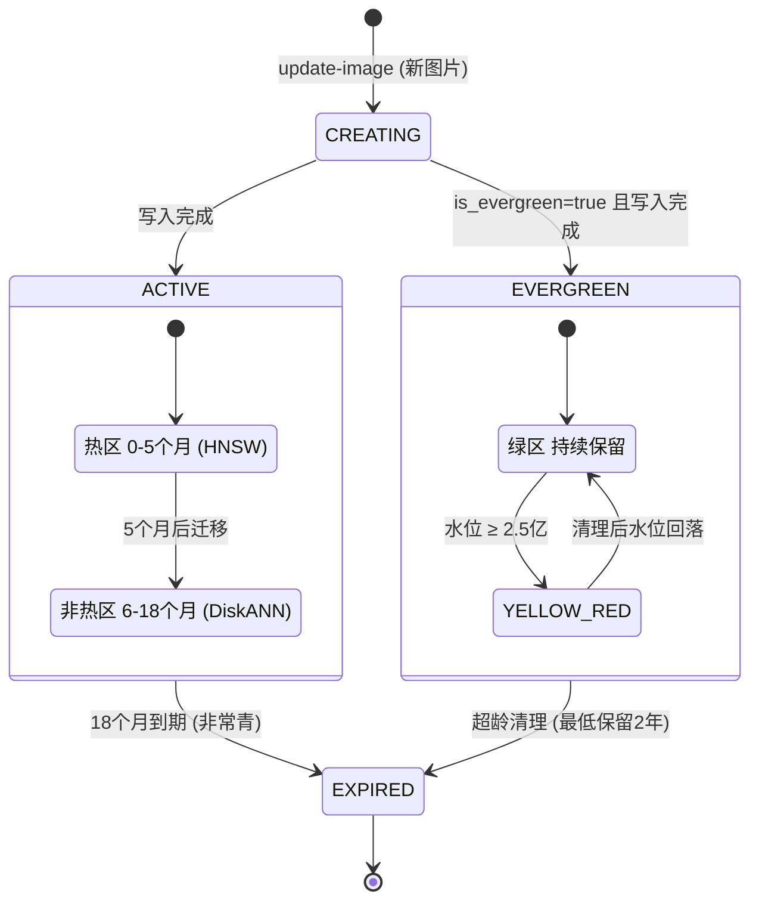

#### 3.3.2 搜索请求处理状态机

> [状态机：RECEIVED → 降级检查 → EXTRACTING(P95≈20ms) → SEARCHING(P99≈40ms) → FILTERING(P99≤3ms) → REFINING(P99≤5ms) → 置信度判定 → COMPLETED/FALLBACK]

#### 3.3.3 系统降级状态机

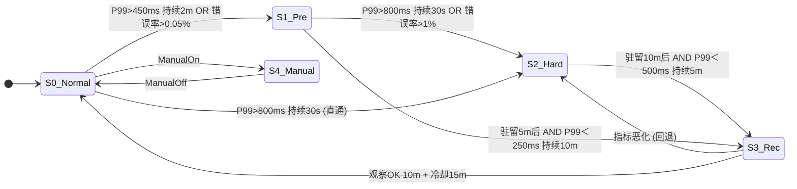

#### 3.3.4 商家过滤降级状态机

> [状态机：Level 0 本地RocksDB(P99≤3ms) → Level 1 远端PG(P99≈10ms) → Level 2 跳过过滤(filter_skipped=true)]

### 3.4 业务逻辑

#### 3.4.1 核心业务规则

| 规则 | 说明 |
|------|------|
| R1 URI唯一性 | image_id = sha256(uri) 前16字节hex，确定性生成，天然幂等 |
| R2 商家关联追加语义 | update-image 每次携带一个 merchant_id，商家列表逐步积累 |
| R3 并发安全 | 分布式锁(Redis SET NX EX30) + image_id确定性 + DB UNIQUE约束 |
| R4 常青推导 | is_evergreen = (category_l1 ∈ 常青类目配置表)，只增不减 |
| R5 类目冲突处理 | 系统AI提取 ≠ 传入值时，以传入为准，记录告警日志 |
| R6 常青池规模治理 | 绿区(<2.5亿)不清理 / 黄区(2.5-3亿)年限递降 / 红区(≥3亿)更激进 |
| R7 置信度分级 | HIGH(≥0.75) / MEDIUM(0.50-0.75) / LOW(<0.50) |
| R8 快路径vs慢路径 | score≥0.75→快路径(P95≈43ms) / score<0.75 AND fallback=true→慢路径(P95≈77ms) |
| R9 降级覆盖 | 降级模式下 time_range=5m, fallback=false，系统稳定性优先 |
| R10 data_scope路由 | evergreen/rolling/all 三种范围 × time_range 5m/18m 组合 |
| R11 融合排序 | final_score = 0.4×global_sim + 0.3×max(sub_sims) + 0.2×tag_overlap + 0.1×cat_match |
| R12 相似性分层 | L4完全相同 / L3同款 / L2高度相似 / L1类目相关 / L0不相关 |
| R13 PM可配置能力 | ✅PM可配(灰度验证) / ⚠️联合验证(A/B+技术评审) / ❌系统保护(架构评审会) |
| R14 接口向后兼容 | 新增字段采用可选参数(带默认值)，不破坏已有调用方 |

**置信度用户提示语义映射（v1.2 新增）**：

| 置信度 | 前端推荐提示文案 |
|--------|----------------|
| HIGH | "找到了与图片高度一致的商品" |
| MEDIUM | "未找到完全同款，以下是相似款式推荐" |
| LOW | "暂未找到高度相似商品，以下是同类推荐" |

**data_scope 分区路由（v4.0 修订）**：

| data_scope | time_range | 检索分区 |
|-----------|------------|---------|
| "evergreen" | (忽略) | 仅常青分区 |
| "rolling" | "5m" | 近5个月热区 (不含常青) |
| "rolling" | "18m" | 近18个月滚动 (热区+非热区) |
| "all"(默认) | "5m" | 近5个月热区 + 常青 |
| "all"(默认) | "18m" | 全量滚动 + 常青 |

#### 3.4.2 融合排序逻辑

```
final_score = w1 × global_sim      (权重 0.4)
            + w2 × max(sub_sims)   (权重 0.3)
            + w3 × tag_overlap     (权重 0.2)
            + w4 × cat_match       (权重 0.1)
```

#### 3.4.3 相似性分层标准

| 级别 | 含义 | 示例 |
|------|------|------|
| L4 | 完全相同 | 同一图片的不同版本（尺寸/水印/裁剪差异） |
| L3 | 同款商品 | 同一 SPU 的不同角度/场景/模特图 |
| L2 | 高度相似 | 不同商家的同款式商品（细节差异） |
| L1 | 类目相关 | 同类目但款式差异大 |
| L0 | 不相关 | 不同类目或无关内容 |

> 强相关(Recall计算): L2及以上 / 相关(Precision计算): L1及以上

### 3.5 异常处理

#### 3.5.1 异常分类

- **请求异常**：参数校验失败、图片格式不支持、merchant_scope 超限等 → HTTP 4xx
- **系统内部异常**：特征提取失败、向量写入失败 → 重试/降级/异步补偿
- **基础设施异常**：Redis/PG/Milvus 不可用 → 多级降级链路
- **业务异常**：商家未注册、类目词表外值 → HTTP 400 + 明确错误码

#### 3.5.2-3.5.4 写入/检索/视频异常处理

> [详见原文 flowchart 和表格]

### 3.6 数据实体

#### 3.6.1 数据实体关系图

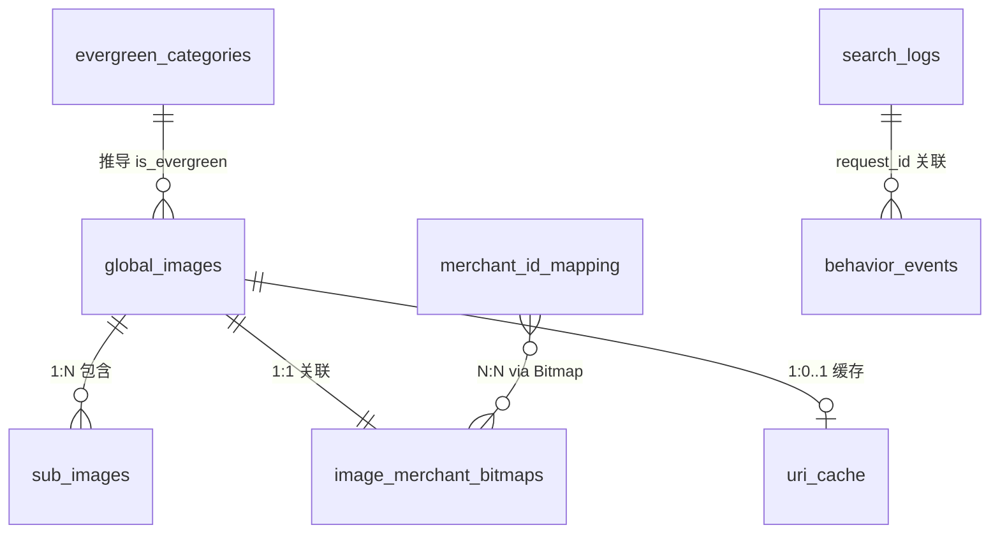

#### 3.6.2 存储引擎分工

| 引擎 | 角色 | 关键数据 |
|------|------|---------|
| **Milvus** | 向量检索 + 标量过滤 | 向量(HNSW/DiskANN) + 类目/属性/标签(INVERTED index) |
| **PostgreSQL** | 元数据 + Bitmap | URI映射、商家字典编码、商家Bitmap |
| **Redis** | 缓存 | URI查重缓存(90d)、字典编码缓存 |
| **RocksDB** | 本地 Bitmap 缓存 | 搜索节点本地 Bitmap 副本（CDC同步） |

#### 3.6.3 数据分区策略

> **v4.0 重构**：对齐技术架构 v1.2 两区分区模型。

```
┌─────────────────────────────────────────────────────────────────┐
│ Milvus 分区布局 (v4.0)                                          │
│ ┌──────────────────────────────────────────────────────────┐    │
│ │ 热区 (HNSW) — 最近 5 个月滚动数据                        │    │
│ │ ~7.5 亿向量 | 内存常驻 | 99.99% SLA                      │    │
│ └──────────────────────────────────────────────────────────┘    │
│ ┌──────────────────────────────────────────────────────────┐    │
│ │ 非热区 (DiskANN) — 第 6-18 月滚动 + 常青                 │    │
│ │ ~22 亿向量 (滚动 19.5 亿 + 常青 ≤3 亿)                   │    │
│ │ NVMe 磁盘检索 | 可降级跳过                                │    │
│ └──────────────────────────────────────────────────────────┘    │
│ 总计: 滚动 ~26.5 亿 + 常青 ≤3 亿 = ~29.5 亿                    │
└─────────────────────────────────────────────────────────────────┘
```

### 3.7 数据流图

> [DFD Level 0 / Level 1 / Level 2 写入数据流 / 检索数据流 / 质量评估数据流 — 详见原文 Mermaid 流程图]

---

## 四、功能需求

### 4.1 相似度检索

> [表格：检索功能详细规格]

### 4.2 商家范围过滤

**过滤语义**：`image.merchant_ids ∩ merchant_scope ≠ ∅`

**merchant_scope 来源说明（v4.0.1 新增）**：查询时传入的 merchant_scope（0-3000 个商家 ID）由调用方自行维护，图搜系统不负责集合的构建与更新。超过 3000 个商家的查询将被拒绝（HTTP 400）。

### 4.3 时间范围策略

> [表格：5m/18m 时间范围策略详细说明]

> 常青节点在 data_scope=all 时始终参与查询；data_scope=rolling 时不参与。

### 4.4 多粒度检索（长尾兜底）

> **v4.0 重构**：从单路 ANN + fallback 标签模式演进为两区级联 + 全量标签双路召回。

**检索策略级联流程（v4.0）**：

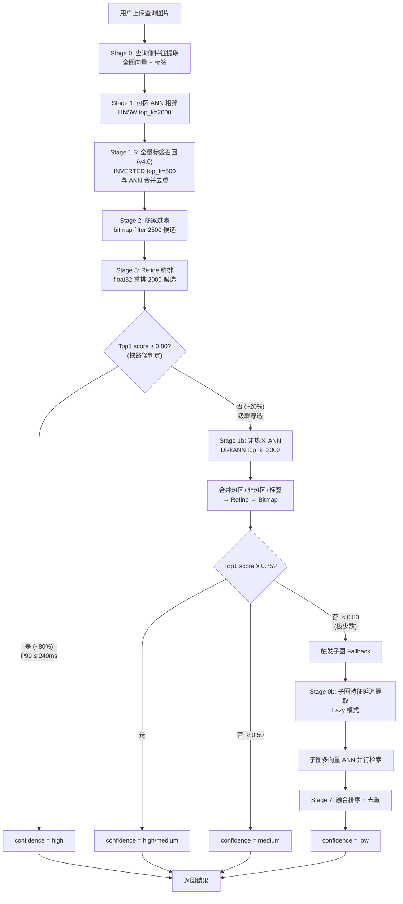

### 4.5 数据范围查询（v3.4 新增）

**data_scope 与 time_range 组合关系**：

| data_scope | time_range | 实际检索分区 | 典型场景 |
|-----------|------------|-------------|---------|
| "all"(默认) | "18m" | 全量滚动 + 常青 | 全量搜索 |
| "all"(默认) | "5m" | 近5月热区 + 常青 | 日常快搜 |
| "rolling" | "18m" | 近18月滚动 (不含常青) | 快变行业 |
| "evergreen" | (忽略) | 仅常青分区 | 慢变行业 |

---

## 五、性能与质量要求

### 5.1 在线查询性能（SLO）

> **v4.0 重构**：从单一 P99 <300ms 演进为**双路径延迟模型**。

| 路径 | 请求比例 | P99 目标 | 场景 |
|------|---------|---------|------|
| **快路径** | ~80% | **≤ 240ms** | 热区 HNSW ANN + 全量标签召回 → 商家过滤 → Refine, Top1 score ≥ 0.80 |
| **级联路径** | ~20% | **≤ 400ms** | 热区未命中 → 穿透非热区 DiskANN → 合并 → 过滤 → Refine |

**级联穿透率声明（v4.0.1 新增）**：~20% 为设计目标，非 SLA 承诺。穿透率指标 cascade_penetration_ratio 按小时统计。

**合作方超时配置要求（v4.0.1 强调）**：所有调用方必须将 timeout 设置为 **≥500ms**。

### 5.2 子系统延迟预算

**快路径预算（~80% 请求，热区命中）**：

| 阶段 | 内容 | 预算 |
|------|------|------|
| Stage 0 | 查询侧特征提取 (TensorRT FP16) | ≤ 30ms |
| Stage 1 | 热区 ANN (HNSW top_k=2000) | ≤ 40ms |
| Stage 1.5 | 全量标签召回 (INVERTED top_k=500) | ≤ 10ms |
| Stage 2 | 商家过滤 (bitmap-filter gRPC) | ≤ 8ms |
| Stage 3 | 精排 Refine (float32 重排 2000 候选) | ≤ 7ms |
| 其他 | 网络/序列化/降级判断 | ≤ 15ms |
| 富余 | 安全余量 | ~20ms |
| **快路径总计** | | **≤ 240ms** |

**标签召回截断保护（v4.0.1 新增）**：仅取 IDF 最高的 Top-5 标签参与召回；Stage 1.5 设置硬超时 10ms；tag_recall_timeout_ratio 预警 >5%，告警 >10%。

**级联路径追加预算（~20% 请求）**：

| 阶段 | 内容 | 预算 |
|------|------|------|
| Stage 1b | 非热区 DiskANN ANN | ≤ 120ms |
| 合并/Refine | 合并热区+非热区候选 | ≤ 25ms |
| 其他 | 富余 | ~15ms |
| **级联路径总计** | | **≤ 400ms** |

**v4.0 vs v3.9 变更说明**：(1) 全量标签召回从 fallback 专用提升为每次必执行(Stage 1.5)；(2) Refine 候选池从 500→2000；(3) 商家过滤 Batch 从 2000→2500；(4) 快路径总预算从 ≤108ms→≤240ms（ef_search=192 更精确但更慢），Recall 从 95%→98.5%。

#### 5.2.1 子图 Fallback 延迟预算

> 子图 Fallback 总延迟 P99 ≤ 级联路径 400ms + 45ms = **≤ 445ms**。仅极少数请求触发。

### 5.3 写入性能与可见性

> **v4.0 重构**：写入可见性 **3× 压缩**。

| 写入路径 | 说明 | P95 | P99 | v3.9→v4.0 变化 |
|---------|------|-----|-----|---------------|
| 路径1 批量写入(image/index) | 从接口返回到检索命中 | ≤ 5s | ≤ 10s | 15s→5s (3×) |
| 路径2 update-image(图片已存在) | 从接口返回到商家关联可见 | ≤ 10s | ≤ 20s | 30s→10s (3×) |
| 路径3 update-image(新图片) | 从接口返回到全部可见 | ≤ 15s | ≤ 30s | 45s→15s (3×) |

**可见性 SLA 适用范围声明（v4.0.1 新增）**：上述目标以生产主链路为第一优先级。迁移/异常补偿/月度维护链路允许退化，不计入核心可见性 SLA。

### 5.4 召回质量

> **v4.0 提升**：单路 Recall@100 从 ≥95% 提升至 **≥98%**（热区 98.5% / 非热区 98%）；系统级等效 Recall ≈99-99.5%。

**相关性定义所有权声明（v3.8 新增）**：产品+算法团队联合维护。

---

## 六、高可用与 SLA 设计

### 6.1 可用性目标（自然月）

| 功能层 | SLA | 月停机上限 | 覆盖范围 |
|--------|-----|----------|---------|
| **核心功能** | **99.99%** | ≤ 4.0-4.5 分钟 | 近5个月热区(~7.5亿) + 常青(≤3亿) |
| **完整功能** | **99.5%** | ≤ 3.4-3.9 小时 | 全量18个月(~26.5亿) + 常青(≤3亿) |

> **v4.0 变更**：核心功能 SLA 覆盖范围从近 3 月扩大至**近 5 月**。

### 6.2 SLA 设计原则

- 错误预算优先于功能完整性
- 热区(HNSW) + 常青稳定性优先于非热区(DiskANN)可用性
- 自动降级优先于人工干预

### 6.3 降级触发策略

| 级别 | 触发条件 | 持续时间 |
|------|---------|---------|
| **预降级** | P99 > 450ms OR 错误率 > 0.05% | ≥ 2 分钟 |
| **强降级** | P99 > 800ms OR 错误率 > 1% OR AZ不健康 | ≥ 30 秒 |

### 6.4 降级行为

降级时：强制回退至热区(近5月) + 常青；固定 Top100；跳过子图 fallback（全量标签召回仍保留）；返回 meta.degraded = true。

### 6.5-6.7 非热区故障处理 / 商家过滤降级 / 监控告警

> [详见原文表格和状态机]

---

## 七、接口需求

**向后兼容承诺（v3.7 新增）**。

**⚠️ 调用方超时配置要求（v4.0.1 新增）**：所有调用方必须将 HTTP 超时设置为 ≥500ms。

### 7.1 检索接口

`POST /api/v1/image/search`

**请求参数**：query_image(必填)、merchant_scope(可选,0-3000)、top_k(默认100,上限200)、time_range(5m/18m)、data_scope(evergreen/rolling/all)、enable_fallback(默认true)

**响应**：request_id、results[]（image_id, score, product_id, tags, category_l1/l2/l3, merchant_ids）、meta（confidence, strategy, degraded, data_scope, search_scope_desc, filter_skipped, is_evergreen）

### 7.2 写入接口

#### 7.2.1 update-image（生产主链路）

`POST /api/v1/image/update` — 参数：uri(必填,≤128)、merchant_id(必填)、category_l1(必填)、product_id(可选)

#### 7.2.2 批量写入接口（image/index）

> 用于数据迁移、管理后台等场景

#### 7.2.3 商家关联增量更新

> [详见原文]

#### 7.2.4 视频写入接口（update-video, v3.4 新增）

`POST /api/v1/video/update` — 参数：video_uri(必填)、merchant_id(必填)、category_l1(必填)

---

## 八、数据质量要求

### 8.1 每图必填数据校验

> [详见原文表格：批量写入校验 / 生产写入校验 / 视频写入校验]

### 8.2 图片特征提取

> 写入侧（离线/异步）+ 查询侧（在线 P99 ≤ 30ms）

### 8.3 子图提取规则

> 面积 ≥ 10% / 每图最多5个 / confidence降序

### 8.4 标签质量

> 分类词表 ≤8192 / 标签词表 ≤4096 / 每图合计上限32个 / 内部整数编码存储

### 8.5 商家关联数据质量

> [详见原文表格]

### 8.6 质量闭环

**行为上报边界声明（v3.8 新增）**：行为上报为可选增强能力，不属于核心功能。

**上报完整性免责条款（v4.0.1 新增）**：上报覆盖率 <80% 时业务指标仅作趋势参考，Go/No-Go 止损线不启用。

### 8.7 产品可配置能力边界（v3.7 新增）

| 分类 | 项目 |
|------|------|
| ✅ PM 可配置 | 常青类目列表、data_scope默认值、confidence提示文案、search_scope_desc模板 |
| ⚠️ 联合验证 | 相似度阈值(当前0.75)、Top-K默认值(当前100) |
| ❌ 系统保护 | fallback开关、Top-K硬上限(200)、降级阈值、时间分层边界、常青池硬上限(3亿) |

**反滥用使用约束**：

> [表格：禁止的使用方式]

**调用方依赖级别定义**：

> [表格：L0 / L1 / L2 三级依赖]

---

## 九、成本约束与演进原则

### 9.1 设计原则

最简可行方案先上线，监控驱动演进，不过度设计。

### 9.2 分阶段演进预期

> **v4.0 变更**：从单一云部署方案演进为双部署方案。

> [表格：当前基线成本——云方案 / 自建 IDC 方案对比]

---

## 十、验收标准

### 10.0 验收总则（v3.7 新增）

**P0 必测主干路径**：data_scope=all + time_range=18m + 多商家过滤 + update-image 两路径 + 快路径端到端 + 双路径 P99 达标

**P1 抽样覆盖路径**：data_scope 独立查询 / 子图 fallback / 非热区降级 / 商家过滤降级链路 / update-video / confidence标记

**P2 极端验证路径**：单图3000商家 / 单图1商家 / URI上限 / 标签上下限 / 常青池清理行为

### 10.1-10.4 功能/性能/数据规模/高可用验收

> [详见原文表格]

### 10.5 阶段性止损线（Go / No-Go, v3.7 新增）

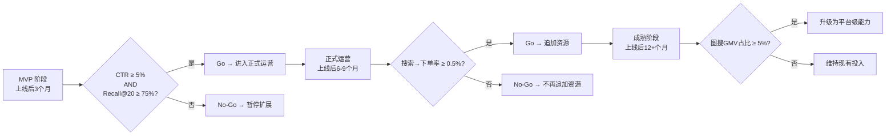

---

## 十一、三视角验收 Checklist

### A. 研发视角（Engineering）

- [ ] 热区(HNSW)/非热区(DiskANN)/常青分区逻辑隔离清晰
- [ ] data_scope 参数正确路由查询分区
- [ ] 系统降级可覆盖用户入参，所有降级路径可自动触发
- [ ] 商家过滤子系统具备独立降级链路
- [ ] 快路径 P99 ≤ 240ms / 级联路径 P99 ≤ 400ms（含500-3000商家过滤）
- [ ] 查询侧特征提取 P99 ≤ 30ms
- [ ] 推理引擎 TensorRT/ONNX Runtime FP16，单次backbone ≤ 15ms
- [ ] Lazy模式：全图 Top1 score ≥ 0.80 时无 YOLOv8 调用
- [ ] Refine 热区 P99 ≤ 7ms（候选池2000）
- [ ] 全量标签召回每次必执行（Stage 1.5）
- [ ] Fallback 多路召回并行执行
- [ ] meta.search_scope_desc / 接口向后兼容

### B. 测试视角（QA）

- [ ] 单/多商家过滤正确（字符串ID，500/1000/3000三档）
- [ ] 5m/18m策略正确，常青始终参与
- [ ] update-image 两路径（已有图/新图）
- [ ] update-video 正常/异常场景
- [ ] confidence 三档标记 + 用户提示语义
- [ ] 降级注入→自动降级→恢复后自动回切
- [ ] 压测：快路径 P99 ≤ 240ms / 级联路径 P99 ≤ 400ms

### C. 运维/SRE 视角

- [ ] 自然月 SLA 计算正确 + 错误预算可统计
- [ ] 无需人工即可降级/恢复
- [ ] 单 AZ 故障核心功能无感
- [ ] 商家增长/过滤延迟/存储容量可监控
- [ ] 常青节点水位告警（绿<2.5亿/黄2.5-3亿/红≥3亿）

---

## 附录A：名词解释

> [表格：ANN、Bitmap、CLIP、DiskANN、HNSW、INVERTED、Milvus、Refine、RocksDB、SQ8等术语]

## 附录B：关联文档

| 文档 | 版本 | 说明 |
|------|------|------|
| 技术架构文档 | v1.2 | 两区架构 HNSW+DiskANN 详细设计 |
| 系统设计文档 | v1.1 | 系统级详细设计 |
| 业务协作与治理说明 | v1.0 | 各方协作规范 |

## 附录C：变更历史

> [表格：v1.0 → v2.0 → v3.0 → ... → v3.9 → v4.0 → v4.0.1 完整变更记录]
