# 以图搜商品系统 — 技术架构文档

**版本**：v1.3
**日期**：2026-02-10
**状态**：评审闭环版（v1.3: 五轮评审风险闭环 + 现有系统迁移对齐 + 文档一致性修复）
**适用范围**：研发 / 架构评审 / SRE / 技术管理 / 合作方技术对接
**关联文档**：BRD v3.9 / 系统设计文档 v1.1 / 业务协作与治理说明 v1.0 / 评审整合报告 v1.1 / 数据追平与灰度验证方案 v1.0

---

## 一、架构概述

### 1.1 文档定位

本文档是以图搜商品系统的**技术架构全景**，定义系统的物理与逻辑架构、技术选型依据、核心子系统设计、数据架构、高可用策略、测试验收规范、变更管理、运维规范和资源规划。与关联文档的分工如下：

| 文档 | 回答的问题 |
|------|---------|
| BRD v3.9 | 做什么？达到什么标准？ |
| BRD v3.9 §三 | 业务怎么运转？对象关系和流程？（原业务架构文档 v1.2，已合并入 BRD） |
| **技术架构文档 v1.3（本文）** | **怎么建？用什么建？部署在哪？如何保障？如何验收？如何运维？** |
| 业务协作与治理说明 v1.0 | 合作方怎么接？依赖边界？语义契约？ |

### 1.2 系统全局指标

| 维度 | 指标 | 目标 |
|------|------|------|
| 数据规模 | 系统总容量 | 滚动 ~26.5 亿 + 常青 ≤3 亿 ≈ **~29.5 亿图片** |
| 数据规模 | 月增量 | ~1.47 亿（图片 ~1.4 亿 + 视频帧 ~700 万） |
| 在线性能 | QPS | > 100 |
| 在线性能 | 快路径 P99 | ≤ 240ms（热区 HNSW + 全量标签召回, ~80% 请求） |
| 在线性能 | 级联路径 P99 | ≤ 400ms（穿透非热区 DiskANN, ~20% 请求） |
| 写入性能 | 峰值吞吐 | ~281/秒（集中 6 小时） |
| 写入性能 | 可见性 P95 | ≤ 5s（Level 1 向量可搜）/ ≤ 10s（Level 2 含商家过滤）/ ≤ 15s（Level 3 新图片完整链路） |
| 可用性 | 核心功能 SLA | 99.99%（近 5 个月热区 + 常青） |
| 可用性 | 完整功能 SLA | 99.5%（全量 18 个月 + 常青） |
| 召回质量 | 单路 ANN Recall@100 | ≥ 98%（热区 98.5%, 非热区 98%） |
| 召回质量 | 系统级等效 Recall@100 | ≈ 99-99.5%（含全量标签双路召回 + Refine 扩池） |
| 召回质量 | Precision@100 | ≥ 90% |
| 成本 | 月度基线 | 方案 A（云上）：¥249,200（36 台）；方案 B（自建 IDC）：¥44,600 运营 + ¥88.7k 折旧（24 台物理机） |

### 1.3 架构约束与设计原则

```
P0  最简可行方案先上线，监控驱动演进，不过度设计
P1  系统降级 > 用户入参，稳定性优先于查询完整性
P2  热区（HNSW）+ 常青稳定性优先于非热区（DiskANN）可用性
    P2.1 DiskANN = Best-effort 非热层（v1.3 评审闭环）
         非热区 P99 > 400ms 持续 5min OR 索引重建 > 6h → 自动退回热区+常青
         完整功能 SLA 99.5% 不构成对 DiskANN 单引擎的强承诺
    P2.2 bitmap-filter-service = 商家隔离语义的核心执行者（v1.3 评审闭环）
         全不可用时禁止返回无过滤结果，必须触发 S2/S4 降级
P3  错误预算优先于功能完整性
P4  接口向后兼容，新增字段带默认值，非兼容变更走新版本
P5  架构设计保留策略替换接口，支持未来平滑升级
```

### 1.4 非目标边界（对齐 BRD v3.9 §1.4）

本系统是**增强型商品发现能力**，不承担交易关键路径。最坏情况下可完全关闭，对核心交易链路无影响。以下明确不在当前技术架构范围内：

- 不保证 100% 找同款（概率性检索）
- 不支持跨行业语义理解（仅视觉特征）
- 不支持人工干预单次搜索结果
- 不替代关键词搜索
- 不支持视频内容语义检索（仅关键帧静态特征）

**使用约束声明**：任何将图搜结果作为业务唯一数据来源或交易关键路径的场景，需自行承担降级与不可用风险，图搜 SLA 不为此类场景兜底。详见《业务协作与治理说明 v1.0》§5。

### 1.5 现有系统与迁移路径（v1.3 新增）

> 本文档描述的是系统**终态架构**。SZWEGO 当前运行一套基于 Milvus 1.1 的图搜系统（自建 IDC, K8s 管理, MinIO 存储），与本文档 Milvus 2.5+ 架构**数据格式/API 完全不兼容**，无法原地升级。

**三阶段迁移路径**（详见《数据追平与灰度验证方案 v1.0》）：

| 阶段 | 部署 | 角色 | 老系统状态 | 关键机制 |
|------|------|------|----------|---------|
| 1. 云上最小热区 | 云上 Milvus 2.5+ 最小热区 | 降级兜底 + 备份 | IDC Milvus 1.1 为主 | nginx mirror 零侵入双写 |
| 2. 并行验证（3 个月+） | 云上热区承接 S1 降级流量 | 降级数据源 | IDC 仍为主路径 | 影子查询对比 + 降级兜底验证 |
| 3. IDC 全面改造 | IDC 部署本文档终态架构 | 生产主力 | 切主 → 下线 | nginx fallback 3 秒回滚 |

**对本文档的影响**：
- §2.2 部署架构、§9 资源规划描述的是**阶段 3 终态**
- DiskANN 非热区在阶段 3 才上线，阶段 1-2 仅有 HNSW 热区
- 五轮评审中多项 P2 风险可在阶段 1 云上低流量环境中提前验证

---

## 二、系统拓扑

### 2.1 逻辑架构

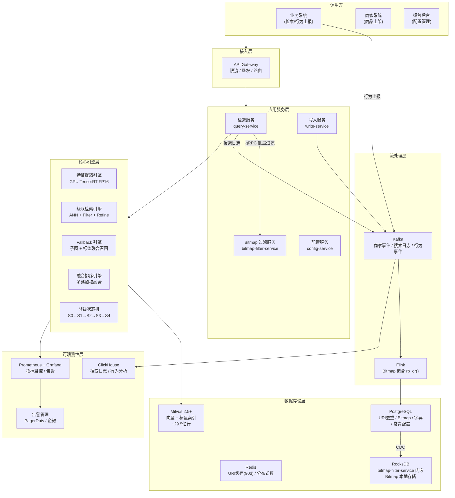

### 2.2 部署架构

> **v1.2 重构**：从三区全 HNSW 架构（44 台云实例）演进为**两区架构（热区 HNSW + 非热区 DiskANN）**，支持云上和自建 IDC 双部署方案。详见系统设计文档 §附录E。

**方案 A：云上部署（36 台实例）**

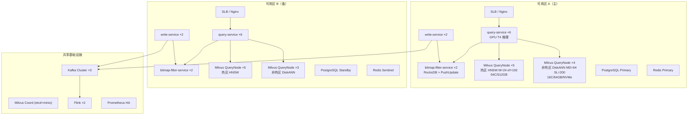

**方案 B：自建 IDC 部署（24 台物理机，使用 19 / 空闲 5）**

```
┌─────────────────────────────────────────────────────────────────┐
│  自建 IDC (24 × AMD EPYC 7763 双路 128C/2TB/4TB NVMe)          │
│                                                                  │
│  ┌─ GPU 推理 (4 台) ──────────────────────────────────────────┐ │
│  │  2 × RTX 4080Ti (~450 img/s)  +  2 × RTX 3090 (~320 img/s)│ │
│  │  合计 ~2,000 img/s                                         │ │
│  └────────────────────────────────────────────────────────────┘ │
│                                                                  │
│  ┌─ 热区 HNSW (8 台) ─┐  ┌─ 非热区 DiskANN (3 台) ──────────┐ │
│  │  7.5 亿向量          │  │  20.5 亿向量                     │ │
│  │  M=24, ef=192        │  │  MD=64, SL=200                   │ │
│  │  Recall ≈98.5%       │  │  Recall ≈98%                     │ │
│  │  ~120 QPS/台         │  │  ~400 QPS/台 (128C)              │ │
│  └─────────────────────┘  └───────────────────────────────────┘ │
│                                                                  │
│  ┌─ bitmap-filter (1 台) ┐  ┌─ MinIO (2 台) ┐  ┌─ Coord (1 台)│ │
│  └───────────────────────┘  └────────────────┘  └──────────────┘ │
│                                                                  │
│  ┌─ 空闲 / 备用 (5 台) ──── HA 副本或业务扩展 ────────────────┐ │
│  └────────────────────────────────────────────────────────────┘ │
└─────────────────────────────────────────────────────────────────┘
```

#### 2.2.1 运行形态与调度规范（v1.1 新增）

**运行形态**：Kubernetes 1.28+

**NodePool 划分**：

| NodePool | 用途 | 节点规格 | taint | 数量 |
|----------|------|---------|-------|------|
| gpu-pool | query-service | 16C 32G + T4 ×1 | `nvidia.com/gpu=present:NoSchedule` | 12 (6×2 AZ) |
| hnsw-pool | Milvus 热区 QueryNode | 64C 512G | `app=milvus-hot:NoSchedule` | 10 (5×2 AZ) |
| diskann-pool | Milvus 非热区 QueryNode | 16C 64G + 2TB NVMe | `app=milvus-nonhot:NoSchedule` | 7 (4+3 AZ) |
| bitmap-pool | bitmap-filter-service | 16C 32G + 1TB NVMe | — | 4 (2×2 AZ) |
| data-pool | PG / Redis / Kafka / Flink / write-service | 16C 64G + SSD | — | ~15 |
| obs-pool | Prometheus / Grafana / ClickHouse | 16C 32G + SSD | — | 4 |

**资源配置基线**：

| 组件 | requests | limits | 说明 |
|------|----------|--------|------|
| query-service | cpu:8, mem:16Gi, gpu:1 | cpu:14, mem:28Gi, gpu:1 | GPU 独占 |
| bitmap-filter-service | cpu:8, mem:24Gi | cpu:14, mem:28Gi | 内存留给 RocksDB Block Cache |
| write-service | cpu:4, mem:8Gi | cpu:6, mem:12Gi | |
| Milvus QueryNode | cpu:24, mem:96Gi | cpu:30, mem:120Gi | 内存 75% 用于向量缓存 |

**扩缩容策略**：

| 组件 | 策略 | 触发条件 | 保护措施 |
|------|------|---------|---------|
| query-service | HPA | CPU >70% 或 GPU 队列 >4 | 冷却期 15min, 最低 4 副本 |
| write-service | HPA | Kafka consumer lag >10000 | 冷却期 10min, 最低 2 副本 |
| bitmap-filter-service | 手动 | CDC lag >10s 或过滤 P99 >6ms | 需 SRE Lead 审批 |
| Milvus QueryNode | 手动 | 内存 >85% 或查询队列 >500 | 需架构评审会 |

### 2.3 网络拓扑

```
                    ┌─────────────────────────────────────┐
                    │         Internet / CDN              │
                    └──────────────┬──────────────────────┘
                                   │
                    ┌──────────────▼──────────────────────┐
                    │       SLB (公网 → VPC)              │
                    │       HTTPS TLS 1.3                 │
                    └──────────────┬──────────────────────┘
                                   │
              ┌────────────────────┼────────────────────┐
              │                    │                    │
    ┌─────────▼──────────┐ ┌──────▼──────────┐ ┌──────▼──────────┐
    │  query-service      │ │  write-service  │ │  config-service │
    │  10.0.1.0/24       │ │  10.0.2.0/24   │ │  10.0.3.0/24   │
    └───┬─────┬──────────┘ └──────┬──────────┘ └────────────────┘
        │     │                    │
        │  ┌──▼──────────────┐    │
        │  │bitmap-filter-svc│    │
        │  │  10.0.4.0/24   │    │
        │  └──────┬──────────┘    │
        │         │               │
    ┌───▼─────────▼───────────────▼──────────────────────────────┐
    │              数据平面 (10.0.10.0/24)                         │
    │  Milvus | PostgreSQL | Redis | RocksDB | Kafka | Flink     │
    └─────────────────────────────────────────────────────────────┘
```

关键网络策略：query-service 与 Milvus 之间走内网千兆/万兆直连；query-service 与 bitmap-filter-service 走同 VPC gRPC 长连接；GPU 推理节点与 query-service 同机部署减少序列化开销；跨 AZ 复制走专线。

---

## 三、技术选型

### 3.1 核心技术栈

| 层次 | 组件 | 技术选型 | 选型理由 |
|------|------|---------|---------|
| **向量引擎** | ANN 检索 + 标量过滤 | **Milvus 2.5+** | 百亿规模验证、HNSW+DiskANN+INVERTED 融合、自托管可控 |
| 热区索引 | 256 维向量 (0-5 月滚动) | HNSW M=24 + Refine | 内存常驻, Recall ≈98.5%, P99 ≤150ms |
| 非热区索引 | 256 维向量 (6-18 月滚动 + 常青) | DiskANN MD=64 SL=200 | NVMe 磁盘检索, Recall ≈98%, P99 ≤250ms |
| 子图索引 | 128 维向量 | IVF_PQ | 成本优先，~120 亿行子图向量需 PQ 压缩 |
| 标量过滤 | 类目/标签/属性 | Milvus INVERTED index | pre-filter 与向量检索融合，全量双路召回 ~5-10ms |
| **商家过滤** | Bitmap 交集运算 | Roaring Bitmap | 外置后过滤；支持 1~3000 宽分布 Bitmap |
| 商家过滤持久化 | Bitmap 写入/聚合 | PG + pg_roaringbitmap | rb_or() 原子合并，天然幂等 |
| 商家过滤查询 | 独立 Bitmap 过滤服务 | **bitmap-filter-service + RocksDB** | P99 ≤ 8ms (含 gRPC)，4 节点 HA |
| **URI 去重** | 写入去重 | Redis (90d TTL) + PG 全局去重表 | 3 层查询：Redis → PG uri_dedup → 新建 |
| ID 生成 | image_pk | sha256(uri) 前 16 字节 hex → CHAR(32) | 天然幂等，碰撞概率 10⁻²⁰ |
| **特征提取** | 模型推理 | CLIP/ViT + YOLOv8 + 多任务分类 | 写入侧全量提取，查询侧 Lazy 模式 |
| 推理加速 | 在线推理 | TensorRT FP16 (GPU T4) | backbone ≤15ms，满足 Stage 1 ≤30ms |
| **商家字典** | string→uint32 | PG 自增序列 + 内存缓存 | 4000 万→2 亿商家，uint32 足够 |
| **消息队列** | 事件流 | Kafka | 削峰填谷、搜索日志、行为事件 |
| **流处理** | Bitmap 聚合 | Flink | string→uint32 转换 + rb_or() 窗口聚合 |
| **缓存** | 热数据加速 | Redis Cluster | URI 缓存、常青配置缓存、热点查询 |
| **关系存储** | 结构化数据 | PostgreSQL 15+ | URI 去重、Bitmap 持久化、字典编码、配置 |
| **分析存储** | 日志分析 | ClickHouse | 搜索日志、行为事件、质量大盘 |
| **监控** | 可观测性 | Prometheus + Grafana | 指标采集、告警、SLA 看板 |

### 3.2 Milvus 选型决策

**对比矩阵**：

| 维度 | Milvus 2.5+ | Elasticsearch 8.x | Vespa | 自研 |
|------|------------|-------------------|-------|------|
| 29.5 亿向量 | ✅ 原生支持 | ⚠️ 需分片调优 | ✅ | ✅ |
| HNSW + DiskANN | ✅ 原生 | ✅ | ✅ | 需自实现 |
| 标量 INVERTED | ✅ 原生 | ✅ 更强 | ✅ | 需自实现 |
| 按月分区 | ✅ Partition | ✅ Index | ✅ | 需自实现 |
| 成本 | 中 | 高（JVM 内存） | 中 | 极高（人力） |
| 运维复杂度 | 中 | 高 | 高 | 极高 |
| 社区成熟度 | ✅ 活跃 | ✅ 最成熟 | ⚠️ 较小 | 无 |

**选择 Milvus 的关键理由**：
1. 向量原生：无需为向量场景适配全文搜索引擎
2. **双索引支持**：同一集群内 HNSW（热区内存）+ DiskANN（非热区 NVMe）并存，无需独立系统
3. 标量融合：INVERTED index 的 pre-filter 满足类目/标签全量双路召回需求，无需独立 ES 集群
4. 成本：DiskANN 非热区仅需 ~64GB PQ 编码内存 + NVMe 磁盘，相比全 HNSW 节省 ~70% 内存
5. 商家过滤外置：Milvus 不原生支持 Bitmap 交集运算，但本方案已设计外置 bitmap-filter-service 方案

**放弃 ES 的理由**：29.5 亿行向量的 ES 集群需 ~40+ 节点（每节点 64GB JVM），月成本远超 Milvus 方案。且 ES 的 kNN 是 "bolt-on" 能力，不如 Milvus 的 native vector 设计高效。

### 3.3 向量维度选型

| 维度 | 召回质量 | 存储成本 | 检索延迟 | 适用场景 |
|------|---------|---------|---------|---------|
| 128 | 基础 | 最低 | 最快 | 子图（精度敏感度低） |
| **256** | **良好** | **较低** | **快** | **全图（主选，工业主流）** |
| 384 | 较优 | 中等 | 中等 | 高精度场景 |
| 768 | 最优 | 最高 | 最慢 | 模型原生输出 |

**决策**：全图 256 维（CLIP/ViT 768→256 PCA 降维，召回损失 <3%）；子图 128 维（独立投影头 768→128）。SIMD 对齐（256=8×32 AVX2 友好），存储比 768 维降低 66%。

### 3.4 整数编码策略（v3.6）

类目/属性/标签在系统内部统一采用整数编码存储：

```
对 API 调用方透明:
  写入: category_l1="家具" → API 层查词表 → INT 42 → 存入 Milvus
  检索: Milvus 返回 INT 42 → API 层反查 → 响应 category_l1="家具"

收益:
  - Milvus INVERTED index 对 INT 字段效率更高
  - 存储空间降低 ~80%
  - 词表变更只需更新映射表，无需重建索引
```

---

## 四、数据架构

### 4.1 存储引擎分工总览

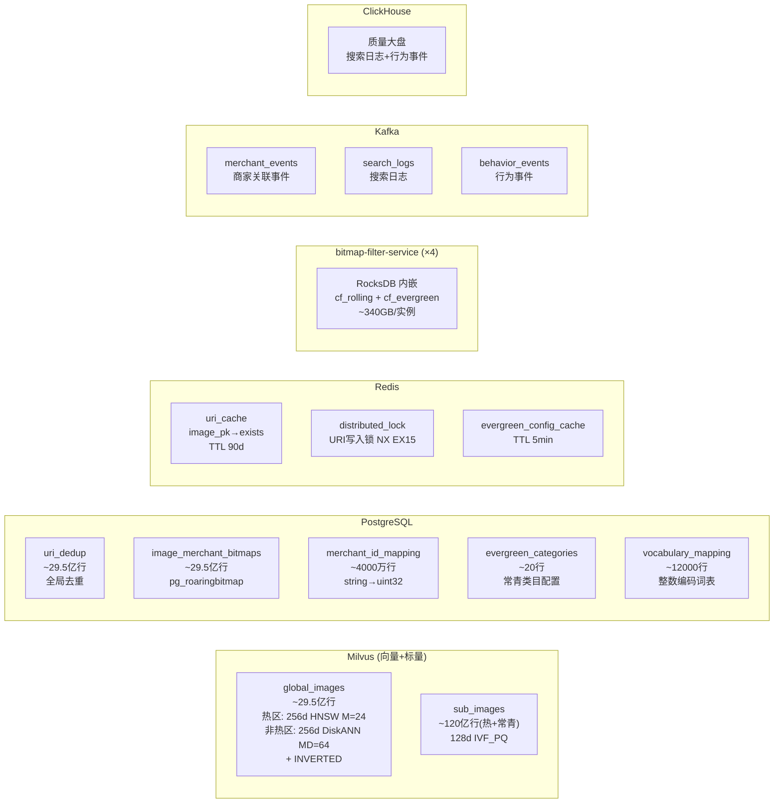

### 4.2 ID 规范（v1.1 统一）

```
image_pk:  CHAR(32)  — sha256(uri) 前 16 字节 hex (32 个十六进制字符)
                       碰撞概率: n²/(2×2^128) ≈ 1.3×10⁻²⁰ (29.5 亿规模下安全)

全链路统一:
  Milvus Primary Key  → VARCHAR(32)    (Milvus 2.5 支持 VARCHAR PK)
  PG 所有表            → CHAR(32)
  RocksDB Key          → 16 bytes      (hex decode 后的原始字节)
  Kafka 事件           → image_pk CHAR(32)
  API 响应 image_id    → 即 image_pk CHAR(32), 对外字段名保持 image_id

生成规则:
  image_pk = hex(sha256(uri)[0:16])    // 确定性, 同一 URI 永远相同
  幂等性: 同一 URI 多次写入, image_pk 不变
```

### 4.3 数据规模估算

| 存储 | 数据量 | 存储大小 | 说明 |
|------|--------|---------|------|
| Milvus 热区向量 (HNSW M=24) | ~7.5 亿行 × 256d | ~1.7 TB/副本 | 内存常驻, 含 HNSW 邻接表 |
| Milvus 非热区向量 (DiskANN) | ~22 亿行 × 256d | ~4.1 TB (NVMe) | PQ 编码 ~64GB RAM + 磁盘图索引 |
| Milvus 全图标量 | ~29.5 亿行 × ~20 字段 | ~150 GB | INVERTED index (全量标签召回) |
| Milvus 子图向量 | ~120 亿行 × 128d | ~580 GB | IVF_PQ, 仅热区+常青 |
| PG uri_dedup | ~29.5 亿行 | ~350 GB | image_pk + uri_hash + ts_month |
| PG Bitmap | ~29.5 亿行 | ~680 GB | Roaring Bitmap 变长 |
| PG 字典编码 | ~4000 万行 | ~3 GB | string→uint32 |
| Redis URI 缓存 | ~7.5 亿（热区 5 月） | ~50 GB | image_pk(32B) + flag, 90 天 TTL |
| RocksDB (每 bitmap-filter 实例) | ~29.5 亿行 | ~340 GB | 4 实例总计 ~1.4 TB |
| **存储总计** | | **~7.7 TB (Milvus+PG+Redis)** | 不含 RocksDB 实例副本 |

**Worst-case 规模防线（v1.3 评审闭环）**：

| 维度 | 设计上限 | 预警线 | 硬限制 | 超限动作 |
|------|---------|--------|--------|---------|
| 常青数据总量 | ≤3 亿 | 2.5 亿（黄区） | 2.8 亿（红区，持续 7 天） | SRE + 产品联合审批后清理超龄图片 |
| 子图总量 | ~120 亿 | 150 亿 | 200 亿 | 仅保留 fallback 子集（热区+常青），非热区子图下线 |
| merchant_scope 单次请求 | ≤3000 | 2000 | 3000 | >3000 返回 400 INVALID_SCOPE_SIZE |
| 滚动分区月增量 | ~1.47 亿 | 2 亿 | 3 亿 | 触发写入限流 + 容量评审 |

### 4.4 Milvus 分区策略

> **v1.2 重构**：从三区（热/温/冷）全 HNSW 架构演进为**两区（热区 HNSW + 非热区 DiskANN）**架构。消除 mmap 温冷区，用 DiskANN 替代，大幅降低内存需求（~70%）且 Recall 从 97% 提升至 98-98.5%。

```
┌─────────────────────────────────────────────────────────────────────┐
│                   Milvus Collection 分区布局 (v1.2)                   │
│                                                                      │
│  ┌──────────────────────────────────────────────────────────────┐   │
│  │           热区 (HNSW)  —  最近 5 个月滚动数据                   │   │
│  │           ~7.5 亿向量 | 内存常驻                                │   │
│  │           索引: HNSW M=24, ef_search=192, Recall ≈ 98.5%      │   │
│  │                                                                │   │
│  │  ┌──────┐ ┌──────┐ ┌──────┐ ┌──────┐ ┌──────┐               │   │
│  │  │02 月 │ │01 月 │ │12 月 │ │11 月 │ │10 月 │               │   │
│  │  │当月  │ │只读  │ │只读  │ │只读  │ │只读  │               │   │
│  │  └──────┘ └──────┘ └──────┘ └──────┘ └──────┘               │   │
│  └──────────────────────────────────────────────────────────────┘   │
│                                                                      │
│  ┌──────────────────────────────────────────────────────────────┐   │
│  │        非热区 (DiskANN)  —  第 6-18 月滚动 + 常青               │   │
│  │        ~22 亿向量 (滚动 19.5 亿 + 常青 ≤3 亿)                  │   │
│  │        索引: DiskANN MD=64, SL=200, Recall ≈ 98%              │   │
│  │        NVMe 磁盘检索, PQ 编码 ~64GB RAM                       │   │
│  │                                                                │   │
│  │  ┌──────┐ ┌──────┐     ┌──────┐ ┌──────────────┐            │   │
│  │  │09 月 │ │08 月 │ ... │08 去 │ │  EVERGREEN   │            │   │
│  │  │只读  │ │只读  │     │待淘汰│ │  ≤3 亿 常青  │            │   │
│  │  └──────┘ └──────┘     └──────┘ └──────────────┘            │   │
│  └──────────────────────────────────────────────────────────────┘   │
│                                                                      │
│  总计: 滚动 ~26.5 亿 + 常青 ≤3 亿 = ~29.5 亿                       │
└─────────────────────────────────────────────────────────────────────┘
```

**分区管理规则**：

| 操作 | 时机 | 说明 |
|------|------|------|
| 创建新月分区 | 每月 1 日 00:30 | 在热区 HNSW 集合中新建当月分区 |
| 第 6 月分区迁移 | 每月 1 日 02:00 | 热区 HNSW → 非热区 DiskANN 索引重建 (~2-4h) |
| 淘汰最老分区 | 每月 1 日 | 删除超 18 个月分区 + PG/Redis 协调清理 |
| 常青分区 | 始终在非热区 | 独立规模治理（绿/黄/红三区水位） |

**DiskANN 退出条件（v1.3 评审闭环，对齐 §1.3 P2.1）**：

| 触发条件 | 自动动作 | 人工确认 |
|---------|---------|---------|
| 非热区 P99 > 400ms 持续 5min | 降级跳过非热区，仅热区+常青 | 否 |
| 索引重建单分区 > 6h | 中止重建，该分区保持不可用 | 是（SRE） |
| NVMe IO latency P99 > 5ms 持续 10min | 限制非热区并发至 50% | 否 |
| 非热区 Recall 实测 < 95%（月度评测） | 报告架构组，评估参数调优或回退 | 是（架构组） |

**月度维护隔离策略（v1.1 新增）**：

```
维护窗口执行流程:
  T-10min: 降级状态机强制进入 S1 (预降级)
           → 查询仅涉及热区+常青, 维护操作不影响核心功能
  T+0:     执行维护任务 (创建/迁移/淘汰)
           → 索引重建在非热区 DiskANN QueryNode 执行
           → 热区 HNSW QueryNode 不参与维护
           → Milvus 索引构建限速: max_background_compactions=2
  T+完成:  进入 S3 Recovering, 灰度放量验证
  T+10min: 观察通过后回到 S0

隔离保证:
  - 热区 HNSW QueryNode 与非热区 DiskANN QueryNode 在不同 Milvus 资源组
  - Drop Partition 安排在维护窗口末尾 (对在线影响最小)
  - DiskANN 索引重建期间该分区暂不可搜索 (维护窗口已预降级, 影响可控)
```

**索引参数对照**：

| 场景 | 索引类型 | 关键参数 | Recall@100 | P99 延迟 | Refine |
|------|---------|---------|-----------|---------|--------|
| 热区当月（写入中） | HNSW | M=24, ef_search=192 | ≈98.5% | ≤150ms | float32 内存常驻 |
| 热区历史（只读） | HNSW | M=24, ef_search=192 | ≈98.5% | ≤150ms | float32 内存常驻 |
| 非热区滚动 | DiskANN | MD=64, SL=200 | ≈98% | ≤250ms | PQ 粗排 + Refine |
| 常青分区 | DiskANN | MD=64, SL=200 | ≈98% | ≤250ms | PQ 粗排 + Refine |
| 降级 S1 | HNSW/DiskANN | ef=128 / SL=150 | ≈97% | 降低 ~30% | float32 |
| 降级 S2 | HNSW | ef=64 (仅热区) | ≈90% | 降低 ~55% | float32 |

### 4.5 PostgreSQL Schema 设计（v1.1 修订）

```sql
-- 1. 全局 URI 去重表 (v1.1: 替代原 uri_mapping 按月分区表)
CREATE TABLE uri_dedup (
    image_pk     CHAR(32)     PRIMARY KEY,   -- sha256(uri) 前16字节 hex
    uri_hash     CHAR(64)     NOT NULL,       -- sha256(uri) 完整 hex, 校验用
    ts_month     CHAR(7)      NOT NULL,       -- '2026-02' 首次写入月份
    is_evergreen BOOLEAN      DEFAULT FALSE,
    created_at   TIMESTAMPTZ  DEFAULT NOW()
);
CREATE INDEX idx_uri_hash ON uri_dedup(uri_hash);

-- 去重查询链路 (替代原"查近3月"):
-- Redis GET image_pk → miss → PG SELECT FROM uri_dedup WHERE image_pk=$1
-- 命中 → 已存在 (追加商家关联)
-- 未命中 → 新图片 (走完整写入流程)

-- 2. 商家 Bitmap 表 (v1.1: image_pk 统一为 CHAR(32))
CREATE TABLE image_merchant_bitmaps (
    image_pk       CHAR(32)      PRIMARY KEY,
    bitmap_data    ROARINGBITMAP  NOT NULL,   -- pg_roaringbitmap
    merchant_count INT           GENERATED ALWAYS AS (rb_cardinality(bitmap_data)) STORED,
    is_evergreen   BOOLEAN       DEFAULT FALSE,
    created_at     TIMESTAMPTZ   DEFAULT NOW(),
    updated_at     TIMESTAMPTZ   DEFAULT NOW()
);
-- 写入: UPDATE SET bitmap_data = rb_or(bitmap_data, rb_build(ARRAY[{uint32}]))

-- 3. 商家字典编码表
CREATE TABLE merchant_id_mapping (
    merchant_string_id VARCHAR(64)  PRIMARY KEY,
    bitmap_index       SERIAL       UNIQUE,   -- uint32 自增
    created_at         TIMESTAMPTZ  DEFAULT NOW()
);

-- 4. 常青类目配置表
CREATE TABLE evergreen_categories (
    category_l1  VARCHAR(32) PRIMARY KEY,
    enabled_at   TIMESTAMPTZ NOT NULL,
    operator     VARCHAR(64)
);

-- 5. 词表映射表 (v3.6)
CREATE TABLE vocabulary_mapping (
    vocab_type   VARCHAR(16) NOT NULL,   -- 'category_l1', 'tag', 'color'...
    string_value VARCHAR(64) NOT NULL,
    int_id       INT         NOT NULL,
    PRIMARY KEY (vocab_type, string_value),
    UNIQUE (vocab_type, int_id)
);
```

### 4.6 bitmap-filter-service 存储设计（v1.1 替代原 §4.5）

```
bitmap-filter-service: 独立服务, 4 实例 (2×2 AZ), 内嵌 RocksDB

每个实例存储全量 Bitmap:
  Column Families:
    cf_rolling   -- 滚动数据 Bitmap (18个月)
    cf_evergreen -- 常青数据 Bitmap

  Key:   image_pk 原始字节 (16 bytes, hex decode)
  Value: serialized RoaringBitmap (变长, 4B~12KB)

数据同步: PG → CDC (Debezium) → Kafka → bitmap-filter-service RocksDB Writer
同步延迟: P95 ≤ 5s

读取优化:
  - Block Cache: 12 GB (每实例)
  - Bloom Filter: 10 bits/key
  - 4 线程并行 MultiGet
  - gRPC 服务接口: BatchFilter(image_pks[], query_bitmap) → filtered_pks[]

运维规范:
  - 磁盘水位红线: 60% 绿 / 75% 黄(预警) / 85% 红(P0)
  - compaction: Level Compaction, max_background_compactions=4
  - 峰值空间预留: 数据量 × 1.5 (compaction 临时放大)
  - 冷启动: CDC 全量快照 → catch-up, ~10min
  - 节点重建 SOP: 从 SLB 摘除 → CDC 全量快照 → catch-up → 对账通过 → 加回
```

### 4.7 数据生命周期管理

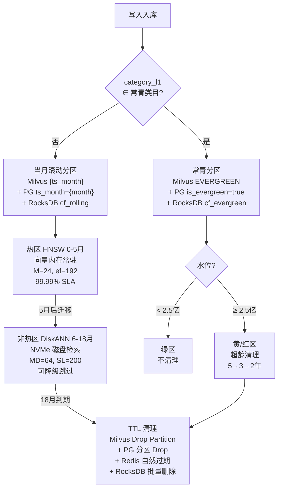

**常青池清理安全机制（v1.3 评审闭环）**：

```
清理操作安全规约:

  1. 软删除优先:
     Milvus 清理前先标记 is_deleted=true（新增 BOOL 字段）
     查询时 pre-filter 自动排除 is_deleted=true 的记录
     标记后 7 天内不执行物理 Delete（冷备期）

  2. 冷备期保护:
     PG 和 RocksDB 中的 bitmap 数据在冷备期内不删除
     仅 Milvus 向量被软删除（查询不可见但数据仍在）
     冷备期内可通过 is_deleted=false 一键恢复

  3. 审计与人工复核:
     每次清理记录完整的 image_pk 列表 → ClickHouse 审计表
     红色预警清理（> 2.8 亿且持续 7 天）→ SRE + 产品联合审批
     清理前生成预览报告: 待清理图片数量/类目分布/top 商家影响

  4. 物理删除:
     冷备期（7 天）结束后, cron 执行 Milvus Delete + PG 清理 + RocksDB 批量删除
     Delete 操作在维护窗口执行
```

---

## 五、核心子系统设计

### 5.1 检索引擎

#### 5.1.1 级联检索流水线

> **v1.2 重构**：从单路 ANN + fallback 标签模式演进为**两区级联 + 全量标签双路召回**。Stage 3.5 标签召回提升为每次请求必执行，Refine 候选池从 500 扩大至 2000。

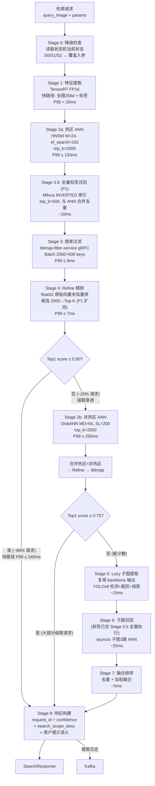

#### 5.1.2 延迟预算分解

**快路径（~80% 请求，热区命中 + 标签召回）**：

| Stage | 描述 | P99 预算 | 实现要点 |
|-------|------|---------|---------|
| 0 | 降级检查 | <1ms | 本地状态读取 |
| 1 | 特征提取 | ≤30ms | TensorRT FP16, backbone ≤15ms |
| 2a | 热区 ANN | ≤150ms | HNSW M=24, ef_search=192, coarse_top_k=2000 |
| 3.5 | 全量标签召回 | ≤10ms | Milvus INVERTED 索引, top_k=500 |
| 3 | 商家过滤 | ≤8ms | bitmap-filter-service gRPC (含 RTT ~1-2ms) |
| 4 | Refine 精排 | ≤7ms | float32 重排 2000 候选 (P1 扩池) |
| — | 其他 (网络/序列化) | ≤15ms | |
| | **快路径总计** | **≤240ms** | **~80% 请求在此路径完成** |

**级联路径（~20% 请求，穿透非热区）**：

| Stage | 描述 | P99 预算 | 实现要点 |
|-------|------|---------|---------|
| 2b | 非热区 ANN | ≤250ms | DiskANN MD=64, SL=200, NVMe 磁盘检索 |
| — | 合并 + 二次 Refine | ≤10ms | 热区+非热区+标签候选合并精排 |
| | **级联路径总计** | **≤400ms** | **仅 ~20% 请求穿透** |

**Fallback 路径（极少数请求）**：

| Stage | 描述 | P99 预算 | 实现要点 |
|-------|------|---------|---------|
| 5 | 子图延迟提取 | ≤15ms | 复用 backbone 输出 |
| 6 | 子图召回 | ≤25ms | 子图 3 路 ANN（标签已在 Stage 3.5 全量执行） |
| 7 | 融合排序 | ≤5ms | 去重 + 加权 |

#### 5.1.3 Refine 精排数据来源（v1.2 修订）

```
Refine 精排策略因区不同:

热区 (HNSW):
  - Milvus 存储 float32 原始向量, 内存常驻
  - ANN 粗排 2000 候选 → float32 精排 Top-K
  - P99 ≤ 7ms (2000 候选, 256d COSINE, SIMD 优化)

非热区 (DiskANN):
  - DiskANN 内部使用 PQ 压缩向量做粗排
  - 粗排 2000 候选 → 从磁盘加载 float32 精排
  - P99 稍高但在级联预算内

全量标签召回候选:
  - 标签召回的 500 候选与 ANN 候选合并后统一进入 Refine
  - Refine 候选池: 2000 (P1: 从 500 扩大, 修复 PQ 量化误差)

存储影响:
  热区: 7.5 亿 × 1.7KB ≈ ~1.7TB/副本 (含 HNSW 邻接表 + float32)
  非热区: 22 亿 × ~2.0KB ≈ ~4.1TB (NVMe 磁盘, PQ 编码 ~64GB RAM)
```

#### 5.1.4 融合排序算法

```
final_score = 0.4 × global_sim        // 全图向量余弦相似度
            + 0.3 × max(sub_sims)     // 最佳子图相似度
            + 0.2 × tag_overlap       // Jaccard(query_tags, candidate_tags)
            + 0.1 × cat_match         // L1=0.3, L2=0.6, L3=1.0

排序后取 Top-K 返回
权重为初始值，可通过 A/B 实验调优（联合验证项）
```

#### 5.1.5 data_scope 分区路由

| data_scope | time_range | 实际查询分区 |
|------------|-----------|------------|
| "evergreen" | (忽略) | 仅常青分区 (非热区) |
| "rolling" | "5m" | 近 5 个月滚动（热区, 不含常青） |
| "rolling" | "18m" | 近 18 个月滚动（热区 + 非热区级联） |
| "all"(默认) | "5m" | 近 5 个月 + 常青（热区 + 非热区常青） |
| "all"(默认) | "18m" | 全量滚动 + 常青（热区 + 非热区级联） |
| 降级模式 | (强制) | 近 5 个月热区 + 常青（跳过非热区滚动） |

### 5.2 写入引擎

#### 5.2.1 update-image 主链路（v1.1 修订：uri_dedup 全局去重）

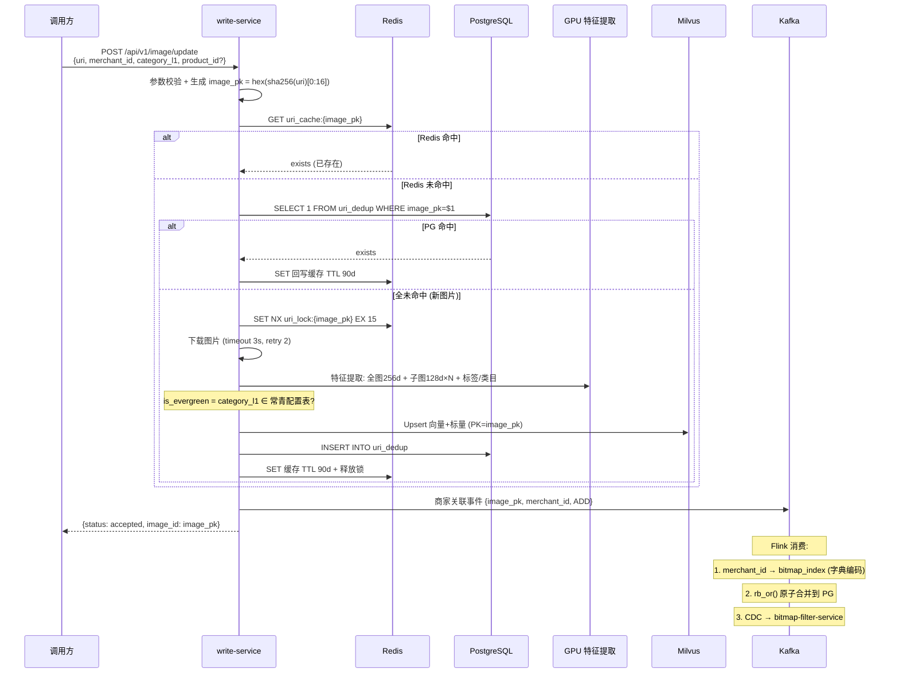

#### 5.2.2 update-video 链路

```
调用方 → POST /api/v1/video/update {video_uri, merchant_id, category_l1}
  → 系统下载视频 (timeout 10s)
  → FFmpeg 提取前 5 秒 3 个关键帧 (I-frame 优先)
  → 每帧 URI = {video_uri}#frame_{N}
  → 每帧独立走 update-image 内部流程
  → 返回 {video_id, frame_ids[3]}

端到端延迟: P95 ≤ 2s, P99 ≤ 5s
```

#### 5.2.3 批量写入接口（image/index）

用于数据迁移/管理后台/系统初始化，调用方提供完整数据（embedding、tags、merchant_ids、product_id 等），直接写入 Milvus + PG，不触发特征提取。

#### 5.2.4 商家关联写入管道

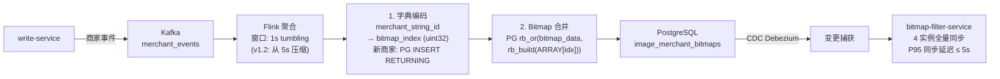

#### 5.2.5 可见性 SLA 精确定义（v1.2 修订：3 倍压缩）

> **v1.2 变更**：写入可见性从 15s/30s/45s 压缩至 **5s/10s/15s**，通过双写路径（Kafka + 直推 bitmap-filter）、IO 并行化、Milvus 写后即 Flush 实现。

```
可见性分三级:

Level 1 - 向量可搜到 (不含商家过滤):
  定义: Milvus ANN 检索可命中该 image_pk
  适用: 批量写入 (image/index)
  SLA: P95 ≤ 5s, P99 ≤ 10s

Level 2 - 完整可见 (向量 + 商家过滤):
  定义: Milvus ANN 可命中 + bitmap-filter-service 过滤可匹配
  适用: 生产写入 (update-image 已存在图)
  SLA: P95 ≤ 10s, P99 ≤ 20s

Level 3 - 新图片完整可见 (含特征提取):
  定义: Level 2 + 特征提取完成
  适用: 生产写入 (update-image 新图片)
  SLA: P95 ≤ 15s, P99 ≤ 30s
```

**v1.2 关键优化手段**：

```
1. 双写路径 (bitmap-filter 直推):
   write-service → 并行发送:
     Path A: Kafka → Flink → PG → CDC → RocksDB (持久化)
     Path B: gRPC PushUpdate → bitmap-filter 内存即时生效 (~2ms)
   → bitmap 过滤可见性从 ~30s 压缩到 ~50ms

2. IO 并行化:
   Milvus upsert + PG insert + Redis set + Kafka send → asyncio.gather 并发执行
   → 消除串行瓶颈, 节省 ~3-5s

3. Milvus 写后即 Flush:
   upsert 后立即 Flush → growing segment 转 sealed (~1-2s)
   → 向量立即可搜索, 消除定时 Flush 等待 (~5-10s)

4. 管道压缩:
   Flink 窗口: 5s → 1s
   Kafka: linger 10ms→5ms, batch 64KB→32KB
   CDC: batch 500→200, commit 1000ms→500ms
```

**全链路打点**：

```
T0: write-service 收到请求                    (ingest_received_ts)
T1: 特征提取完成                              (feature_ready_ts)         — 仅新图片
T2: Milvus upsert + Flush 返回               (milvus_done_ts)           — 并行写入
T3: PG uri_dedup 写入完成                     (pg_uri_done_ts)           — 并行写入
T3': bitmap-filter PushUpdate 完成            (direct_push_done_ts)      — v1.2 新增
T4: Kafka 事件发送                            (kafka_sent_ts)
T5: Flink 处理完成                            (flink_done_ts)
T6: PG Bitmap 写入完成                        (pg_bitmap_done_ts)
T7: bitmap-filter CDC 同步完成                (filter_visible_ts)        — CDC 最终覆盖 PushUpdate

Prometheus 指标:
  ingest_visibility_duration_seconds{level="vector|full|new_image"}
  bitmap_filter_direct_push_total{result="success|failure"}
  bitmap_filter_direct_push_latency_seconds{quantile}

可见性 = max(T2, T3') - T0 (Level 2, 快速路径) 或 T7 - T0 (Level 2, CDC 路径)
```

**止损策略**：

```
T7 - T0 > 30s (P99 超限):
  → 进入延迟可见队列 (Kafka DLQ)
  → 触发 P1 告警
  → 后台重试 (每 5min)
T7 - T0 > 120s:
  → 触发 P0 告警 + 进入对账修复任务
```

**告警路由**：

| 环节 | 超时阈值 | 路由 |
|------|---------|------|
| T1-T0 (特征提取) | > 1s | GPU oncall |
| T2-T1 (Milvus upsert+Flush) | > 5s | Milvus oncall |
| T3-T2 (PG 写入) | > 3s | DBA oncall |
| T3'-T0 (直推 bitmap) | > 100ms | SRE oncall |
| T6-T4 (Flink→PG bitmap) | > 5s | 数据平台 oncall |
| T7-T6 (CDC→bitmap-filter) | > 5s | SRE oncall |
| T7-T0 (端到端) | > 30s | P0 联合告警, 图搜 oncall 主责 |

### 5.3 特征提取引擎

#### 5.3.1 模型架构

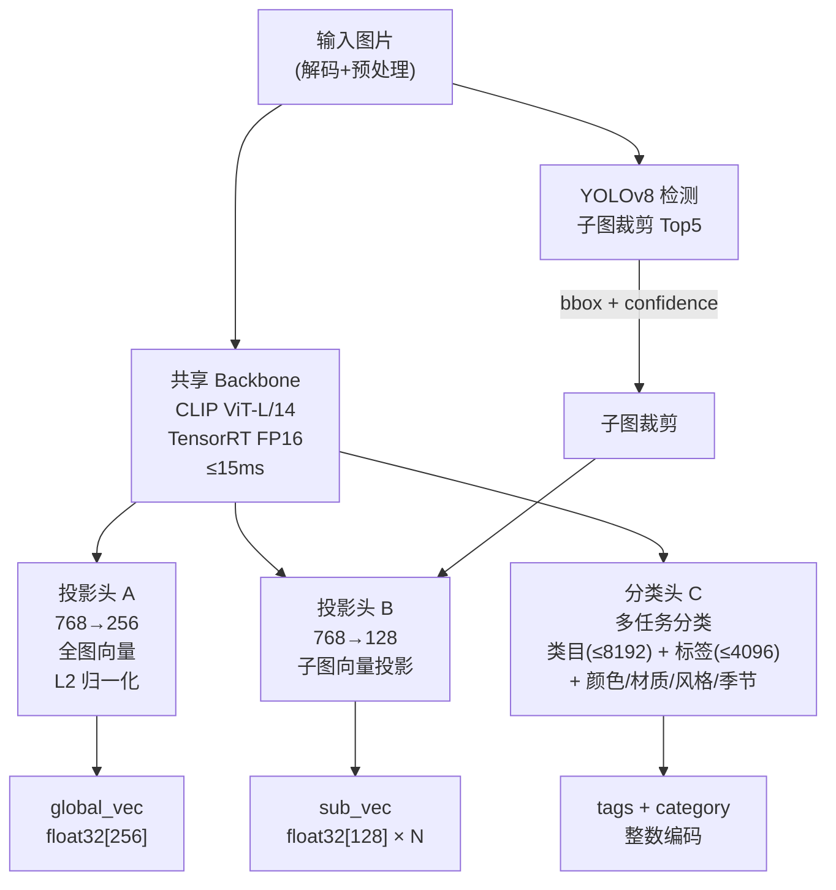

#### 5.3.2 查询侧 vs 写入侧

| 维度 | 查询侧（在线关键路径） | 写入侧（异步/离线） |
|------|-------------------|-------------------|
| 延迟要求 | **P99 ≤ 30ms** | 无硬约束（~250-600ms） |
| 加速引擎 | TensorRT FP16 (GPU T4) | TensorRT FP16 或 CPU |
| 提取范围 | 快路径：仅全图+标签；Lazy：追加子图 | 全量：全图+子图+标签+类目+属性 |
| Backbone 复用 | ✅ 全图/子图/分类共享输出 | ✅ |
| 批处理 | 单张（实时） | mini-batch 8-16 |

#### 5.3.3 GPU 推理容量模型（v1.1 新增）

**T4 单卡容量基线**（TensorRT FP16, batch=1）：

| 模型 | P50 | P99 | 说明 |
|------|-----|-----|------|
| Backbone (ViT-L/14) | ~8ms | ~15ms | 224×224 输入 |
| YOLOv8-s 检测 | ~5ms | ~10ms | |
| 投影头+分类 | ~1ms | ~2ms | |
| 快路径合计 (backbone+分类) | ~9ms | ~17ms | 单卡 ~50 QPS |
| 慢路径合计 (+YOLO+投影) | ~14ms | ~27ms | 单卡 ~30 QPS |

**集群容量**（8 张 T4）：

| 负载模式 | 单卡 QPS | 集群 QPS | 对比需求 |
|---------|---------|---------|---------|
| 纯快路径 | ~50 | ~400 | >>100 ✅ |
| 混合 (75% 快 + 25% 慢) | ~40 | ~320 | >>100 ✅ |

**超载保护**：

| 指标 | 预警 | 告警 | 动作 |
|------|------|------|------|
| GPU 推理队列长度 | >4 | >8 | >8 时拒绝 fallback, 强制快路径 |
| GPU 推理 P99 | >20ms | >25ms | >25ms 纳入降级触发条件 |
| GPU 利用率 | >80% | >90% | >90% HPA 扩容 query-service |
| GPU 不可用 | — | — | CPU 推理降级 (+~100ms, 仅 backbone) |

#### 5.3.4 子图提取规则

| 场景 | 处理方式 | 说明 |
|------|---------|------|
| 检测到多物体 | 按 confidence 取 Top5 | YOLOv8 目标检测裁剪 |
| 单物体或检测失败 | 2×2 网格切分 | 兜底策略 |
| 子图面积 < 原图 10% | 跳过 | 避免噪声 |
| 写入侧 | 全量提取存储 | |
| 查询侧 | Lazy 模式，仅 fallback 触发时提取 | 75-85% 查询无需子图 |

### 5.4 商家过滤子系统（v1.1 重构为独立服务）

#### 5.4.1 架构总览

> **v1.2 新增**：双写路径——除 Kafka→Flink→PG→CDC 持久化路径外，write-service 直接 gRPC PushUpdate 推送 bitmap 到 bitmap-filter-service 内存，实现过滤可见性 ~50ms（原 ~30s）。

```mermaid
flowchart TB
    subgraph WritePath["写入路径 (双写)"]
        WS["write-service"] -->|"Path A: 事件"| Kafka
        WS -->|"Path B: gRPC PushUpdate\n~50ms 即时生效"| BFS
        Kafka --> Flink["Flink 聚合\n窗口: 1s"]
        Flink -->|"string→uint32\nrb_or()"| PG["PG pg_roaringbitmap\n~29.5亿行 ~680GB"]
        PG -->|"CDC Debezium\n最终覆盖 PushUpdate"| BFS["bitmap-filter-service\n×4 实例, 各 ~340GB"]
    end

    subgraph ReadPath["读取路径（P99 ≤ 8ms）"]
        QS["query-service\n传入 2000+500 个 image_pk"] -->|gRPC| BF["bitmap-filter-service\nRocksDB MultiGet\n4线程并行 Bitmap AND"]
        BF --> Filter["输出: 过滤后候选集"]
    end

    subgraph Degrade["三级降级（v1.3 修订）"]
        L0["Level 0: bitmap-filter-service\nP99 ≤ 8ms"]
        L1["Level 1: 远端 PG 查询\nP99 ≈ 15ms"]
        L2["Level 2: 强制触发 S2/S4 降级\n⚠️ 禁止返回无过滤结果"]
        L0 -->|服务不可用| L1
        L1 -->|PG 不可用| L2
    end
```

**PushUpdate gRPC 接口**（v1.2 新增）：

```protobuf
service BitmapFilterService {
    rpc BatchFilter (BatchFilterRequest) returns (BatchFilterResponse);
    rpc PushUpdate (PushUpdateRequest) returns (PushUpdateResponse);  // v1.2 新增
    rpc HealthCheck (HealthCheckRequest) returns (HealthCheckResponse);
}

message PushUpdateRequest {
    bytes image_pk = 1;        // CHAR(32) hex
    uint32 bitmap_index = 2;   // 商家字典编码
}

message PushUpdateResponse {
    bool applied = 1;
}
```

**PushUpdate 语义**：

```
write-service 调用 PushUpdate 时:
  1. bitmap-filter-service 读取 RocksDB 已有 bitmap (或空 bitmap)
  2. rb_or(existing, rb_build([bitmap_index])) → 幂等合并
  3. 写入 RocksDB (Memory + WAL)
  4. 内存即时可查 (~2ms)
  5. CDC 路径最终会覆盖为 PG ground truth (一致性保障)

失败处理:
  - PushUpdate 失败时静默降级, 不阻塞写入主链路
  - 依赖 CDC 路径最终生效 (P95 ~5s)
  - 指标: bitmap_filter_direct_push_total{result="success|failure"}

节点级止损（v1.3 评审闭环）:
  - 每个 bitmap-filter 实例定期（每 60s）采样比对本地 RocksDB 与 PG 的 bitmap 覆盖度
  - 若 diff > 10000 行 且持续 > 3min → 从 gRPC 负载均衡中自动摘除该实例
  - 摘除后触发 CDC 全量重建（~10min），重建完成后自动重新加入
  - 指标: bitmap_filter_node_ejected_total, bitmap_filter_pg_diff_count
  - 防止"部分节点正确、部分节点数据陈旧"的幽灵问题

重启恢复保障（v1.3 评审闭环）:
  - PushUpdate 写入 RocksDB 含 WAL，服务重启后 RocksDB 自动恢复
  - 重启后立即触发一次 PG→RocksDB 增量对账（仅对比 last_cdc_ts 之后的变更）
  - 对账完成前该实例不加入 gRPC 负载均衡
```

#### 5.4.2 查询执行细节

```
输入: 2000 个 candidate_image_pk + query_merchant_scope (500-3000 个 string)

Step 1: 商家 scope 编码 (query-service 本地)
  query_bitmap = rb_build(
    [dict_cache.get(mid) for mid in merchant_scope]
  )
  // 内存缓存命中率 >99%，miss 时查 PG

Step 2: gRPC 调用 bitmap-filter-service
  request: BatchFilterRequest {
    candidate_pks: [image_pk_1, ..., image_pk_2000],
    query_bitmap: serialized_roaring_bitmap
  }

Step 3: bitmap-filter-service 内部执行
  bitmaps = rocksdb.multi_get([cf_rolling/cf_evergreen], candidate_pks)
  // 4 线程并行，每线程 500 个 key
  filtered = [pk for pk, bmp in bitmaps if rb_intersect(bmp, query_bitmap)]

Step 4: 返回过滤后候选集
  response: BatchFilterResponse { filtered_pks: [...] }
```

#### 5.4.3 Bitmap 正确性规约（v1.1 新增）

```
不变量 (Invariant):
  ∀ image_pk:
    bitmap-filter-service.get(pk).bitmap ⊇ PG.get(pk).bitmap  (允许短暂超前)
    PG.get(pk).bitmap = rb_or(所有历史 ADD 事件)               (PG 是 ground truth)
    rb_or(bitmap, bitmap) = bitmap                             (幂等性)

一致性窗口:
  PG → bitmap-filter-service CDC 延迟 P95 ≤ 5s
  超过 30s 的不一致: P1 告警
  超过 300s: P0 告警 + 对账修复

对账规格:
  频率: 每日 03:00
  范围: 全量 (分批, 每批 10 万行)
  比对: PG bitmap vs bitmap-filter-service bitmap, 按 image_pk 逐行
  允许差异: CDC 延迟导致的短期不一致 (< 30s 内的写入)
  差异处理: 以 PG 为准, 覆盖 bitmap-filter-service
  指标: bitmap_reconcile_diff_count, bitmap_reconcile_duration_seconds
```

#### 5.4.4 Bitmap 存储特征

| 商家数范围 | 图片占比 | Bitmap 大小 | 特征 |
|-----------|---------|------------|------|
| 1-10 | ~30% | 4-40 B | 极小，Array Container |
| 10-100 | ~40% | 40-400 B | 小 |
| 100-1000 | ~25% | 0.4-4 KB | 中，可能转 Bitmap Container |
| 1000-3000 | ~5% | 4-12 KB | 大 |

> Roaring Bitmap 自动选择最优容器类型（Array/Bitmap/Run），无需手动调优。

### 5.5 降级状态机

#### 5.5.1 状态定义与转移

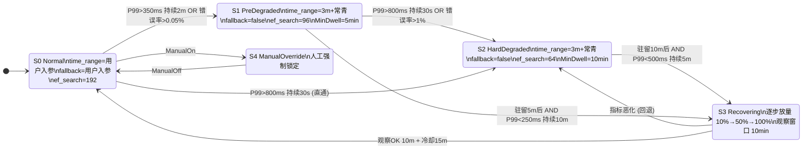

#### 5.5.2 降级行为

| 状态 | 查询范围 | fallback | ef_search | refine_top_k | 最短驻留 |
|------|---------|----------|-----------|-------------|---------|
| S0 Normal | 用户入参 | 用户入参 | 192 | 2000 | — |
| S1 PreDegraded | 3m + 常青 | false | 96 | 500 | 5 min |
| S2 HardDegraded | 3m + 常青 | false | 64 | 200 | 10 min |
| S3 Recovering | 灰度放量 | 渐进恢复 | 渐进恢复 | 渐进恢复 | — |
| S4 ManualOverride | 人工设定 | 人工设定 | 人工设定 | 人工设定 | — |

> **v1.3 修正**：S0 的 ef_search 从 v1.2 表中的 128 修正为 192，对齐 §5.1.2 延迟预算（HNSW M=24, ef_search=192）和系统设计文档 v1.1 热区搜索参数。refine_top_k 从 500 修正为 2000，对齐 v1.2 §5.1.2 Refine 候选池扩大方案。

**降级状态的用户语义保证（v1.3 评审闭环）**：

| 状态 | 结果语义 | 可能缺失 | 前端提示建议 |
|------|---------|---------|------------|
| S0 | 完整结果, 覆盖用户指定时间范围 | 无 | 无需提示 |
| S1 | 仅近 3 个月 + 常青结果, Top1 保证来自热区 | 第 4-18 个月的滚动数据可能缺失 | "当前搜索范围已缩小，部分历史商品可能未展示" |
| S2 | 仅近 3 个月 + 常青, 精度降低 | 同 S1 + Recall 约降至 90% | "系统维护中，搜索结果可能不完整" |
| S4 | 人工设定, 视具体配置 | 视配置 | 人工决定 |

> **产品确认项**：前端提示方案需与产品 PM 对齐，确认 meta.search_scope_desc 字段的文案展示方式。

#### 5.5.3 降级状态测试矩阵（v1.1 新增）

| 目标状态 | 触发方式 (测试环境) | 验证点 | 预期指标变化 |
|---------|-------------------|--------|------------|
| S0→S1 | Milvus proxy 注入 200ms sleep, 持续 3min | meta.degraded=true, time_range 强制 3m, search_scope_desc 含"范围已缩小", Prometheus degrade_state=S1 | P99 ↓, 温冷命中→0 |
| S1→S2 | Milvus proxy 注入 500ms sleep, 持续 1min | ef_search 降为 64, enable_fallback 强制 false | P99 ↓, fallback→0 |
| S0→S2 | 直接注入 800ms sleep, 持续 1min (直通) | 同 S2 验证点 | |
| S2→S3 | 恢复 Milvus, 等待 10min 驻留 + 5min 观察 | 灰度放量 10%→50%→100% | 流量逐步恢复 |
| S3→S0 | 继续观察 10min | degrade_state=S0, meta.degraded=false | 全量指标恢复 |
| S3→S2 | S3 阶段再次注入延迟 | 回退到 S2 | 灰度中断 |
| S0→S4 | API /admin/degrade/override | 人工锁定, 审计日志记录操作人 | |
| S4→S0 | API /admin/degrade/release | 解锁, 审计日志记录 | |

**测试开关（仅测试/staging 环境启用）**：

```
/admin/test/inject-latency?target=milvus&delay_ms=500&duration_s=120
/admin/test/inject-error?target=pg&rate=0.02&duration_s=60
/admin/test/force-state?state=S2

生产环境: 仅 S4 ManualOverride 可用, 需 SRE 审批
```

#### 5.5.4 降级实现

```python
# 伪代码: 降级状态机（运行在每个 query-service 节点）
class DegradeStateMachine:
    state: S0 | S1 | S2 | S3 | S4
    last_transition_at: datetime
    metrics_window: RollingWindow(2min)

    def check_and_transition(self, current_metrics):
        if self.state == S0:
            if current_metrics.p99 > 350 and self.metrics_window.duration_above(350) >= 2min:
                self.transition(S1)
            elif current_metrics.p99 > 800 and self.metrics_window.duration_above(800) >= 30s:
                self.transition(S2)  # 直通
            # v1.1: GPU 超载也触发
            elif current_metrics.gpu_queue > 8:
                self.transition(S1)

        elif self.state == S1:
            if self.dwell_time() >= 5min and current_metrics.p99 < 250 for 10min:
                self.transition(S3)

    def apply_overrides(self, request_params) -> SearchParams:
        if self.state in (S1, S2):
            request_params.time_range = "3m"
            request_params.enable_fallback = False
            request_params.ef_search = 96 if self.state == S1 else 64
            request_params.degraded = True
        return request_params
```

### 5.6 配置管理子系统

#### 5.6.1 产品可配置能力边界（对齐 BRD v3.9 §8.7）

| 能力 | 配置级别 | 存储 | 生效方式 |
|------|---------|------|---------|
| 常青类目列表 | ✅ PM 可配 | PG evergreen_categories → Redis 5min | 灰度验证后全量 |
| data_scope 默认值 | ✅ PM 可配 | PG config → 本地缓存 | 热更新 |
| confidence 用户提示文案 | ✅ PM 可配 | PG config → API 层引用 | 热更新 |
| search_scope_desc 模板 | ✅ PM 可配 | PG config → API 层引用 | 热更新 |
| 相似度阈值 (0.75) | ⚠️ 联合验证 | PG config + A/B 实验平台 | 需技术评审 |
| Top-K 默认值 (100) | ⚠️ 联合验证 | PG config + 性能评估 | 需技术评审 |
| fallback 开关 | ❌ 系统保护 | 代码常量 | 架构评审会 |
| Top-K 硬上限 (200) | ❌ 系统保护 | 代码常量 | 架构评审会 |
| 降级阈值 | ❌ 系统保护 | SRE 配置 | SRE 审批 |
| 时间分层边界 | ❌ 系统保护 | 与存储绑定 | 架构评审会 |
| 常青池硬上限 (3 亿) | ❌ 系统保护 | 与存储预算绑定 | 架构评审会 |

---

## 六、接口设计

### 6.1 接口总览

| 接口 | 方法 | 路径 | 用途 | QPS |
|------|------|------|------|-----|
| 检索 | POST | /api/v1/image/search | 以图搜商品 | >100 |
| 写入（生产主链路） | POST | /api/v1/image/update | 商品图片上架 | ~281/s 峰值 |
| 写入（视频） | POST | /api/v1/video/update | 视频商品上架 | ~11/s 峰值 |
| 写入（批量） | POST | /api/v1/image/index | 数据迁移/初始化 | 低频 |
| 商家关联 | POST | /api/v1/merchant/bindImage | 增量商家关联 | 低频 |
| 行为上报 | POST | /api/v1/behavior/report | 搜索行为反馈 | ~100/s |
| **系统状态** | **GET** | **/api/v1/system/status** | **降级状态/维护窗口查询** | **低频** |
| 健康检查 | GET | /healthz | 存活检测 | — |
| 就绪检查 | GET | /readyz | 就绪检测 | — |

> **向后兼容承诺（BRD v3.9）**：主版本周期内保持向后兼容。新增字段采用可选参数带默认值。非兼容变更通过新版本接口提供。废弃字段标记 deprecated 至少 2 个版本周期后移除。

### 6.2 检索接口详细设计

**POST /api/v1/image/search**

请求：

```json
{
  "query_image": "<base64>",
  "merchant_scope": ["m001", "m002", "..."],  // 可选, 0-3000
  "merchant_scope_id": "scope_abc123",         // 可选, 预注册 scope 的 ID (与 merchant_scope 二选一)
  "top_k": 100,                                // 可选, 默认100, 上限200
  "time_range": "9m",                          // 可选, 9m/18m/3m, 默认9m
  "data_scope": "all",                         // 可选, evergreen/rolling/all, 默认all
  "enable_fallback": true                      // 可选, 默认true, 系统保护字段(不对外暴露)
}
```

**字段规范**：

| 字段 | 必填 | 类型 | 默认值 | 约束 | 兼容性 |
|------|------|------|--------|------|--------|
| query_image | 是 | base64 string | — | ≤10MB | 不可变 |
| merchant_scope | 否 | array[string] | null (不过滤) | 0-3000 个 | 不可变 |
| merchant_scope_id | 否 | string | null | 与 merchant_scope 互斥 | v1.1+ |
| top_k | 否 | int | 100 | [1, 200] | 默认值可调(联合验证) |
| time_range | 否 | enum | "9m" | 9m/18m/3m | 不可变 |
| data_scope | 否 | enum | "all" | evergreen/rolling/all | v3.4+ |
| enable_fallback | 否 | bool | true | 系统保护 | 不对外暴露 |

响应：

```json
{
  "request_id": "req_20260207_abc123",
  "results": [
    {
      "image_id": "a1b2c3d4e5f67890a1b2c3d4e5f67890",
      "score": 0.87,
      "product_id": "prod_12345",
      "position": 1,
      "is_evergreen": false
    }
  ],
  "meta": {
    "confidence": "high",
    "strategy": "fast_path",
    "latency_ms": 48,
    "degraded": false,
    "expanded": false,
    "filter_skipped": false,
    "data_scope": "all",
    "search_scope_desc": "全平台商品（近9个月+经典款）"
  }
}
```

**product_id 语义声明（v1.1 新增）**：

```
results[].product_id 语义:
  图搜系统不维护 image→product 映射。
  product_id 来自写入时调用方携带的元数据（如有），表示
  "该图片在写入时关联的商品 ID"。

  ❌ 不保证跨请求稳定 (不同 merchant_scope 可能返回不同结果)
  ❌ 不保证跨策略版本稳定
  ❌ 不可直接用于库存/价格/交易判断

  product_id 为 nullable 字段:
  - 通过 update-image 写入且未携带 product_id → 返回 null
  - 通过 image/index 批量写入且携带 product_id → 返回写入时的值

  调用方如需从 image_id 获取当前可售商品，
  应自行查询商品域服务。
```

**错误码**：

| HTTP | 错误码 | 说明 |
|------|--------|------|
| 400 | INVALID_IMAGE | 图片无法解析 |
| 400 | INVALID_PARAMS | 参数校验失败 |
| 413 | IMAGE_TOO_LARGE | 图片 >10MB |
| 429 | RATE_LIMITED | 超过限流阈值 |
| 503 | SERVICE_DEGRADED | 系统降级中，部分功能受限 |

**置信度与用户提示语义映射**（对齐 BRD v3.9 §4.4）：

| meta.confidence | 阈值 | 推荐前端提示文案（PM 可配置） |
|----------------|------|--------------------------|
| high | score ≥ 0.75 | "找到了与图片高度一致的商品" |
| medium | 0.50 ≤ score < 0.75 | "未找到完全同款，以下是相似款式推荐" |
| low | score < 0.50 | "暂未找到高度相似商品，以下是同类推荐" |

### 6.3 写入接口详细设计

**POST /api/v1/image/update**（生产主链路）

请求：

```json
{
  "uri": "https://cdn.example.com/product/img_001.jpg",
  "merchant_id": "merchant_abc",
  "category_l1": "家具",
  "product_id": "prod_12345"
}
```

> `product_id` 为 v1.1 新增可选字段，用于透传到检索响应。未传则检索响应中 product_id 为 null。

响应（新图片）：

```json
{
  "status": "accepted",
  "image_id": "a1b2c3d4e5f67890a1b2c3d4e5f67890",
  "is_new": true,
  "is_evergreen": true
}
```

**幂等性保证**：
- image_pk = hex(sha256(uri)[0:16]) 确定性生成，同一 URI 多次调用返回相同 image_id
- 商家关联通过 rb_or() 合并，重复写入无副作用

**POST /api/v1/video/update**

请求：

```json
{
  "video_uri": "https://cdn.example.com/product/video_001.mp4",
  "merchant_id": "merchant_abc",
  "category_l1": "箱包"
}
```

响应：

```json
{
  "status": "accepted",
  "video_id": "vid_hash...",
  "frame_ids": ["frame_0_hash...", "frame_1_hash...", "frame_2_hash..."],
  "frames_processed": 3
}
```

### 6.4 行为上报接口

**POST /api/v1/behavior/report**

```json
{
  "event_type": "click",
  "request_id": "req_20260207_abc123",
  "image_id": "a1b2c3d4e5f67890a1b2c3d4e5f67890",
  "position": 3,
  "timestamp": "2026-02-07T12:00:00Z",
  "dwell_time_ms": 5200
}
```

异步写入 Kafka → ClickHouse，不影响主链路。

**行为上报边界声明（v1.1 新增）**：行为上报为可选增强能力，不上报不影响基础检索能力。行为数据仅用于图搜质量评估与模型优化，不反向影响调用方业务策略，不提供给第三方或其他业务线。数据留存 90 天。

### 6.5 系统状态接口（v1.1 新增）

**GET /api/v1/system/status**

```json
{
  "degrade_state": "S0",
  "degrade_since": null,
  "affected_scope": "none",
  "estimated_recovery": null,
  "maintenance_window": false,
  "next_maintenance": "2026-03-01T00:30:00Z"
}
```

| 字段 | 说明 |
|------|------|
| degrade_state | S0/S1/S2/S3/S4 |
| degrade_since | 降级开始时间 (S0 时为 null) |
| affected_scope | none / warm_cold / full |
| estimated_recovery | 预计恢复时间 (如有) |
| maintenance_window | 当前是否在维护窗口 |
| next_maintenance | 下一次维护窗口时间 |

调用方可轮询此接口（建议 30s 间隔）或接入 webhook 订阅状态变更（v1.2 规划）。

---

## 七、高可用与灾备

### 7.1 SLA 分层保障

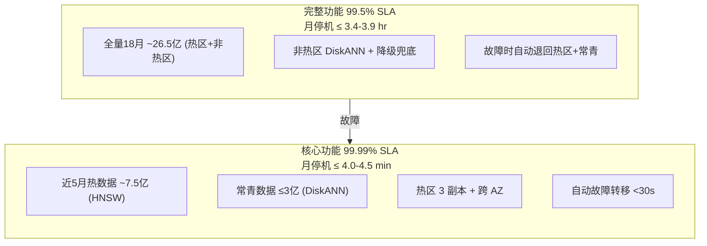

### 7.2 跨 AZ 部署策略

| 组件 | AZ-A | AZ-B | 故障切换 |
|------|------|------|---------|
| query-service | ×6 | ×6 | SLB 自动摘除 |
| write-service | ×2 | ×2 | Kafka 消费自动 rebalance |
| bitmap-filter-service | ×2 | ×2 | gRPC 负载均衡自动摘除 |
| Milvus 热区 HNSW | ×5 | ×5 | 跨 AZ 副本，<30s 切换 |
| Milvus 非热区 DiskANN | ×4 | ×3 | 降级跳过 |
| PostgreSQL | Primary | Standby (流复制) | 自动 failover |
| Redis | Primary | Sentinel | 自动 failover |
| Kafka | 3 节点跨 AZ | 同左 | ISR 自动选主 |

### 7.3 故障场景与恢复

| 故障场景 | 影响 | 自动恢复策略 | RTO | RPO |
|---------|------|------------|-----|-----|
| 单 query-service 节点挂掉 | 无感知 | SLB 摘除 + K8s 重建 (无需预热数据) | <30s | 0 |
| 单 AZ 故障 | 无感知（核心功能） | SLB 切换到存活 AZ | <30s | 0 |
| Milvus 热区 HNSW 不可用 | 核心功能受损 | 跨 AZ 副本接管 | <60s | 0 |
| 非热区 DiskANN 集群故障 | 完整功能降级 | 自动退回热区+常青 | 即时 | 0 |
| bitmap-filter-service 单节点故障 | 无感知 | gRPC 负载均衡摘除 | <10s | 0 |
| bitmap-filter-service 全部不可用 | 商家过滤不可用 | L1→PG 兜底；PG 也不可用→**强制 S2/S4 降级**（v1.3: 禁止返回无过滤结果） | 即时 | 0 |
| PG Primary 故障 | 写入暂停 | Standby 自动 promote | <60s | <5s |
| Redis 故障 | URI 缓存丢失 | Sentinel failover + PG 兜底 | <10s | 部分缓存丢失 |
| GPU 节点故障 | 特征提取延迟增加 | CPU 推理降级 (+~100ms) | 即时 | 0 |
| Kafka 不可用 | 写入链路暂停 | 本地 WAL 兜底 + 异步重试 | <5min | 0 |
| NVMe 磁盘故障 (DiskANN) | 单节点数据丢失 | Milvus 从 MinIO 重建 DiskANN 索引 (~2-4h/分区) | <4h | 0 |

### 7.4 数据一致性保证

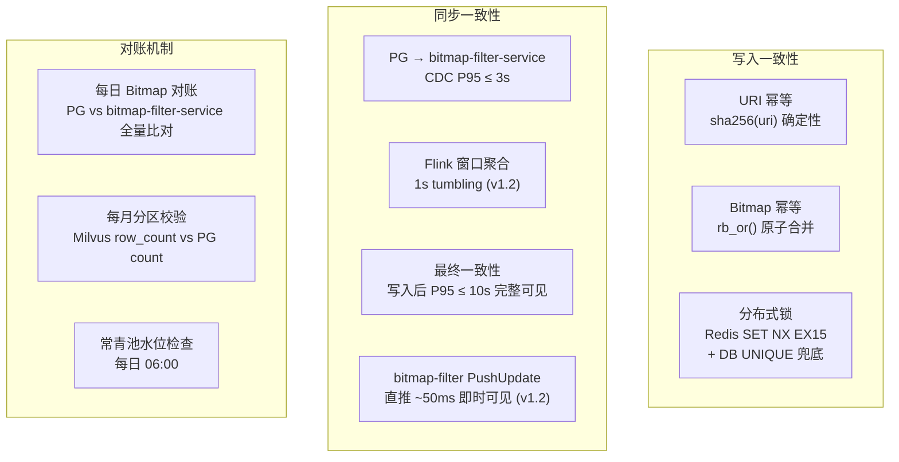

### 7.5 备份与恢复

| 数据 | 备份策略 | 备份频率 | 恢复 RTO |
|------|---------|---------|---------|
| PG 全量 | pg_basebackup + WAL 归档 | 每日增量，每周全量 | <4h |
| Milvus 向量 | milvus backup (minio snapshot) | 每周全量 | <8h |
| Redis | RDB + AOF | 实时 | <5min |
| Kafka | 多副本 ISR | 实时 | <1min |
| bitmap-filter-service | 无需备份（CDC 重建） | — | ~10min |

**恢复演练制度（v1.1 新增）**：

| 频率 | 演练内容 | 验收标准 |
|------|---------|---------|
| 月度 (自动化) | PG 恢复到独立实例 → row_count 比对 → 抽样 1000 行 bitmap 校验 | 数据一致性 100%, RTO <4h |
| 月度 (自动化) | Redis RDB 恢复 → key_count 比对 | RTO <5min |
| 季度 (人工) | Milvus snapshot 恢复到 staging → 执行 100 组标准查询 → 比对 Top10 一致性 | Top10 一致性 >99%, RTO <8h |
| 季度 (人工) | 全链路: 写入 100 张图片 → 验证可见性 → 验证检索+过滤 | Level 2 可见性 <60s |

每次演练出报告，包含恢复时长、数据差异、改进项。

---

## 八、可观测性与运维

### 8.1 监控指标体系

#### 8.1.1 SLA 核心指标（对标 99.99%）

| 指标 | 采集方式 | 预警阈值 | 告警阈值 | 处理 |
|------|---------|---------|---------|------|
| 检索 P95 延迟 | Prometheus histogram | >150ms | >200ms | 预警/告警 |
| 检索 P99 延迟 | Prometheus histogram | >400ms | >500ms | 自动降级 |
| 错误率 | Prometheus counter | >0.01% | >0.05% | 触发应急 |
| 副本延迟 | Milvus metrics | >3s | >5s | 告警 |

**验收指标口径（v1.1 新增）**：

```
检索延迟:
  计时起点: query-service 收到 HTTP 请求 (application layer, 不含 SLB/Gateway)
  计时终点: query-service 发出 HTTP 响应
  Prometheus: image_search_latency_seconds{quantile="0.95|0.99"}

错误率:
  分子: HTTP 5xx + 业务码 INTERNAL_ERROR + 超时 (>5s 未响应)
  分母: 总请求数
  不计入错误: 429 (限流) / 400 (参数错误) / 503 SERVICE_DEGRADED (设计行为)
  Prometheus: image_search_errors_total / image_search_requests_total

SLA 分层计算:
  核心请求: time_range ∈ {3m} 或 data_scope=evergreen 或系统降级后的所有请求
  完整请求: time_range ∈ {9m, 18m} 且 data_scope ∈ {rolling, all}
  SLA 分别计算, 分别告警
```

#### 8.1.2 子系统指标

**特征提取引擎**：

| 指标 | 预警 | 告警 |
|------|------|------|
| backbone 推理 P99 | >20ms | >30ms |
| GPU 利用率 | >80% | >90% |
| GPU 显存使用 | >80% | >90% |
| GPU 推理队列长度 | >4 | >8 |
| 模型加载延迟 | — | >30s |

**商家过滤子系统 (bitmap-filter-service)**：

| 指标 | 预警 | 告警 |
|------|------|------|
| 过滤 P99 延迟 | >6ms | >8ms |
| Bitmap 平均大小 | >3KB | >5KB |
| 写入可见性 P95 (Level 2) | >25s | >30s |
| RocksDB Block Cache 命中率 | <50% | <30% |
| CDC 同步延迟 | >3s | >5s |

**写入链路**：

| 指标 | 预警 | 告警 |
|------|------|------|
| 写入成功率 | <99.95% | <99.9% |
| 写入 P95 延迟（已存在图） | >10ms | >20ms |
| 写入 P95 延迟（新图片） | >800ms | >1.5s |
| Kafka 消费 lag | >10000 | >50000 |
| Flink 窗口积压 | >5 个窗口 | >10 个窗口 |

**常青池**：

| 指标 | 预警 | 告警 |
|------|------|------|
| 常青数量 | >2.3 亿 | >2.5 亿（黄区） |
| 常青数量 | >2.8 亿 | ≥3 亿（红区 P0） |
| 月度清理量 | — | >5000 万 |

#### 8.1.3 业务质量指标

| 指标 | 数据源 | 计算周期 | 告警阈值 |
|------|--------|---------|---------|
| CTR | ClickHouse | 实时/每日 | <5% |
| 跳出率 | ClickHouse | 每日 | >65% |
| 负反馈率 | ClickHouse | 每日 | >8% |
| 二次搜索率 | ClickHouse | 每日 | >30% |
| 覆盖率 | ClickHouse | 每日 | <85% |

### 8.2 Grafana 看板规划

| 看板 | 核心面板 | 受众 |
|------|---------|------|
| SLA Overview | 可用性 / P99 / 错误率 / 降级状态 | SRE |
| Search Engine | 各 Stage 延迟分布 / 快慢路径比例 / QPS | 研发 |
| Write Pipeline | 写入吞吐 / 可见性延迟 (三级) / Kafka lag | 研发 |
| Bitmap Filter | 过滤延迟 / Bitmap 大小分布 / CDC lag | 研发 |
| Feature Extraction | GPU 利用率 / 推理延迟 / 推理队列长度 | 研发 |
| Data Lifecycle | 分区数据量 / 常青水位 / TTL 清理量 | SRE |
| Business Quality | CTR / 跳出率 / 负反馈率 / MRR | 产品 |
| Cost Tracking | 服务器利用率 / 存储增长 / 月度成本 | 管理 |

### 8.3 后台定时任务清单

| Job | 触发时间 | 功能 | 优先级 |
|-----|---------|------|--------|
| partition-monthly-maintenance | 每月 1 日 00:30 | 创建新分区 / 上月索引重建 / 淘汰最老分区 | P0 |
| evergreen-monthly-cleanup | 每月 1 日 01:00 | 常青池超龄清理（黄/红区触发） | P1 |
| bitmap-daily-cleanup | 每日 02:00 | 18 月 Bitmap 过期清理 | P1 |
| bitmap-daily-reconcile | 每日 03:00 | PG vs bitmap-filter-service Bitmap 对账 | P1 |
| evergreen-daily-check | 每日 06:00 | 常青池水位检查 + 预警 | P2 |
| merchant-mapping-gc | 每周日 04:00 | 商家字典编码过期清理 | P2 |

**月度任务执行顺序**：

```
每月 1 日:
  00:20  强制降级状态机进入 S1 (维护窗口预降级)
     ↓
  00:30  partition-monthly-maintenance (分区创建/迁移, 在非热区 DiskANN 资源组执行)
     ↓
  01:00  evergreen-monthly-cleanup (常青清理)
     ↓
  02:00  bitmap-daily-cleanup (Bitmap 清理)
     ↓
  03:00  bitmap-daily-reconcile (数据对账)
     ↓
  完成后  进入 S3 Recovering, 灰度放量验证后回到 S0
```

### 8.4 运维操作手册

| 场景 | SOP |
|------|-----|
| 降级状态持续 >10min | 1. 查看 Grafana SLA 看板确认触发原因 2. 检查 Milvus/bitmap-filter/PG 健康状态 3. 若硬件故障，走 S4 ManualOverride 4. 恢复后监控 S3 Recovering 过程 |
| bitmap-filter-service 重建 | 1. 从 gRPC 负载均衡摘除 2. 触发 CDC 全量快照 3. 等待 ~10min 完成 4. 验证 bitmap-daily-reconcile 对账通过 5. 加回负载均衡 |
| 常青池红区 | 1. 确认当前水位和清理参数 2. 执行 evergreen-monthly-cleanup 3. 验证清理后水位回落到绿区 4. 若 2 年以上全删仍超限，通知产品经理 |
| 分区维护失败 | 1. 检查 Milvus Coord 健康 2. 手动执行失败步骤 3. 创建失败为 P0（影响当月写入）|

---

## 九、资源规划与成本

### 9.1 服务器资源清单（v1.2 修订：两区架构 + 双部署方案）

> **v1.2 变更**：从三区全 HNSW 44 台云实例演进为两区（HNSW + DiskANN），支持云上和自建 IDC 双方案。详见系统设计文档 §附录E。

**方案 A：云上部署**

| 组件 | 规格 | 数量 | 单价(月) | 小计(月) | 说明 |
|------|------|------|---------|---------|------|
| **query-service** | GN7.2XLARGE32 (T4) | 12 | ¥8,000 | ¥96,000 | 6×2 AZ, 含特征提取 |
| **write-service** | 8C 16G | 4 | ¥1,500 | ¥6,000 | 2×2 AZ |
| **bitmap-filter-service** | 16C 32G + 1TB NVMe | 4 | ¥3,500 | ¥14,000 | 2×2 AZ, 含 PushUpdate |
| **Milvus 热区 HNSW** | M5.16XLARGE512 (64C/512GB) | 10 | ¥9,500 | ¥95,000 | 5×2 AZ, M=24/ef=192 |
| **Milvus 非热区 DiskANN** | IT5.4XLARGE64 (16C/64GB/NVMe) | 7 | ¥5,200 | ¥36,400 | 4+3 AZ, MD=64/SL=200 |
| **Milvus Coord + etcd** | 8C 16G | 3 | ¥1,500 | ¥4,500 | 跨 AZ |
| **PostgreSQL** | 16C 64G + 2TB SSD | 2 | ¥5,000 | ¥10,000 | Primary + Standby |
| **Redis** | 8C 32G | 2 | ¥2,500 | ¥5,000 | Primary + Sentinel |
| **Kafka** | 8C 16G + 500G SSD | 3 | ¥2,000 | ¥6,000 | 跨 AZ |
| **Flink** | 8C 16G | 2 | ¥1,500 | ¥3,000 | |
| **MinIO** | 4C 8G + 2T HDD | 3 | ¥1,000 | ¥3,000 | |
| **ClickHouse** | 16C 32G + 1T SSD | 2 | ¥3,500 | ¥7,000 | 日志分析 |
| **Prometheus + Grafana** | 4C 8G + 200G SSD | 2 | ¥1,000 | ¥2,000 | HA |
| | | **合计 56 台** | | **¥287,900/月** | |

**方案 B：自建 IDC 部署**（推荐，3 年 TCO 显著优于云方案）

| 角色 | 数量 | 规格 | 说明 |
|------|------|------|------|
| GPU 推理 | 4 台 | AMD EPYC + 2×4080Ti/3090 | ~2,000 img/s |
| 热区 HNSW | 8 台 | AMD EPYC 128C/2TB/4TB NVMe | M=24/ef=192, ~120 QPS/台 |
| 非热区 DiskANN | 3 台 | AMD EPYC 128C/2TB/4TB NVMe | MD=64/SL=200, ~400 QPS/台 |
| bitmap-filter | 1 台 | AMD EPYC | 合并部署 |
| MinIO 对象存储 | 2 台 | AMD EPYC + 4TB NVMe × 2 | Milvus 持久化 |
| Coord + PG + Redis + Kafka | 1 台 | AMD EPYC | 轻量服务合并 |
| **已分配** | **19 台** | | |
| **空闲/备用** | **5 台** | AMD EPYC | HA / 扩展 |
| **硬件总计** | **24 台** | 一次性 ¥266 万 | 月运营 ¥44,600 |

**3 年 TCO 对比**：自建方案 3 年累计 ¥426.6 万，相比云包年（8 折）¥717.7 万，节省 **¥291 万**，约 2.7 年回本。

> v1.2 vs v1.1 变更：三区全 HNSW (44 台 ¥181k/月) → 两区 HNSW+DiskANN，新增自建方案 (¥44.6k/月 运营)。Recall 从 97% 提升至 98-99.5%，写入可见性从 45s 压缩至 15s。

### 9.2 存储容量规划

| 存储 | 当前 | 1 年后 | 3 年后 | 说明 |
|------|------|--------|--------|------|
| Milvus (热区 HNSW + 非热区 DiskANN + 标量 + 子图) | ~7.7 TB | ~8.2 TB | ~9.5 TB | 热区 1.7TB/副本 + 非热区 4.1TB NVMe |
| PG (URI去重+Bitmap+字典) | ~1.0 TB | ~1.1 TB | ~1.3 TB | 随数据量线性增长 |
| Redis | ~30 GB | ~32 GB | ~35 GB | 仅热区缓存 |
| bitmap-filter-service (每实例) | ~340 GB | ~360 GB | ~400 GB | 含 Bloom Filter |
| ClickHouse | ~200 GB | ~500 GB | ~1.5 TB | 日志增长较快 |
| **总计 (不含 RocksDB 副本)** | **~6.7 TB** | **~7.4 TB** | **~9.3 TB** | |

### 9.3 分阶段演进成本

| 阶段 | 时间 | 商家规模 | 触发条件 | 增量成本/月 |
|------|------|---------|---------|-----------|
| 一 (当前) | 当前→3 年 | 40M→85M | — | ¥0（基线方案） |
| 二 | 3-5 年 | 85M→100M | 过滤 P99 > 6ms | +¥7,000（bitmap-filter 扩容） |
| 三 | 5-10 年 | 100M→200M | 过滤 P99 > 7ms 或商家 > 120M | +¥14,000（编码策略升级+扩容） |

---

## 十、演进路线

### 10.1 技术债与演进方向

```mermaid
gantt
    title 技术架构演进路线
    dateFormat YYYY-Q
    axisFormat %Y-Q%q

    section 阶段一: MVP
    核心检索链路上线         :done, m1, 2026-Q1, 90d
    写入链路 + 商家过滤       :done, m2, after m1, 60d
    降级状态机               :done, m3, after m2, 30d
    两区架构 (HNSW+DiskANN)  :done, m3b, after m3, 15d
    写入可见性压缩 3×        :done, m3c, after m3b, 15d
    Recall 提升 P0+P1        :done, m3d, after m3c, 15d

    section 阶段二: 优化
    质量闭环 (行为上报+大盘)  :m4, after m3d, 45d
    Hard Negative Mining (P2) :m5, after m4, 60d
    A/B 实验平台接入          :m6, after m5, 30d
    融合排序权重调优           :m7, after m6, 60d

    section 阶段三: 成熟
    模型迭代 (384维/套娃向量)  :m8, 2027-Q2, 90d
    常青数据热区副本 (P2)      :m9, 2027-Q3, 60d
    跨集群联邦检索            :m10, 2027-Q4, 90d
```

### 10.2 关键演进决策点

| 决策点 | 触发条件 | 选项 | 评估维度 |
|--------|---------|------|---------|
| 全图维度升级 256→384/512 | Recall@100 持续 <95% 且模型评测确认高维提升 >3% | 升级/不升级/套娃向量 | 召回 vs 存储成本 vs 延迟 |
| 子图存储从 IVF_PQ 升级 | 子图 fallback 召回 <80% | IVF_PQ → DiskANN | 成本 vs 召回 |
| 商家过滤编码升级 | 过滤 P99 > 6ms 或商家 > 85M | uint32→uint64 / 分段编码 | 存储 vs 查询性能 |
| Hard Negative Mining | 线上坏例率 >5% | 模型迭代/不迭代 | Recall +2-5% vs 全量向量重建 48h |
| 常青数据热区副本 | 常青品类搜索占比 >30% 且 Recall 敏感 | 热区副本/不副本 | 内存 +500GB vs 常青 Recall +1.5% |
| 独立特征提取微服务 | GPU 利用率 >85% 持续 | 嵌入 → 独立服务 | 复杂度 vs 可伸缩性 |

### 10.3 接口版本规划

| 版本 | 状态 | 说明 |
|------|------|------|
| v1 (当前) | Active | 当前版本，保持向后兼容 |
| v2 (规划) | Planned | 当 v1 积累足够非兼容需求时 |

v1 → v2 升级策略：v2 上线后 v1 保留 6 个月兼容期，通过 API Gateway 路由；存量调用方无需立即迁移。

---

## 十一、安全与合规

### 11.1 数据安全

| 层面 | 措施 |
|------|------|
| 传输加密 | HTTPS TLS 1.3 (外部)；mTLS (内部服务间通信) |
| 存储加密 | Milvus + PG + RocksDB 启用 at-rest 加密 |
| 图片安全 | 查询图片仅用于特征提取，不持久化原始图片 |
| 访问控制 | API Gateway 统一鉴权；内部服务走 ServiceAccount |
| 审计日志 | 配置变更、降级操作、人工干预全部记录 |

### 11.2 商家数据隔离

- 商家 ID 仅用于过滤匹配，不暴露其他商家的关联信息
- 搜索结果中 merchant_scope 为空时返回全平台结果（无商家维度信息泄露）
- Bitmap 数据仅存储商家索引号，不含商家敏感信息

---

## 十二、测试与验收策略（v1.1 新增）

### 12.1 验收指标口径与计算规则

见 §8.1.1 验收指标口径。以下补充测试环境要求：

```
验收环境要求:
  - 数据规模: ≥ 生产 10% (≥ 2.95 亿图片) 或等比例缩放的完整分区结构
  - 资源配比: 与生产相同规格, 数量按比例缩放
  - 网络拓扑: 与生产相同 VPC/子网/AZ 结构
  - 指标采集: 与生产相同 Prometheus/Grafana 配置
```

### 12.2 质量评测基准集规格

```
黄金集 (Golden Set) 要求:
  规模: ≥ 5,000 组 query-result 对
  覆盖:
    - 一级类目覆盖率 ≥ 80%
    - 热区/非热区滚动/常青 各占 ≥ 15%
    - 难例 (score 0.4-0.6 区间) ≥ 20%
    - 单商家/多商家查询各占 ≥ 30%

  标注规则:
    - "相关"定义由产品+算法联合维护 (标注指南文档另行维护)
    - 标注人数 ≥ 3, 多数投票
    - 标注版本号化, 每季度更新

  评测执行:
    - 离线评测: 每次模型迭代 / 索引参数变更前执行
    - 在线评测: 每周从线上请求抽样 ≥ 1,000 组, 对比离线基准
    - 差异报告: Recall/Precision/MRR 绝对值 + 与上版本的 delta

  Owner: 算法团队构建+维护, QA 团队执行+报告
```

### 12.3 压测流量模型与验收门槛

**请求画像**：

| 维度 | 分布 |
|------|------|
| 图片大小 | P50=800KB, P90=3MB, P99=8MB (>10MB 拒绝) |
| 格式 | JPEG 70%, PNG 20%, WebP 10% |
| merchant_scope 大小 | 500(30%) / 1500(50%) / 3000(20%) |
| time_range | 9m(70%) / 18m(20%) / 3m(10%) |
| data_scope | all(80%) / rolling(10%) / evergreen(10%) |
| top_k | 100(90%) / 50(5%) / 200(5%) |
| fallback 触发率 | ~20% |

**并发模型**：

| 场景 | 检索 QPS | 写入 TPS | 时长 |
|------|---------|---------|------|
| 基准测试 (Baseline) | 80 | 150 | 30 min |
| 峰值测试 (Peak) | 120 | 280 | 2 hr |
| 长稳测试 (Soak) | 80 | 150 | 24 hr |
| 极限测试 (Stress) | 渐增至 200 | 280 | 至拐点 |

**验收门槛**：

| 指标 | 稳态 | 峰值 |
|------|------|------|
| 快路径 P99 | < 240ms | < 300ms |
| 级联路径 P99 | < 400ms | < 500ms |
| 错误率 | < 0.05% | < 0.1% |
| GPU 利用率 | < 80% | < 95% |
| Milvus 热区内存水位 | < 85% | < 90% |
| 非热区 DiskANN P99 | < 250ms | < 350ms |
| bitmap-filter Block Cache 命中率 | > 50% | > 40% |
| 写入可见性 Level 3 P95 | < 15s | < 20s |
| 长稳: 内存趋势 | 无单调上升 | — |
| 长稳: P99 趋势 | 无劣化 | — |

---

## 十三、可测性契约（v1.1 新增）

### 13.1 请求级必打字段

每个检索请求必打字段（结构化 JSON 日志 + Prometheus 标签）：

| 字段 | 类型 | 说明 |
|------|------|------|
| request_id | string | 全链路唯一, 贯穿搜索→行为上报 |
| image_pk | string | 查询图片的临时 hash |
| merchant_scope_size | int | 传入商家数量 (0=不过滤) |
| degrade_state | enum | S0/S1/S2/S3/S4 |
| stage_latency_ms.0~7 | float | 各 Stage 延迟 (未触发的 stage 为 0) |
| total_latency_ms | float | 端到端 |
| milvus_partitions_hit | array | 命中分区列表 |
| fallback_triggered | bool | |
| filter_skipped | bool | |
| topk_before_filter | int | ANN 返回候选数 |
| topk_after_filter | int | 过滤后候选数 |
| refine_topk | int | 精排输入数 |
| result_count | int | 最终返回数 |
| top1_score | float | 最高分 |
| confidence | enum | high/medium/low |
| error_source | string? | null/milvus/pg/bitmap-filter/gpu/kafka |

**禁止打入日志**：query_image 原始 base64, merchant_scope 完整列表。允许打入 merchant_scope 的 hash 摘要用于排障关联。

**Trace 采样策略**：

| 条件 | 采样率 |
|------|--------|
| 正常请求 | 1% (request_id 尾号取模) |
| 异常请求 (任一 stage P99 超预算 / 错误 / 降级 / filter_skipped) | 100% |
| 人工指定 (按 request_id / image_pk) | 100% |

**日志留存**：

| 类型 | 留存 | 存储 |
|------|------|------|
| 结构化请求日志 | 30 天 | ClickHouse |
| Trace 详情 | 7 天 | ClickHouse / Jaeger |
| Prometheus 指标 | 90 天 | 7天内 15s, 30天内 1min, 90天内 5min 降采样 |
| 审计日志 (配置/降级) | 365 天 | PG / 冷存储 |

### 13.2 接口字段规范与兼容性承诺

见 §6.2 字段规范表。补充兼容性规则：

```
已有字段: 类型/语义不变, 可新增可选字段
新增字段: 带默认值, 旧客户端忽略即可
废弃字段: 标记 deprecated 至少 2 个版本周期后移除
错误码: HTTP 码 + 业务码稳定, message 可变
```

---

## 十四、变更管理（v1.1 新增）

### 14.1 标准灰度发布流程

适用：query-service / write-service / bitmap-filter-service / config-service

```
Phase 1: 10% 流量, 持续 10min
Phase 2: 50% 流量, 持续 15min
Phase 3: 100% 全量

必看指标 (任一触发回滚):
  P99 增长 > 30%
  错误率 > 0.1%
  降级状态从 S0 变为 S1/S2
  GPU 推理 P99 > 25ms
  Kafka consumer lag > 50000

回滚:
  镜像回滚: kubectl rollout undo (< 30s)
  配置回滚: ConfigMap 版本化, revert + restart (< 2min)
  数据回滚: 不支持自动 → 走对账修复
```

### 14.2 变更冻结窗口

| 时间 | 冻结范围 | 原因 |
|------|---------|------|
| 每月 1 日 00:00-06:00 | 全部变更 | 分区维护窗口 |
| 业务大促前 48h | 全部变更 | 稳定性保护 |
| 降级状态 ≠ S0 时 | 非紧急变更 | 避免叠加风险 |

### 14.3 维护窗口与降级联动

见 §4.4 月度维护隔离策略。维护期间强制 S1, 维护完成后灰度放量恢复。

---

## 十五、运维规范（v1.1 新增）

### 15.1 容量水位与扩容规则

| 组件 | 指标 | 绿区 | 黄区(预警) | 红区(告警) | 扩容动作 |
|------|------|------|-----------|-----------|---------|
| GPU | 推理队列长度 | <2 | 2-4 | >4 | HPA 扩 query-service |
| GPU | 利用率 | <70% | 70-85% | >85% | 加 GPU 节点 |
| GPU | 显存使用 | <70% | 70-85% | >85% | 检查模型/batch |
| Milvus | 内存使用率 | <75% | 75-85% | >85% | 加 QueryNode |
| Milvus | 查询队列 | <100 | 100-500 | >500 | 加 QueryNode / 降级 |
| Milvus | segment 数 | <2000 | 2000-5000 | >5000 | 触发 compaction |
| PG | 连接数 | <60% | 60-80% | >80% | 连接池调优 / 加从库 |
| PG | 复制延迟 | <1s | 1-3s | >3s | 检查网络/从库 |
| Kafka | consumer lag | <5000 | 5-30k | >30k | 加消费者 / 检查 Flink |
| Kafka | 磁盘水位 | <60% | 60-80% | >80% | 扩盘 / 缩 retention |
| bitmap-filter | RocksDB 磁盘 | <60% | 60-75% | >75% | 扩盘 |
| bitmap-filter | Block Cache 命中 | >60% | 40-60% | <40% | 扩缓存 / 加节点 |
| bitmap-filter | CDC lag | <3s | 3-10s | >10s | 检查消费者 |
| Redis | 内存使用 | <70% | 70-85% | >85% | 扩内存 / 检查 TTL |

**扩容审批流**：HPA 自动（query/write-service，无需审批）→ 手动（Milvus/bitmap-filter/PG，SRE Lead 审批）→ 架构变更级（加 AZ/改分片，架构评审会）。

### 15.2 依赖矩阵与故障影响

| 故障组件 | 依赖类型 | 影响范围 | 自动降级动作 | 需人工? |
|---------|---------|---------|-------------|--------|
| Milvus 热区 HNSW | 强 | 核心功能不可用 | 跨 AZ 副本切换 | 否 (>60s 需人工) |
| Milvus 非热区 DiskANN | 软 | 完整功能降级 | 自动退回热区+常青 | 否 |
| bitmap-filter-service | **强**（商家隔离核心执行者） | 商家过滤不可用 | L1→PG 兜底；L1+PG 均不可用→**强制 S2/S4** | L2 禁止跳过 |
| PostgreSQL | 强(写)/软(读) | 写入暂停 / 过滤降级 | Standby promote | 否 (需验证) |
| Redis | 软 | URI 缓存丢失 | Sentinel failover + PG 兜底 | 否 |
| Kafka | 强(写) | 写入链路暂停 | 本地 WAL 兜底 | 是 (>5min) |
| Flink | 软 | Bitmap 更新延迟 | Kafka 积压, 恢复后追平 | 否 (>1h 需检查) |
| GPU | 强(查询) | 特征提取不可用 | CPU 推理降级 (+100ms) | 是 (需换卡) |
| NVMe 磁盘 (DiskANN) | 软 | 非热区部分不可用 | Milvus 从 MinIO 重建 | 是 (~2-4h) |
| ClickHouse | 无 | 日志/分析不可用 | 无影响主链路 | 否 |
| Prometheus | 无 | 监控告警缺失 | fallback: 日志告警 | 是 (尽快恢复) |

### 15.3 bitmap-filter-service 运维规范

见 §4.6 存储设计中的运维规范部分。补充：

```
日常巡检项:
  - 磁盘水位 (每 4h 自动检查)
  - CDC lag (实时 Prometheus)
  - Block Cache 命中率 (每日 Grafana)
  - compaction pending bytes (每 4h)
  - PG-RocksDB diff count (每 60s 自动采样, v1.3 新增)
  - 节点自动摘除/重新加入事件 (v1.3 新增)

异常处理:
  单实例故障 → gRPC 负载均衡自动摘除, 剩余实例承载
  全部故障 → 降级到 PG；PG 也不可用→强制 S2/S4（v1.3: 禁止跳过过滤）
  数据损坏 → CDC 全量重建 (~10min)
  磁盘满 → 紧急扩盘 + 检查 compaction 策略
  PG-RocksDB diff 持续偏高 → 检查 CDC connector 状态, 必要时触发增量对账
```

---

## 附录 A：关联文档矩阵

| 文档 | 定义 | 版本 |
|------|------|------|
| BRD（业务需求文档） | "做什么"、"达到什么标准" | v3.9 |
| 业务架构文档 | 已合并入 BRD v3.9 §三「领域模型与业务架构」 | v1.2（归档） |
| **技术架构文档（本文）** | **"怎么建"、"用什么建"、"部署在哪"、"如何保障"** | **v1.3** |
| 业务协作与治理说明 | "合作方怎么接"、"语义契约"、"依赖边界" | v1.0 |
| 系统设计文档 | "怎么做"、"技术方案细节" | v1.1 |
| 评审整合报告 | 五轮评审风险/共识/行动计划 | v1.1 |
| 数据追平与灰度验证方案 | Milvus 1.1→2.5 迁移灰度方案 | v1.0 |
| BRD §10.0 验收总则 | 验收责任归属、测试优先级 | v3.9 |
| BRD §10.5 止损线 | Go/No-Go 阶段性决策门限 | v3.9 |

---

## 附录 B：技术术语表

| 术语 | 说明 |
|------|------|
| ANN | 近似最近邻检索 (Approximate Nearest Neighbor) |
| bitmap-filter-service | 独立 Bitmap 过滤服务, 内嵌 RocksDB, 4 实例 HA |
| CDC | 变更数据捕获 (Change Data Capture)，PG→bitmap-filter-service 同步机制 |
| cf_rolling / cf_evergreen | RocksDB Column Family，分别存储滚动/常青 Bitmap |
| data_scope | 检索数据范围参数 (evergreen/rolling/all) |
| DiskANN | 基于磁盘的图索引（Vamana Graph），非热区使用，内存仅需 PQ 编码 (~64GB)，磁盘存储图索引 |
| ef_search | HNSW 检索时的搜索宽度参数，越大越精确但越慢。v1.2 热区设为 192 (Recall 98.5%) |
| Fallback | 降级召回策略（子图召回），score < 0.75 时触发。标签召回已在 v1.2 提升为全量执行 |
| HNSW | 分层可导航小世界图索引 (Hierarchical Navigable Small World)，热区使用，内存常驻 |
| image_pk | 图片主键, CHAR(32), sha256(uri) 前 16 字节 hex |
| INVERTED index | Milvus 倒排索引，用于标量字段 pre-filter |
| IVF_PQ | 倒排文件 + 乘积量化，适用于大规模低成本向量存储 |
| Lazy 子图提取 | 仅在 fallback 触发时才提取子图特征，避免 75-85% 查询的不必要开销 |
| mmap | 内存映射。v1.2 两区架构中已消除 mmap 温冷区，改用 DiskANN NVMe 磁盘检索 |
| MultiGet | RocksDB 批量读取接口，一次调用读多个 key |
| pg_roaringbitmap | PG 扩展，支持 Roaring Bitmap 类型和 rb_or() 等函数 |
| Refine | 使用 float32 原始向量精确重排的精排阶段（Milvus 原生支持） |
| Roaring Bitmap | 高效压缩位图结构，自动选择 Array/Bitmap/Run 容器 |
| search_scope_desc | 检索响应中的人类可读搜索范围描述字段 |
| SQ8 | 8-bit 标量量化，向量压缩 75% |
| TensorRT | NVIDIA 推理优化引擎，FP16 推理加速 |
| uri_dedup | 全局 URI 去重表, 替代原按月分区的 uri_mapping |
| WAL | 预写日志 (Write-Ahead Log)，Kafka 不可用时的本地兜底 |

---

## 附录 C：变更历史

| 版本 | 日期 | 变更内容 | 作者 |
|------|------|---------|------|
| v1.0 | 2026-02-07 | 初始版本。详见 v1.0 变更日志。 | — |
| v1.1 | 2026-02-07 | **基于技术/业务/测试/SRE/合作方五轮评审的修订版**。详见 v1.1 变更日志（21 项修订）。 | — |
| v1.2 | 2026-02-10 | **两区架构重构 + Recall 提升 + 写入可见性压缩 + 双部署方案**。核心变更：(1) **存储架构重构**——从三区（热/温/冷）全 HNSW 演进为两区（热区 HNSW M=24 ef=192 + 非热区 DiskANN MD=64 SL=200），消除 mmap 温冷区 (§4.4, §4.7)；(2) **Recall 提升 P0+P1**——热区 Recall 97%→98.5%, 非热区 97%→98%, 新增全量标签双路召回 Stage 3.5 + Refine 候选池 500→2000, 系统级等效 Recall ≈99-99.5% (§5.1.1, §5.1.2)；(3) **写入可见性 3× 压缩**——Level 1 P95 15s→5s, Level 2 30s→10s, Level 3 45s→15s。实现：bitmap-filter PushUpdate 直推 (~50ms)、IO 并行化、Milvus 写后即 Flush、Flink 5s→1s、Kafka linger 10→5ms、CDC batch 500→200 (§5.2.5, §5.4.1)；(4) **双部署方案**——新增自建 IDC 方案（24 台物理机, ¥44.6k/月运营），3 年 TCO 省 ¥291 万 (§2.2, §9.1)；(5) **部署规模调整**——云方案从 44 台调整为 56 台（热区 HNSW 需更多高内存节点），自建方案 19 台使用/5 台备用 (§9.1)；(6) **检索延迟调整**——快路径 P99 ≤240ms, 级联路径 P99 ≤400ms (§1.2, §5.1.2)；(7) **演进路线更新**——DiskANN 已落地（原规划 2027-Q3），新增 P2 候选方案：Hard Negative Mining / 常青热区副本 / 套娃向量 / 类目动态置信度 (§10.1, §10.2)；(8) **bitmap-filter gRPC 接口扩展**——新增 PushUpdate RPC (§5.4.1)；(9) 全文档参数联动更新 (§2.2.1 NodePool, §4.3 数据规模, §7 HA, §8.1 监控, §12 压测, §15 运维)。 | — |
| v1.3 | 2026-02-10 | **五轮评审风险闭环 + 现有系统迁移对齐 + 文档一致性修复**。核心变更：(1) **§1.3 架构约束新增 P2.1/P2.2**——DiskANN 显式定位为 Best-effort 非热层（P99>400ms/build>6h→退回热区+常青）；bitmap-filter-service 显式声明为"商家隔离语义核心执行者"，全不可用时禁止返回无过滤结果 (评审 P0-1, P0-3)；(2) **§1.5 新增现有系统与迁移路径**——对齐《灰度方案 v1.0》三阶段部署路径（云上最小热区→并行验证→IDC 改造），说明本文档描述终态 (评审现状补充)；(3) **§4.3 新增 worst-case 规模防线**——常青>3亿/子图>150亿/scope>3000/月增>3亿的硬限制与超限动作 (评审 P1-4)；(4) **§4.7 新增常青池清理安全机制**——软删除 is_deleted + 7天冷备期 + 红区人工复核 + ClickHouse 审计 (评审 P1-6)；(5) **§5.4.1 PushUpdate 节点级止损**——bitmap-filter 与 PG diff>10000行且>3min→自动摘除+CDC重建；重启后增量对账完成前不加入负载均衡 (评审 P0-2)；(6) **§5.4.1 降级 L2 修正**——从"跳过过滤(filter_skipped=true)"改为"强制触发 S2/S4"，同步更新 §7.3/§15.2 (评审 P0-1)；(7) **§5.5.2 参数一致性修复**——S0 ef_search 128→192, refine_top_k 500→2000，对齐 §5.1.2 和系统设计文档 v1.1 (评审 P1-7)；(8) **§5.5.2 新增降级用户语义保证**——S1/S2 各状态的结果语义、可能缺失、前端提示建议 (评审 P1-5)。 | — |
